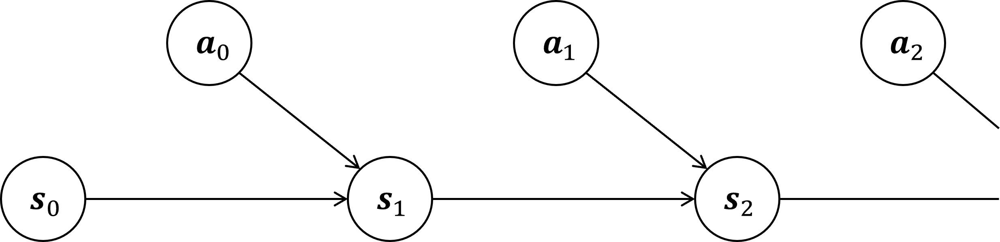
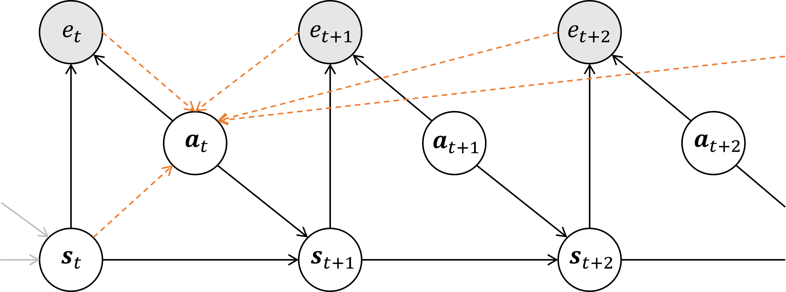

# Control as Inference

**Control as Inference**は強化学習を統一的な枠組みで議論するために、強化学習の最適制御やプランニングを**推論**（*inference*）とみなすという考え方です。

## 目次

- [目次](#目次)
- [MDPの軌跡](#mdpの軌跡)
- [軌跡と最適性](#軌跡と最適性)
  - [最適な軌跡](#最適な軌跡)
- [推論](#推論)
  - [厳密推論：Forward-backward アルゴリズム](#厳密推論forward-backward-アルゴリズム)
    - [逆方向伝達（*backward message passing*）](#逆方向伝達backward-message-passing)
    - [逆方向伝達（*forward message passing*）](#逆方向伝達forward-message-passing)
  - [近似推論](#近似推論)
- [参考文献](#参考文献)

## MDPの軌跡

以下では、ステップ数 $T$ の有限MDP（*finite Marcov decision process*）をMDPと呼称します。また、以下の議論は容易にステップ数が無限大の場合に拡張できるようです[1]。加えて、以下ではMDPを $(\mathcal{S,A},p_{s_0},p_T,r)$ の組とします。ここで、 $\mathcal{S,A}$ はそれぞれ状態空間と行動空間、 $p_{T}(\cdot|s,a)$ は遷移関数（kernel）、 $p_{s_0}$ は初期状態分布、 $r$ は報酬関数とします。

MDPの軌跡について、グラフィカルモデルを用いると下図のように図示されます。

図１．MDPのグラフィカルモデル[1]

このグラフィカルモデルにおける軌跡 $\tau=(s_0,a_0,s_1,a_1,...,s_T)$ の確率は、MDPのダイナミクスの下での軌跡の確率と等しくなります。

次に $S_0$ の（初期状態）分布を $p_{s_0}$ とし、各時間ステップ $t$ での状態 $S_t$ の分布を、MDPの遷移確率 $p_T$ を用いて

$$\mathrm{Pr}(S_{t+1}=s'|S_t=s,A_t=a)=p_T(s'|a,s)$$

とします。また、行動 $A_t$ についても

$$\mathrm{Pr}(A_t=a)=C$$

と定義します（すなわちすべての行動についてその**事前確率は**一様に等しい）。このとき、モデルの軌跡 $\tau$ の確率は次のように表すことができます。

$$\begin{aligned}
\mathrm{Pr}(\tau)=&\mathrm{Pr}(S_0=s_0)\prod_{t=0}^{T-1}{\mathrm{Pr}(A_t=a)P(S_{t+1}=s_{t+1}|S_t=s_t,A_t=a_t)}\\
=&C^T\left(p_{s_0}\prod_{t=0}^{T-1}{p_T(s_{t+1}|s_t,a_t)}\right)\\
\propto&p_{s_0}\prod_{t=0}^{T-1}{p_T(s_{t+1}|s_t,a_t)}
\end{aligned}$$

ここから、グラフィカルモデルの軌跡の確率 $\mathrm{Pr}(\tau)$ は、MDPのダイナミクスの確率（右辺）に比例するということがわかります。さらには、ダイナミクスが決定論的である場合、確率 $\mathrm{Pr}(\tau)$ はすべての軌跡 $\tau$ について等しくなります。

> 確率 $\mathrm{Pr}(\tau)$ がすべての軌跡 $\tau$ について等しくなることを、 $\mathrm{Pr}(\tau)\propto 1\{\mathrm{Feasible}\}$ とも書くようです。

## 軌跡と最適性

以上にMDPの軌跡の尤度を記述しましたが、これだけではすべての軌跡について確率が等しくなり議論が深まりません。ここで、**最適性変数**（*optimally variable*） $e_t\in\{0,1\}$ を導入し、各時間ステップ $t$ でのエージェントの最適性を考えることにします。エージェントが時間ステップ $t$ で最適（*optimal*）である確率を $\mathrm{Pr}(\mathrm{Optimal\space at}\space t)=f(s_t,a_t)$ として定義したとき、これは最適性変数を用いて次のように表現できます。

$$\mathrm{Pr}(e_t=1|S_t=s_t,A_t=a_t)=f(s_t,a_t)$$

次に報酬関数 $r$ を次のように定義します。

$$\begin{aligned}r(s_t,a_t)=&\log f(s_t,a_t)\\\Big(=&\log{\mathrm{Pr}(e_t=1|S_t=s_t,A_t=a_t)}\Big)\\\leq &\space0\end{aligned}$$

この報酬を用いると、全ステップに渡って最適である場合の確率は、次のように定義されます。

$$\mathrm{Pr}(\mathrm{All}\space e_t=1|\tau)=\exp\left(\sum_{t=0}^T r(s_t,a_t)\right)\mathrm{Pr}(\tau)\tag{5}$$

また、このときグラフィカルモデルは下図のようになります。ここから、最適性変数を導入した以下のグラフィカルモデルは、**隠れマルコフモデル**（*Hidden Markov Model*; HMM）に似ていることがわかります。

図２．最適性を導入したMDPのグラフィカルモデル[1]

### 最適な軌跡

ここまでで、最適な軌跡の分布を説明するモデル（式 $(5)$ ）を作ることができました。全時間ステップに渡って最適であるような、**最適軌跡分布**（*optimal trajectory distribution*）を次のように定義すれば、

$$\pi_{optimal}(\tau)=\mathrm{Pr}(\tau|\mathrm{All}\space e_t=1)=\mathrm{Pr}(\tau|e_{1\colon T}=1)\tag{6}$$

このとき、式 $(5)$ は次のように表すことができます。

$$\mathrm{Pr}(\tau|e_{1\colon T}=1)\propto \exp\left(\sum_{t=0}^T r(s_t,a_t)\right)\mathrm{Pr}(\tau)$$

また、ダイナミクスが決定論的である場合、上式はさらに

$$\mathrm{Pr}(\tau|e_{1\colon T}=1)\propto \exp\left(\sum_{t=0}^T r(s_t,a_t)\right)$$

とかけ、軌跡のエネルギーが報酬に比例する、エネルギーベースのモデルの特殊な形式とみなすことができます[1]。

ここで、式 $(6)$ は時刻 $t$ における最適方策を表しています。これをグラフィカルモデルで表すと下図のようになります。ここから、**最適制御問題は確率的推論を行うという確率モデル一般の問題に帰着でき**ることがわかります[2]。これが *Control as Inference* というフレームワークの主題です。

図３．最適方策のグラフィカルモデル[2]

## 推論

ここからは余談となりますが、どのように推論を行うかについて、厳密な推論とその近似推論の面から説明を行います。実用性という点では近似推論としての Control as Inference である *Soft Actor-Critic*（*SAC*）や *Stochastic Laten Actor Critic*（*SLAC*）にこそ重きを置くべきですが、本題には関係がないためここを省略しています。

### 厳密推論：Forward-backward アルゴリズム

前節では（全時間ステップにわたる）最適な軌跡分布のモデルを作成しました。次に、ある時間ステップ $t$ までの履歴をもとにした、それ以降の最適な行動（の分布）を考えます。一般には、この分布は

$$\pi_t(a|s)=\mathrm{Pr}(A_t=a|S_t=s,e_{1\colon T}=1)$$

で与えられます。一方で環境はマルコフ的ですので、ある時刻 $t$ のイベントは、時刻 $t-1$ 以前のイベントから独立しています。したがって、時刻 $t$ で状態が $s$ であった場合の、行動の最適な分布は

$$\pi_t(a|s)=\mathrm{Pr}(A_t=a|S_t=s,e_{t\colon T}=1)\tag{7}$$

と書けます。

> イベント（状態、行動など）を $E_t$ とした場合、 $A_t\mathop{\perp\!\!\!\perp} E_0,...,E_{t-1}$ （ $E_{t-1}$ 以前のすべてのイベントについて行動 $A_t$ は独立）が成立します。

式 $(7)$ の確率を求めることは、図２のグラフィカルモデルで正確な推論（*exact inference*）を行うことに対応しており、HMM の *forward-backward* アルゴリズムとの類似性を持ちます[1]。推論の過程は次の２段階から構成されます。

1. 逆方向伝達： $\mathrm{Pr}(e_{t\colon T}=1|S_t=s), \mathrm{Pr}(e_{t\colon T}|S_t=s,A_t=a)$ を計算
2. 順方向伝達： 前項とベイズの定理から $\mathrm{Pr}(A_t=a|S_t=s,e_{t\colon T}=1)$ を計算

> forward-backward アルゴリズム：HMM の推論手法であり、観測のもとでにすべての隠れ変数の事後周辺確率を計算します。順方向確率を計算する段階（*forward-step*）と逆方向確率を求める段階（*backward-step*）、および平滑化段階の３段階から構成されます[3]。

#### 逆方向伝達（*backward message passing*）

この段階では、逆方向メッセージ（*backward message*）をそれぞれ次のように計算します。

$$\begin{aligned}
\mathrm{Pr}(e_{t\colon T}=1|A_t=a,S_t=a)=&e^{r(s,a)}\mathbb{E}_{s'\sim p_T(\cdot|s,a)}\big[\mathrm{Pr}(e_{t+1\colon T}=1|S_{t+1}=s')\big]\\
\mathrm{Pr}(e_{t\colon T}=1|S_t=s)=&\mathbb{E}_a\big[\mathrm{Pr}(e_{t\colon T}=1|S_t=s,A_t=a)\big]
\end{aligned}\tag{8}$$

> すなわち、逆方向メッセージはそれぞれ $\mathrm{Pr}(e_{t\colon T}=1|A_t=a,S_t=a)$ が $\mathrm{Pr}(e_{t+1\colon T}=1|S_{t+1}=s')$ から、 $\mathrm{Pr}(e_{t\colon T}=1|S_t=s)$ が $\mathrm{Pr}(e_{t\colon T}=1|S_t=s,A_t=a)$ から、**再帰的に**計算されます。

上の式を理解するために、対数確率空間を考えることにます。はじめに、逆方向メッセージを用いて

$$\begin{aligned}Q_t(s,a)=&\log \mathrm{Pr}(e_{t\colon T}=1|A_t=a,S_t=a)\\V_t(s)=&\log \mathrm{Pr}(e_{t\colon T}=1|S_t=s)\end{aligned}$$

を定義します。ここで $\log\mathbb{E}[\exp(f(X))]\eqqcolon\mathrm{soft}\max_X f(X)\space\big(\approx \max_X f(X)\big)$ とすれば、上の式は次のように書き直すことができます。

$$\left\{\begin{aligned}Q_t(s,a)=&r(s,a)+\mathrm{soft}\max_{s'} V_{t+1}(s')\\V_t(s)=&\mathrm{soft}\max_a Q_t(s,a)\end{aligned}\right.\tag{9}$$

> $\mathrm{soft}\max$ ：ソフトマックス関数 $\sigma\colon\R^K\to(0,1)^K\colon\sigma (\pmb{x})=e^{\pmb{x}} / \sum_{x} e^x$ とは異なります

ここで $Q_t,V_t$ はそれぞれ通常の強化学習における行動価値関数 $Q(\cdot|\cdot)$ 、価値関数 $V(\cdot)$ にならった表現です。以下では**ソフト行動価値関数** $Q_t$ **ソフト価値関数** $V_t$ と呼称し、また上の連立方程式を**ソフトベルマン方程式**（*soft Bellman backup equations*）と呼ぶことにします。このとき、新しく定義したソフトな関数は次のような意味を持ちます。

- $V_t$ : 行動に対する「ソフトな」最大値（厳密な最大値ではない）
- $Q_t$ : 次の状態に対する「ソフトな」最大値（期待値ではない）
  - 通常のQ関数と比較し、高い確率でそこそこよい状態になる選択よりも、確率は低いがとてもよい状態になる可能性のある選択を行うようになります（「楽観的」になる）

> 補足：式 $(9)$ への式変形
>
> 式 $(8)$ を代入すれば、$Q_t, S_t$ は次のようになります。これに $\log\mathbb{E}[\exp(f(X))]=\mathrm{soft}\max_X f(X)$ を適用すれば式 $(9)$ を導出できます。
>
> $$\begin{aligned}Q_t(s,a)=&r(s,a)+\log\mathbb{E}_{s'\sim p_T(\cdot|s,a)}\big[e^{V_{t+1}(s')}\big]\\V_t(s)=&\log\mathbb{E}_a\left[e^{Q_t(s,a)}\right]\end{aligned}$$

#### 逆方向伝達（*forward message passing*）

上で求めた $Q_t, V_t$ を用いれば、ベイズの定理より最適方策は

$$\begin{aligned}\mathrm{Pr}(A_t=a|S_t=s,e_{t\colon T}=1)=&\frac{\mathrm{Pr}(e_{t\colon T}=1|A_t=a,S_t=s)\mathrm{Pr}(A_t=a|S_t=s)}{\mathrm{Pr}(e_{t\colon T}=1|S_t=s)}\\
=&\frac{e^{Q_t(s,a)}C}{e^{V_t(s)}}\\
\propto &\exp(Q_t(s,a)-V_t(s))\\
\propto &\exp(A_\pi(s,a))\end{aligned}$$

ここで、 $A_\pi(s,a)$ はアドバンテージ関数です。すなわち、ソフト価値関数を計算できれば、最適方策を $\exp(Q_t(s,a)-V_t(s))$ として求めることができます。

### 近似推論

前節で述べた厳密手法はQ関数の更新が「楽観的」になるため、確率的なダイナミクスの場合にはあまり適しません[2]。したがって、大規模な確率モデルに適用するために、近似手法を用いた推論アルゴリズムが存在します。

有名な近似推論手法が、変分推論を導入した **SAC**（*Soft Actor-Critic*）です。SACはオフポリシーであるため、リプレイバッファが可能です。

また、SACに対して環境に不確実性を仮定した拡張が**SLAC**（*Stochastic Laten Actor Critic*）です。潜在変数モデルによるSACの素直な拡張となっており、POMDPへ対応できるようになっています。SAC同様リプレイバッファを使用でき、またモデルフリーでもあります。

## 参考文献

[1] [An Introduction to Control as Inference](https://dibyaghosh.com/blog/rl/controlasinference.html)

[2] [[DL輪読会]Control as Inferenceと発展](https://www.slideshare.net/DeepLearningJP2016/dlcontrol-as-inference-201266247)

[3] [Forward-backward algorithm](https://en.wikipedia.org/wiki/Forward%E2%80%93backward_algorithm)