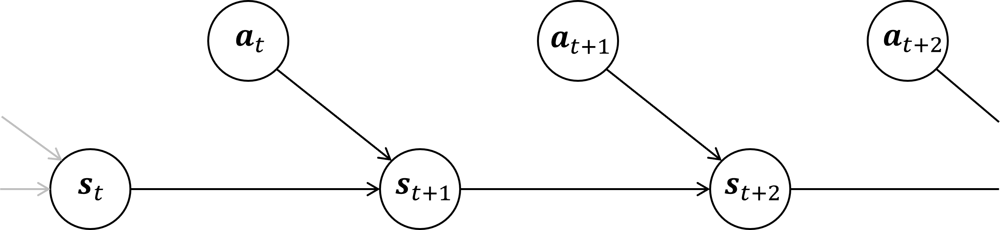
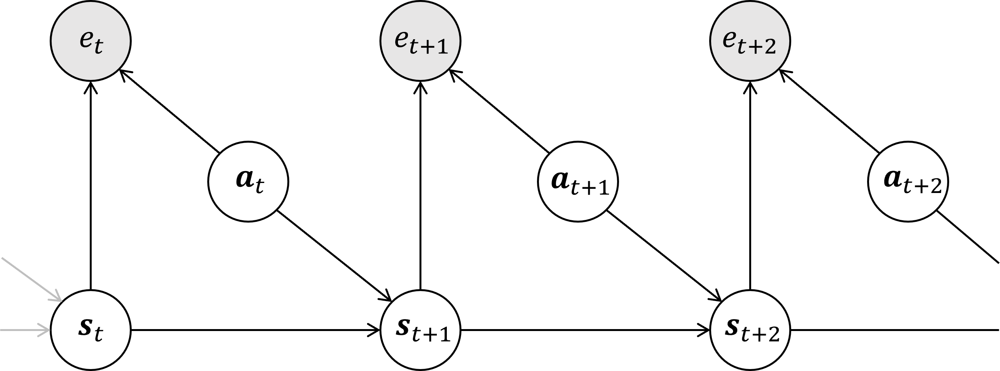

# Control as Inference

**Control as Inference**は強化学習を統一的な枠組みで議論するために、強化学習の最適制御やプランニングを**推論**（*inference*）とみなすという考え方です。

## MDPの軌跡

以下では、ステップ数 $T$ の有限MDP（*finite Marcov decision process*）をMDPと呼称します。また、以下の議論は容易にステップ数が無限大の場合に拡張できるようです[1]。加えて、以下ではMDPを $(\mathcal{S,A,T},\rho,R)$ の組とします。ここで、 $\mathcal{S,A}$ はそれぞれ状態空間と行動空間、 $T(\cdot|s,a)$ は遷移関数（kernel）、 $\rho$ は初期状態分布、 $R$ は報酬とします。

MDPの軌跡について、グラフィカルモデルを用いると下図のように図示されます。

このグラフィカルモデルにおける軌跡 $\tau=(s_0,a_0,s_1,a_1,...,s_T)$ の確率は、MDPのダイナミクスの下での軌跡の確率と等しくなります。

次に $S_0$ の（初期状態）分布を $\rho(s)$ とし、各時間ステップ $t$ での状態 $S_t$ の分布を、MDPの遷移確率 $\mathcal{T}$ を用いて

$$P(S_{t+1}=s'|S_t=s,A_t=a)=T(s'|a,s)$$

とします。また、行動 $A_t$ についても

$$P(A_t=a)=C$$

と定義します（すなわちすべての行動についてその**事前確率は**一様に等しい）。このとき、モデルの軌跡 $\tau$ の確率は次のように表すことができます。

$$\begin{aligned}
P(\tau)=&P(S_0=s_0)\prod_{t=0}^{T-1}{P(A_t=a)P(S_{t+1}=s_{t+1}|S_t=s_t,A_t=a_t)}\\
=&C^T\left(\rho(s_0)\prod_{t=0}^{T-1}{T(s_{t+1}|s_t,a_t)}\right)\\
\propto&\rho(s_0)\prod_{t=0}^{T-1}{T(s_{t+1}|s_t,a_t)}
\end{aligned}$$

ここから、グラフィカルモデルの軌跡の確率 $P(\tau)$ は、MDPのダイナミクスの確率（右辺）に比例するということがわかります。さらには、ダイナミクスが決定論的である場合、確率 $P(\tau)$ はすべての軌道 $\tau$ について等しくなります。

> 確率 $P(\tau)$ がすべての軌道 $\tau$ について等しくなることを、 $P(\tau)\propto 1\{\mathrm{Feasible}\}$ とも書くようです。

## 軌跡と最適性

以上にMDPの軌跡の尤度を記述しましたが、これだけではすべての軌跡について確率が等しくなり議論が深まりません。ここで、**最適性変数**（*optimally variable*） $e_t\in{0,1}$ を導入し、各時間ステップ $t$ でのエージェントの最適性を考えることにします。エージェントが時間ステップ $t$ で最適（*optimal*）である確率を $P(\mathrm{Optimal\space at}\space t)=f(s_t,a_t)$ として定義したとき、これは最適性変数を用いて次のように表現できます。

$$P(e_t=1|S_t=s_t,A_t=a_t)=f(s_t,a_t)$$

次に報酬関数 $r$ を次のように定義します。

$$\begin{aligned}r(s_t,a_t)=&\log f(s_t,a_t)\\\Big(=&\log{P(e_t=1|S_t=s_t,A_t=a_t)}\Big)\\\leq &\space0\end{aligned}$$

この報酬を用いると、全ステップに渡って最適である場合の確率は、次のように定義されます。

$$P(\mathrm{All}\space e_t=1|\tau)=\exp\left(\sum_{t=0}^T r(s_t,a_t)\right)P(\tau)\tag{5}$$

また、このときグラフィカルモデルは下図のようになります。

図２．最適性を導入したMDPのグラフィカルモデル[1]

> 補足：式 $(5)$ の説明
>
> 全時間ステップに渡って最適であるような、**最適軌跡分布**（*optimal trajectory distribution*）を次のように定義すれば、
>
> $$\pi_{optimal}(\tau)=P(\tau|\mathrm{All}\space e_t=1)=P(\tau|e_{1\colon T}=1)$$
>
> このとき、式 $(5)$ は次のように表すことができます。
>
> $$P(\tau|e_{1\colon T}=1)\propto \exp\left(\sum_{t=0}^T r(s_t,a_t)\right)P(\tau)$$
>
> また、ダイナミクスが決定論的である場合、上式はさらに
>
> $$P(\tau|e_{1\colon T}=1)\propto \exp\left(\sum_{t=0}^T r(s_t,a_t)\right)$$
>
> とかけ、軌跡のエネルギーが報酬に比例する、エネルギーベースのモデルの特殊な形式とみなすことができます[1]。

## 参考文献

[1] [An Introduction to Control as Inference](https://dibyaghosh.com/blog/rl/controlasinference.html)

[2] [[DL輪読会]Control as Inferenceと発展](https://www.slideshare.net/DeepLearningJP2016/dlcontrol-as-inference-201266247)