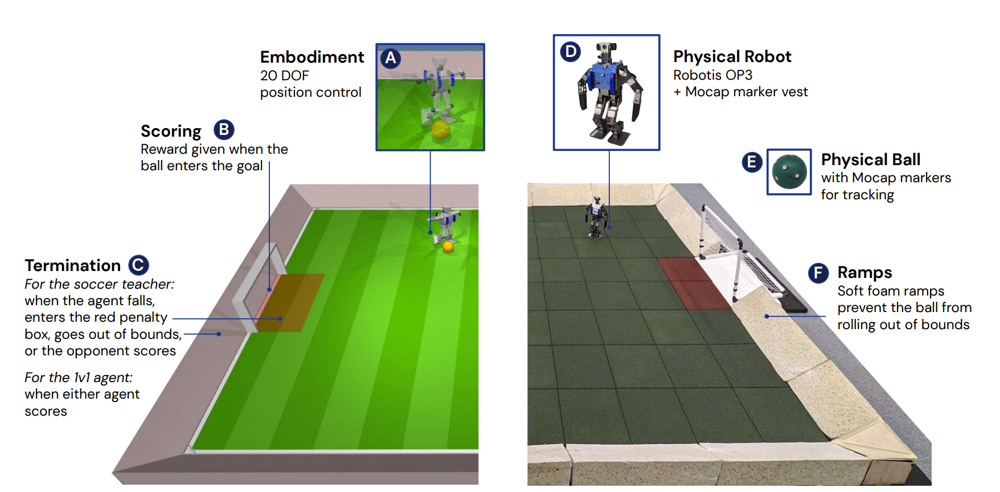
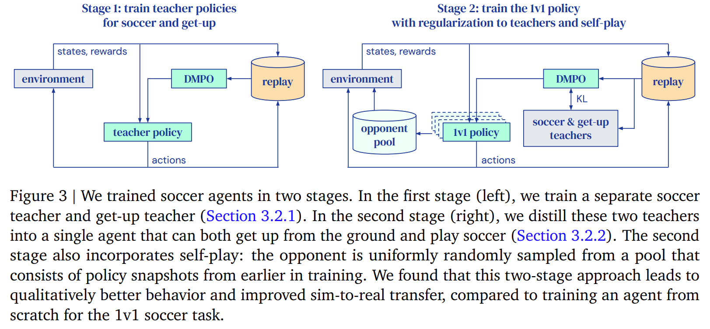

# DeepMind; Learning Agile Soccer Skills for a Bipedal Robot with DeepRL

DeepMindの上記論文についての、大まかな日本語訳および備忘録です。上記論文では、POMDPとしてモデル化した環境において $20$ DOFの二足歩行ロボットにサッカーの手法を学習させました。このときDeepRL手法に**Maximum a Posteriori Policy Optimization**（DMPO）を用いてエージェントの学習を行っています。

## 目次

- [DeepMind; Learning Agile Soccer Skills for a Bipedal Robot with DeepRL](#deepmind-learning-agile-soccer-skills-for-a-bipedal-robot-with-deeprl)
  - [目次](#目次)
  - [要旨](#要旨)
  - [1. 導入](#1-導入)
  - [2. セットアップ](#2-セットアップ)
    - [2.1. 環境](#21-環境)
    - [2.2. ハードウェアとモーションキャプチャー](#22-ハードウェアとモーションキャプチャー)
  - [3. 実験方法](#3-実験方法)
    - [3.1. 概観](#31-概観)
    - [3.2. トレーニング](#32-トレーニング)
      - [3.2.1. 第１段階：教師トレーニング](#321-第１段階教師トレーニング)
      - [3.2.2. 第２段階：蒸留とセルフプレー](#322-第２段階蒸留とセルフプレー)
  - [Appendix（論文）](#appendix論文)
    - [A. トレーニングの詳細](#a-トレーニングの詳細)
      - [A.1. 各関節の可動範囲](#a1-各関節の可動範囲)
      - [A.2. 訓練方法およびアーキテクチャ](#a2-訓練方法およびアーキテクチャ)
        - [A.2.1. DMPO (Distributional MPO)](#a21-dmpo-distributional-mpo)
        - [A.2.2. ハイパーパラメタ](#a22-ハイパーパラメタ)
    - [B. トレーニング](#b-トレーニング)
  - [参考文献](#参考文献)

## 要旨

DeepRLで $20$ 個の関節を持つ人型ロボットに、 $1$ vs $1$ のサッカーゲームをプレイさせた。個々のスキルを分離・訓練し、「これらのスキルをセルフプレイ設定でエンドツーエンドで合成」したところ、迅速な転倒回復、歩行、旋回、キックなどのロバストでダイナミックな動作スキルを獲得した。また、ゲームをプレイさせることもできた。

エージェントはシミュレーションで訓練され、ゼロショットで実際のロボットに移された。「十分な高周波(high-freq)制御、ターゲットダイナミクスのランダム化、摂動(perturbation)の組み合わせ」により、モデル化されていない効果やロボットインスタンス間のばらつきが大きいにも関わらず、質の高い移行(transfer)が可能であった。

## 1. 導入

近年のdeepRLは、複雑な知覚駆動型の全身制御など、シミュレーションされたキャラクターの複雑な運動制御問題を解く能力がある（[1]; [2]; [3]; [4]; [5]）。一方で多くの研究は安定性の高い四足歩行に焦点を当てており、二足歩行に焦点を当てている研究（[6]; 単純な操作のための足の使用）は少ない。

サッカーのようなスポーツは、人間の感覚運動知能の多くの特徴を示している。例えば走行、回転、サイドステップ、キック、パス、転倒回復、物体との接触など、非常に機敏でダイナミックな動きが要求される。さらに、プレーヤーはボール、メンバー、対戦相手について予測し、適応させる必要がある。

本研究では、動的マルチエージェント環境における小型ヒューマノイドの全身制御と物体相互作用を研究する。 $20$ 個の制御可能な関節を持つ小型ヒューマノイドロボットを訓練し、自己認識とゲーム状態の特徴を観測として用いて、簡略化された $1$ vs $1$のサッカーゲームをプレイさせる。DeepRLを用いて動的で俊敏な文脈適応的動作スキルを合成し、ボールの動きを予測し、相手のシュートをブロックする位置を決め、リバウンドを利用することを学習した。エージェントの行動は、スキルの再利用と、マルチエージェント環境における単純な報酬を伴うエンドツーエンドのトレーニングの組み合わせから合成された。シミュレーションから現実への転送は、低コストのロボットでも可能であることが実証された。

## 2. セットアップ

|番号|説明|
|:-:|-|
|A|シミュのロボットの形態：20DOF（関節自由度）, 位置制御（position control）|
|B|得点方法：ボールがゴールに入ったとき報酬|
|C|終了（termination）：スキルの学習時; 転倒、ペナルティエリアへの侵入、フィールド（bounds）外  $1$ vs $1$ 学習時; どちらかの得点|
|D ~ F|現実のロボット、ボール、ランプ|

### 2.1. 環境

20DOFの可動範囲は実際に測定した値を利用した。エージェントは $40$ Hzで行動し、アクションは高周波成分を除去するために指数関数アクションフィルタ（exponential action filter）に通される。

$$\pmb{u}_t=0.8\pmb{u}_{t-1}+0.2\pmb{a}_t$$

ここで、 $\pmb u_t$ は時間ステップ $t$ でロボットに適用されるフィルタリングされた制御であり、 $\pmb a_t$ はポリシーにより出力されるアクションである。フィルタリングされた動作はPIDコントローラに供給され、そのPIDコントローラが関節を駆動して（シミュではトルク、実世界では電圧）、所望の位置に到達する。

観測は身体の感覚（**proprioception**）と**ゲーム状態**情報からなる。身体の感覚は次の5つ。

|観測|次元|説明|
|-|-|-|
|関節位置(positions)| $5\cdot20$ |関節角度 [rad] |
|加速度| $5\cdot3$ |IMUから取得した加速度|
|角速度| $5\cdot3$ |IMUから取得した(ロール, ピッチ, ヨー)の角速度|
|重力| $5\cdot3$|Madwickフィルタを用いて算出した重力の方向|
|行動履歴| $5\cdot20$|アクションフィルタの状態|

Table 1 | 観測対象 1（身体の感覚（*proprioception*））

すべての観測情報は、遅延と潜在的なノイズ、欠落した観測を考慮するために、最新の5ステップ分スタックされる。

ゲーム状態は次の $7$ つ。ゲーム状態情報のうち位置は外部のモーションキャプチャーから測定され、速度はこれらを数値微分することで算出される。

|観測|次元|説明|
|-|-|-|
|ボール位置| $2$ |
|相手の位置| $2$ |
|ゴール位置| $2$ |
|相手ゴールの位置| $2$ |
|エージェントの速度| $5\cdot2$ |位置の数値微分, 直前の5ステップ分の履歴を保持|
|ボール速度| $2$ |ボール位置の数値微分|
|相手の速度| $2$ |相手位置の数値微分|

Table 2 | 観測対象 2（ゲーム状態）

いずれの位置・速度もエージェントを中心とした(?, *expressed in the agent's frame*)平面上の $2$ 次元ベクトルである。以上の情報をもとに、エージェントはモノのグローバルな位置を、*egocentric frame*（自己中心座標; 自分から見て右、など）の水平座標に対応するベクトルとして取得する。

### 2.2. ハードウェアとモーションキャプチャー

高さ51cm、3.5kgの20DOFロボットを利用した。各関節はサーボモーターで作動し、目標角度を送信、比例ゲインのみの位置制御モード（積分項や微分項はない）を利用した。各アクチュエータには磁気ロータリエンコーダが搭載されており、位置を観測する。また、慣性計測ユニット(IMU)も搭載した。

デフォルトのロボット制御ソフトは使用せず、カスタムドライバーを作成した。制御ソフトはIntel Core i3 デュアルコア NUC上で動作する。頭部にはLogitech C920（RGB, 30fps）のカメラが搭載されている。

ボールの位置および相手の位置などは、モーションキャプチャーで追跡し、VRPNプロトコルによりワイヤレスネットワーク経由でストリーミングされ、ROSを介してロボットが利用できるようになった。

また、ダメージを軽減するため、いくつかの修正を加えた。転倒時の衝撃吸収のための安全バンパー、腕の形状の修正など。また、股関節に小さな機械的改良を加え、軸外荷重(*off-axis loads*)が均等に分散するようにし、疲労破壊のリスクを低減した。

## 3. 実験方法

目的は様々なスキルを長期戦略行動に組み込んだエージェントを訓練、現実に移植することである。これは単にゴールを決めるというまばらな報酬でエージェントを訓練しては達成できない。なぜなら探索と転移可能な行動という2つの主な課題があるためである。DeepRLのロボット工学への応用においてこれは一般的な課題である。

トレーニングを2段階に分けることで上記の問題を解決する（上図）。第1段階では、地面から立ち上がることと、訓練されていない相手に対して得点するための教師ポリシーを訓練する。後者のスキルを訓練するとき、エージェントが倒れていたら(*the agent is on the ground*)終了する。終了されない間、エージェントは極小(*local minimun*)を見つけ、歩く/蹴るのではなく、ボールに向かって地面を転がり、ボールをゴールに叩き込むことを学習する。

第2段階では、第1段階のポリシーがエージェントを規則化するために使われ、次第に強くなる相手に対して効果的にプレーすることを学習する。後者では、エージェントはディフェンスや相手の動きを予測するなどの戦術や戦略を学ぶことができる。対戦相手は学習済みエージェントの過去のバージョンからサンプリングされる（自己プレーの形式（*a form of self-play*））。これはautomatic carriculum learning[7]という形式であり、エージェントが上達するにつれて相手の強さも増すため、さらなる改善が促される。また、移行を容易にするため、シミュレーションでの訓練には、領域のランダム化、ランダムな摂動、センサーノイズ、遅延が組み込まれている。

### 3.1. 概観

サッカー環境を、 $(\mathcal{S,A},P,r,p_0,\gamma)$ の組で定義される $\gamma$ -割引部分観測マルコフ決定過程（POMDP）としてモデル化し、これをDeepRL手法[8]により解いた。状態空間 $\mathcal S$ は各ロボットのグローバルな位置、姿勢、関節角度、関節速度、およびボール位置と速度から構成される。各タイムステップ $t$ で、プレイヤーは状態 $\pmb s(t)\in \mathcal S$ から抽出された特徴 $\pmb o(t) \coloneqq \phi(\pmb s(t))$ を観測する（ $\pmb s(t)$ は Table 1&2に記載した通り）。

次にプレイヤーはロボットの関節の所望の位置に対応する $20$ 次元の連続アクション $\pmb a(t) \in \mathcal A$ を選択する。アクションはプレイヤーの（確率的な; *stochastic*）ポリシーから次のようにサンプリングされる。

$$\pmb a(t) \sim \pi(\cdot\mid\pmb h(t))$$

> $\pmb a(t) \sim \pi(\cdot\mid\pmb h(t))$
> 
> $\pmb a(t)$ は $\pi$ の通りに（確率）分布する（*is distributed as*）

> $\pi(\cdot\mid\pmb h(t))=\pi(\pmb a(t)\mid\pmb h(t))$
>
> $\pmb h(t)$ の下での $\pmb a(t)$ の条件付確率分布 $\pi$

ここで、 $\pmb h(t)$ は観測-動作履歴であり、

$$\pmb h(t) \coloneqq \left(\pmb o_{t-H}, \pmb{a}_{t-H}, \pmb{o}_{t-H-1}, ..., \pmb{o}_t\right)$$

で定義される（ $H$ は履歴の長さ）。観測履歴は、環境の部分的な観測可能性を補うために必要である。例えば、フィードバックの待ち時間（*latency*）や、領域（*domain*）ランダム化に使われるモデルの変化（[セクション3.2.2](#322-第２段階蒸留とセルフプレー)）、相手の完全な状態（エージェントは相手の関節角度にアクセスできない）、相手のポリシーなどである。

フィルタリング（[セクション2.2](#22-ハードウェアとモーションキャプチャー)）の後、アクションが環境で実行され、システムダイナミクスに従い新しい状態 $\pmb s_{t+1}\sim P(\cdot\mid\pmb s_t, \pmb a_t)$ がサンプリングされ、またプレイヤーはその状態に従って報酬 $r_{t+1}\coloneqq r(\pmb s_{t+1})$ を得る。後に述べるように（プレイヤーの?）報酬関数の選択は訓練段階により異なるが、一般には次のようになる。

$$r(\pmb s_t)=\sum_{k=1}^K \alpha_k \hat{r_k}(\pmb s_t)$$

これらの相互作用により、経験の長さ(*horizon length*) $T$ にわたる軌跡 $\xi=\{(\pmb s_t, \pmb a_t, r_{t+1})\}_{t=0}^T$ が生じる。ポリシー $\pi$ は、システムダイナミクス $P$ および初期状態分布 $p_0$ とともに、次のような軌道上の分布を生む。

$$p(\xi)=p_0(\pmb s_0)\prod_{t=0}^T {\pi(\pmb a_t\mid\pmb s_t)P(\pmb s_{t+1}\mid\pmb s_t, \pmb a_t)}$$

ポリシー $\pi$ の目的は、誘導された軌道分布 $p(\xi)$ に対する期待値で取られた割引累積報酬 $\mathcal J(\pi)$ を最大化することである。

$$\mathcal J(\pi)\coloneqq\mathbb{E}_\xi\left[\sum_{t=0}^T \gamma^t r(\pmb s_t)\right]\tag{1}$$

Maximum a Posteriori Policy Optimization (MPO, [9]) with a distributional critic (Distributional MPO; [DMPO](#a21-dmpo-distributional-mpo))を用いて式 $(1)$ を最適化した。このとき、パラメータ $\theta$ を持つディープフィードフォワードNNとしてポリシーをパラメータ化した。部分的な観測可能性をよりよく扱うために、Table 1のように長さ $5$ の履歴をサブセットとしてエージェントに与えた。

DMPOエージェントは、多変量（*multivariate*）ガウス分布の平均と対角共分散（*diagonal covariance*）を出力し、criticはQ値のカテゴリ分布を出力する。DMPOアルゴリズムとエージェント・アーキテクチャの詳細は[付録A.2](#a2-訓練方法およびアーキテクチャ)に示す。

ここで、式 $(1)$ の軌道分布は特定の選択に依存することに注意したい。第２ステージで１vs１ポリシーをトレーニングするとき、対戦相手はエージェントの過去のスナップショットのプールからサンプリングされ、目的を非定常とした。一方で実際には、このことがトレーニングの妨げとなることはなく、またポリシーはよい形で収束した。同様のアプローチは、マルチエージェントDeepRLに関する先行研究（[1]; [11]; [12];）でも検討されている。

### 3.2. トレーニング

#### 3.2.1. 第１段階：教師トレーニング

#### 3.2.2. 第２段階：蒸留とセルフプレー

## Appendix（論文）

### A. トレーニングの詳細

#### A.1. 各関節の可動範囲

#### A.2. 訓練方法およびアーキテクチャ

##### A.2.1. DMPO (Distributional MPO)

DMPOとはdistributional criticによるMPO[9]（Distributional MPO）である。

MPOはActor-CriticなDeepRLアルゴリズムであり、ポリシーの反復、すなわちポリシーの評価と改善を交互に実行する。評価段階では、現在のポリシー（Actor）を考慮してQ関数（Critic）を推定する。次に改善段階では、現在のQ関数に基づいてポリシーを更新します。

> Q関数（行動価値関数）
> 
> 状態 $\pmb s$ で行動 $\pmb a$ を取り、その後最善の戦略に基づき行動し続けた場合に、最終的に得られる長期的な報酬の期待値

**ポリシー評価**：この段階では、現在のポリシー $\pi_t$ に対してQ関数を学習する。ポリシーはターゲットポリシーネットワークによってパラメタ化される。Q関数を学習するためには、任意のQ学習アルゴリズムが使用可能であり、本論文では $n=5$ としたnステップQ学習[A1]が用いられている。さらに、Bellemare et al. (2017, [A2]) のように、カテゴリ分布(*categorical distribution*)を出力する深層FFNN(*Feed-Forward Neural Network*)としてQ関数をパラメタ化する。

**ポリシー改善**：この段階では、現在のQ関数 $Q_t$ と現在のポリシー $\pi_t$ に対してポリシーを改善することを目的とする。MPOのポリシー改善手順には２段階存在する。第１段階では、標準的なRL目的関数と現在のポリシーとKLダイバージェンス制約を最適化するように、改善された行動分布 $q(\pmb a|\pmb s)$ を計算する。

$$\begin{align}
\max_q &\mathbb E_\xi\left[\int_a{q(\pmb a|\pmb s)Q(\pmb s, \pmb a)\mathrm d\pmb a}\right]\tag{A1}\\
\mathrm{s.t.}\space&\mathbb E_\xi\left[\mathrm{KL}\left(q(\cdot|\pmb s)||\pi_t(\cdot|\pmb s)\right)\right]<\epsilon
\end{align}$$

> 式 $\max_q \mathbb E_\xi\left[\int_a{q(\pmb a|\pmb s)Q(\pmb s, \pmb a)\mathrm d\pmb a}\right]$ は、MPOが最大化しようとする目的関数です。２つの関数 $q(\pmb a|\pmb s)$ と $Q(\pmb s, \pmb a)$ の積の積分の期待値を。行動価値関数 $Q(\pmb s,\pmb a)$ は、

> KLダイバージェンス
>
> *Kullback-Leivler divergence*（KLダイバージェンス）とは、2つの確率分布がどの程度似ているかを表す尺度です。２つの確率分布が似ているほど0に近づき、そうでないほど大きくなります。定義は下記の通りです[A2]。
> 
> $$KL(p||q)=\int_{-\infty}^\infty {p(x)\log{\dfrac{p(x)}{q(x)}}}dx$$

KL発散発散制約により、改善されたアクションの分布が現在のポリシーから大きく逸脱しないことが保証され、学習が安定します。式 $(A1)$ には各状態 $s$ の閉じた形式（*closed-form*）の解があり、ここで

$$q(\pmb a|\pmb s)\propto \pi_t(\pmb a|\pmb s) \exp\left(\frac{Q(\pmb s, pmb a)}{\eta}\right)\tag{A2}$$

であり、温度 $\eta$ は $\epsilon$ を含む凸双対関数（*convex dual function*）の解である。

$$\eta=\argmin_n{\eta\epsilon+\eta\mathbb{E}_\xi\left[\log{\int_a{\pi_t(\pmb a|\pmb s)\exp\left(\frac{Q(\pmb s,\pmb a)}{\eta}\right)}}\mathrm d\pmb a\right]}\tag{A3}$$

【上記2式の詳細詳細】

> $(A3)$ 式の表現は、 $\epsilon$ でパラメータ化された凸関数の族の最小値であるため、凸双対関数である。
> 
> これを見るためには、対数の中の項が、任意の固定された $Q(\pmb s,\pmb a)$ と $\eta$ に対して $\pi_t(\pmb a|\pmb s)$ の凸関数であり、対数は凹関数であるので、その合成も凸関数であることに注意する。次に、 $\xi$ に関する期待値を取ると凸性が保たれ、 $\eta$ を掛けても凸性は変わらない。最後に、凸関数に $\eta\epsilon$ を加えると、別の凸関数が得られる。したがって、 $(A3)$ 式の表現は、各 $\epsilon$ に対して $\eta$ の凸関数の最小値であることが分かり、これは凸双対関数であることを意味する。

> 凸双対関数（convex dual function）
>
> 凸双対関数とは、凸最適化問題の最適値の下界を与える関数である。双対変数のベクトルが与えられたとき、主変数についてラグランジュ関数の下界（最大下界）として定義される。ラグランジュ関数は、元の問題の制約を非負のラグランジュ乗数（双対変数）をかけて目的関数に加えたものである。
>
> 性質（抜粋）
> 
> - 元の問題が凸でなくても、常に凹関数となる
> - 常に元の問題の最適値以下である（**弱双対性**）

> 双対変数

 
検証では、

$$\begin{align}
\theta_{t+1}=\argmax_\theta&\mathbb E_\xi\left[\int_aq(\pmb a|\pmb s)\log{\pi_\theta(\pmb a|\pmb s)}\mathrm d\pmb a\right]\\
\mathrm{s.t.}\space&\mathbb E_\xi\left[\mathrm{KL}\left(\pi_t(\cdot|\pmb s)||\pi_\theta(\cdot|\pmb s)\right)\right]<\beta
\end{align}$$

##### A.2.2. ハイパーパラメタ

### B. トレーニング

## 参考文献

[0] [Learning Agile Soccer Skills for a Bipedal Robot with DeepRL](https://arxiv.org/abs/2304.13653)

[1] T. Bansal, J. Pachocki, S. Sidor, I. Sutskever, and I. Mordatch. Emergent complexity via multi-agent competition. In 6th International Conference on Learning Representations (ICLR), 2018.

[2] N. Heess, D. Tirumala, S. Sriram, J. Lemmon, J. Merel, G. Wayne, Y. Tassa, T. Erez, Z. Wang, A. Eslami, M. Riedmiller, et al. Emergence of locomotion behaviours in rich environments. arXiv preprint arXiv:1707.02286, 2017.

[3] S. Liu, G. Lever, Z. Wang, J. Merel, S. M. A. Eslami, D. Hennes, W. M. Czarnecki, Y. Tassa, S. Omidshafiei, A. Abdolmaleki, N. Y. Siegel, L. Hasenclever, L. Marris, S. Tunyasuvunakool, H. F. Song, M. Wulfmeier, P. Muller, T. Haarnoja, B. D. Tracey, K. Tuyls, T. Graepel, and N. Heess. From motor control to team play in simulated humanoid football. Sci. Robotics, 7(69), 2022.

[4] J. Merel, S. Tunyasuvunakool, A. Ahuja, Y. Tassa, L. Hasenclever, V. Pham, T. Erez, G. Wayne, and N. Heess. Catch & Carry: Reusable Neural Controllers for Vision-Guided Whole-Body Tasks. ACM Transactions on Graphics (TOG), 39(4), 2020.

[5] X. B. Peng, P. Abbeel, S. Levine, and M. van de Panne. DeepMimic: Example-guided deep reinforcement learning of physics-based character skills. ACM Transactions on Graphics (TOG), 37(4):143, 2018.

[6] X. Cheng, A. Kumar, and D. Pathak. Legs as manipulator: Pushing quadrupedal agility beyond locomotion. arXiv preprint arXiv:2303.11330, 2023.

[7] R. Portelas, C. Colas, L. Weng, K. Hofmann, and P.-Y. Oudeyer. Automatic curriculum learning for deep rl: A short survey. In Proceedings of the Twenty-Ninth International Joint Conference on Artificial Intelligence, IJCAI-20, pages 4819–4825, 7 2020.

[8] R. S. Sutton and A. G. Barto. Reinforcement Learning: An Introduction. A Bradford Book, Cambridge, MA, USA, 2018. ISBN 0262039249.

[9] A. Abdolmaleki, J. T. Springenberg, Y. Tassa, R. Munos, N. Heess, and M. Riedmiller. Maximum a posteriori policy optimisation. In Proceedings of the 6th International Conference on Learning Representations (ICLR), 2018.

[10] M. G. Bellemare, W. Dabney, and R. Munos. A distributional perspective on reinforcement learning. In Proceedings of the 34th International Conference on Machine Learning, 2017.

[11] J. Heinrich, M. Lanctot, and D. Silver. Fictitious self-play in extensive-form games. In F. R. Bach and D. M. Blei, editors, Proceedings of the 32nd International Conference on Machine Learning, ICML 2015, Lille, France, 6-11 July 2015, volume 37 of JMLR Workshop and Conference Proceedings, pages 805–813. JMLR.org, 2015.

[12] M. Lanctot, V. Zambaldi, A. Gruslys, A. Lazaridou, K. Tuyls, J. Pérolat, D. Silver, and T. Graepel. A unified game-theoretic approach to multiagent reinforcement learning. In Advances in neural information processing systems, pages 4190–4203, 2017.

[A1] R. S. Sutton and A. G. Barto. Reinforcement Learning: An Introduction. A Bradford Book, Cambridge, MA, USA, 2018. ISBN 0262039249.

[A2] M. G. Bellemare, W. Dabney, and R. Munos. A distributional perspective on reinforcement learning. In Proceedings of the 34th International Conference on Machine Learning, 2017.