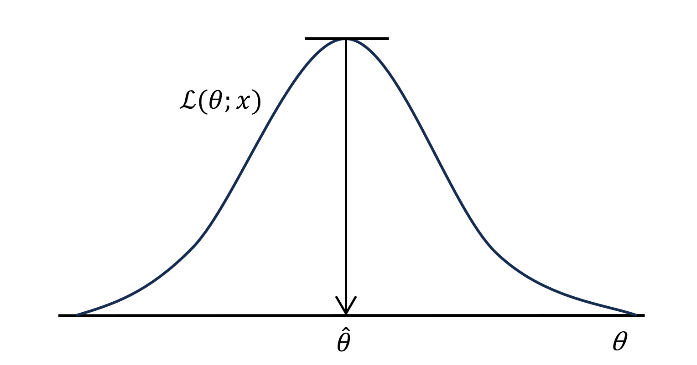

# EMアルゴリズム

ここでは、欠測データの存在を許容する点推定アルゴリズムである、**EMアルゴリズム**の解説を記述します。はじめに観測された標本から母集団のパラメタの値を推測する**点推定**の概要を説明し、その一般的な方法である**最尤法**を見ていきます。EMアルゴリズムは観測データに欠測がある場合の最尤法ですので、この順に見ていくことで概要を理解することができます。

また、EMアルゴリズムは機械学習で広く使用されるアルゴリズムですが、これは同様に広く利用される最急勾配降下法の弱点（複雑なモデルに弱い）を解決した手法でもあります[4]。EMアルゴリズムは様々な面においてその影響を持つために、これを理解することで以降の強化学習アルゴリズムの理解に大きく寄与すると考えられます。

## 目次

- [EMアルゴリズム](#emアルゴリズム)
  - [目次](#目次)
  - [統計的推定](#統計的推定)
  - [点推定](#点推定)
  - [最尤法](#最尤法)
  - [データの欠測](#データの欠測)
  - [EMアルゴリズム](#emアルゴリズム-1)
    - [Q関数（EMアルゴリズム）](#q関数emアルゴリズム)
    - [E-step \& M-Step](#e-step--m-step)
    - [おまけ](#おまけ)
  - [参考文献](#参考文献)

## 統計的推定

パラメタ $\theta$ に従う分布がある場合に、得られた標本からその分布の推定を行うことを考えます。標本から推定した量を**推定量**（*estimator*）とよび、 $\hat\theta$ のように表します（ $\hat{}$ : ハット）。例えば確率分布の期待値 $\mu$ を考える場合に、標本 $X_1,...,X_n,\space iid\sim P_\mu$ のもとで推定量は

$$\hat\mu=\frac1n\sum_{i=1}^n X_i$$

と計算できます。上からわかるように、推定量 $\hat\theta$ は標本 $X_1,...,X_n$ の関数です。また、実現値を代入した $\hat\theta(x_1,...,x_n)$ は**推定値**（*estimate*）と呼ばれます。

> $iid$（*ndependently and identically distributed*） : 確率変数 $X_1,..,X_n$ が互いに独立

> 推定量：日本語の字面からは関数であるということが伝わりにくいですが、英名estimatorには確かに関数らしさがあるように感じます。

パラメタ $\theta$ で記述された確率密度関数（or 確率の集合）を**パラメトリックモデル**（*parametric model*）といい、 $g(x;\theta)$ と表記します。例えば、 $d$ 次元正規分布に対応するパラメトリックモデルは次のように表されます。

$$g(x;\mu,\Sigma)=\frac1{(2\pi)^\frac{d}{2}\sqrt{\det{\Sigma}}}\exp\left({-\frac12(x-\mu)^T\Sigma^{-1}(x-\mu)}\right)$$

このばあい、モデルのパラメタは期待値（ベクトル） $\mu$ と分散共分散行列 $\Sigma$ の２つとなります。

> $g(x;\theta)$ : $\theta$ をパラメタとする $x$ の関数 $g$

このパラメトリックモデルを用いて確率密度関数の推定を行う手法を**パラメトリック法**といいます。一方、パラメタが無限個ある場合やパラメトリックモデルを作成せずに推定を行う場合もあり、この手法を**ノンパラメトリック法**とよびます。

## 点推定

母集団のパラメータの値を、観測された標本に基づき推測することを**点推定**（*point estimation*）といいます。一般に、推定量がパラメタをより正確に推定できる関数であるために、推定量には不偏性と一致性という性質が備わります[1]。不偏性を持つ推定量は**不偏推定量**（*unbiased estimator*）とよばれ、

$$\mathbb{E}\left[\hat\theta(X_1,...,X_n)\right]=\theta$$

を満たします。この式から、不偏的であるとき $\hat\theta$ は平均的に $\theta$ の周りに分布していることがわかります。次に一致性をもつ推定量は**一致推定量**（*consistent estimator*）とよばれ、

$$\lim_{n\to\infty}{P_\theta(|\hat\theta-\theta|\leq c)}=1, \space\forall c>0, \forall \theta$$

を満たします。上式から、一致性を持つとき推定量 $\hat\theta$ は、 $n$ を大きくするだけ真の値 $\theta$ に近づくことがわかります。

## 最尤法

母集団の確率関数（or 確率密度関数）が $f(x;\theta)$ で与えられているとき、ランダム標本を

$$\pmb{X}=X_1,...,X_n,\space iid\sim f(s;\theta)$$

とします。また、実現値を $\pmb{x}=(x_1,...,x_n)$ とします。

観測値として $\pmb{x}$ が与えられたとき、（ $\pmb{x}$ を固定して） $\theta$ の関数として $\mathcal{L}(\theta;\pmb{x})$ 

$$\mathcal{L}(\theta;\pmb{x})=\prod_{\pmb{x}}{f(x;\theta)}$$

を考えます。この関数 $\mathcal{L}(\theta;\pmb{x})$ は**尤度関数**（*likelihood function*; 単に**尤度**とも）とよばれ、 $\pmb{X}$ の $\pmb{x}$ における同時確率関数（or 同時確率密度関数）です。**最尤法**（*maximum likelihood method*）では、尤度関数 $\mathcal{L}(\theta;\pmb{x})$ を最大化して未知パラメタ $\theta$ を推定します。以下に最尤法のイメージ図を示します[1]。

図1. 最尤法のイメージ[1]

例えば成功確率が $p$ のベルヌーイ分布に従う標本 $\{成功,失敗,成功,成功,失敗\}$ を得たとき、その尤度関数は次のように計算されます。

$$\mathcal{L}=p^3(1-p)^2$$

> ベルヌーイ分布（*Bernoulli distribution*）：確率 $p$ で１を、確率 $1-p$ で０をとる離散確率分布。すなわち
>
> $$P(X=1)=p, P(X=0)=1-p$$

この尤度関数を最大化する $\theta$ は $\pmb{x}$ の関数として与えられるので、これを ${\hat\theta}^*(\pmb{x})$ と書くとき、 ${\hat\theta}^*={\hat\theta}^*(\pmb{X})$ を**最尤推定量**（*maximum likelihood estimator*; MLE）と言います。以下では、最尤推定量を指すことが明らかである場合には ${\hat\theta}^*={\hat\theta}^*(\pmb{X})$ の代わりに $\theta^*=\theta^*(\pmb{X})$ を用いることにします。

定義から、最尤推定量は 

$$\mathcal{L}(\theta^*; \pmb{X})=\max_\theta{\mathcal{L}(\theta; \pmb{X})}$$

を満たします。ここで、尤度関数は確率関数の積の形をしているので、尤度関数の微分を取った

$$\ell(\theta;\pmb{x})=\log\mathcal{L}(\theta;\pmb{x})=\sum_{\pmb{x}}\log{f(x;\theta)}$$

を**対数尤度関数**（*log-likelihood function'）として、これを最大化する $\theta$ を求めることが多いです。

> 尤度関数の各要素 $f(x;\theta)$ が1よりも小さい値を取るとき、その積 $\mathcal{L}(\theta;x)$ は計算が困難なほど小さな値を取ることになります。

$\mathcal{L}(\theta; \pmb{X})$ が $\theta$ について微分可能であれば、対数尤度関数の偏微分を $D\ell(\theta; \pmb{X})$ とおくと、最適点では傾きが0となるので（上図参照）

$$D\ell(\theta^*; \pmb{X})=\frac{\partial}{\partial \theta}\ell(\theta^*; \pmb{X})=0$$

がわかります。これを**尤度方程式**といい、最尤推定量は通常この方程式の解を求めることで得られます。

## データの欠測

$\pmb{x}$ に欠測部分があることを考えます。このとき、最尤推定を行うためには $\pmb{X}$ の欠測メカニズムを考慮することが必要になります[2]。

はじめに、 $\pmb{x}$ の欠測を有無を示す２値の確率変数

$$O_{ij}=\left\{\begin{aligned}&1\space&(x_{ij}は観測)\\
&0\space&(x_{ij}は欠測)\end{aligned}\right.$$

を導入し、これを要素とした行列を $\pmb{O}$ と書くことにします。

$$\pmb{O}=[O_1,...,O_n]=
\begin{bmatrix}O_{11}&\cdots&O_{n1}\\\vdots&\ddots&\vdots\\O_{1K}&\cdots&O_{nK}\end{bmatrix}$$

このとき、 $\pmb{x}$ の欠測の有無は $\pmb{O}$ の値 $\pmb{o}$ で表現されます。たとえば、

$$\pmb{x}=[x_1,x_2,x_3]=\begin{bmatrix}x_{11}&x_{21}&x_{31}\\x_{12}&*&*\\x_{13}&*&x_{33}\end{bmatrix}$$

が与えられたとき（ $*$ は欠測）、

$$\pmb{o}=[o_1,o_2,o_3]=\begin{bmatrix}1&1&1\\1&0&0\\1&0&1\end{bmatrix}$$

となります。 $\pmb{X}$ において、観測部分を $\pmb{Y}$ 、欠測部分を $\pmb{Z}$ で書くことにすれば、観測データ $\pmb{x}$ に対応する確率変数は

$$\pmb{X}=[X_1,X_2,X_3]=\begin{bmatrix}Y_{11}&Y_{21}&Y_{31}\\Y_{12}&Z_{22}&Z_{32}\\Y_{13}&Z_{23}&Y_{33}\end{bmatrix}$$

と書けます。

次に、欠測データの確率分布を考えます。欠測データの発生メカニズムを規定するパラメータベクトル $\pmb{\psi}$ と、そのパラメタ空間 $\Omega_\psi$ を考えれば、 $\pmb{x,o}$ の従う同時確率分布の密度関数は

$$f(\pmb{x,o}|\pmb{\theta,\psi})=f(\pmb{x|\theta})f(\pmb{o|x},\pmb{\psi},\pmb{\theta})$$

と書けます。実際の解析においては（ $\pmb{z}$ は観測されず） $\pmb{y}$ が観測されるため、

$$\begin{aligned}
f(\pmb{y,o}|\pmb{\theta,\psi})=&\int_{\Omega_\psi}{f(\pmb{x,o}|\pmb{\theta,\psi})}d\pmb{z}\\
=&\int_{\Omega_\psi}{f(\pmb{y,z|\theta})f(\pmb{o|y},\pmb{z},\pmb{\psi},\pmb{\theta})}d\pmb{z}
\end{aligned}\tag{18}$$

を考えることになります。ここで考慮するのが**欠測データの発生メカニズム**（*missing data mechanism*）であり、 $\pmb{y}$ のみからの $\pmb{\theta}$ の推測でバイアスが生じることを防ぎます。

- **MCAR**（*Missing Completely At Random*）：欠測が $\pmb{y,z}$ の両方の値に依存しない
- **MAR**（*Missing At Random*）：欠測が $\pmb{y}$ の値にのみ依存する
- **NMAR**（*Not Missing At Random*）：欠測が $\pmb{z}$ （と $\pmb{y}$ の両方）の値に依存する

欠測がMCARまたはMARであり、 $\pmb{\theta}$ と $\pmb{\theta}$ のパラメタ空間が分離できるとき、欠測データの発生メカニズムは尤度関数について**無視可能**（*ignorable*）です[2]。すなわち、式 $(18)$ はMCAR/MARのもとで

$$f(\pmb{y,o}|\pmb{\theta,\psi})=\left\{\begin{aligned}
&f(\pmb{y|\theta})f(\pmb{o|\psi})\space&(MCAR)\\
&f(\pmb{y|\theta})f(\pmb{o|y,\psi})\space&(MAR)
\end{aligned}\right.$$

となり、それぞれ尤度関数は

$$\mathcal{L}(\pmb{\theta,\psi})=\left\{\begin{aligned}
&f(\pmb{y|\theta})f(\pmb{o|\psi})\propto\mathcal{L}(\pmb{\theta})\space&(MCAR)\\
&f(\pmb{y|\theta})f(\pmb{o|y,\psi})\propto\mathcal{L}(\pmb{\theta})\space&(MAR)
\end{aligned}\right.$$

となります。したがって、MCAR/MARのもとでは最尤推定ははじめに述べた通り、

$$\theta^*=\argmax_{\pmb{\theta}\in\Omega_{\theta}}{\mathcal{L}(\pmb\theta)}$$

で行うことが可能とわかりました。

## EMアルゴリズム

### Q関数（EMアルゴリズム）

ようやく本題です。観測データ $x$ に欠測部分があり、その発生メカニズムにMAR（欠測が観測部分 $y$ にのみ依存し、欠測部分 $z$ に依存しない）を仮定します。このとき、 $z$ に何らかの値を代入することで $x=[y,z]^T$ は完全データになります。ここで、 $x,y,z$ に対応する確率変数 $X,Y,Z$ の標本空間をそれぞれ $\Omega_X,\Omega_Y,\Omega_Z$ と書きます。

$X,Y$ の従う確率分布の密度関数をそれぞれ $f(x|\theta), f(y|\theta)$ とすれば

$$f(y|\theta)=\infty_{\Omega_Z}f(x|\theta)dz=\int_{\Omega_Z}f(y,z|\theta)dz$$

となります。ここで $\theta\space(=[\theta_1,...,\theta_p]^T)\in\Omega_\theta\space(\subset\mathbb{R}^p)$ は未知値です。

$x,y$ に対する対数尤度関数を

$$\begin{align}
\ell_c(\theta)=\ln f(x|\theta)\tag{2.1}\\
\ell_o(\theta)=\ln f(y|\theta)\tag{2.2}\\
\end{align}$$

と書くことにします。パラメタ $\theta$ の最尤推定値 $\theta^*$ は

$$D\ell_o(\theta)=0\tag{2.3}$$

を解くことで推測可能です。一方で $y$ は欠測ありの観測データですから、これに対する $\ell_o(\theta)$ は複雑になります。一方、 $\ell_c(\theta)$ の尤度方程式を解くことは比較的容易であることが多いため、**EMアルゴリズム**（*Expectation-Maximization algorithm*）では

$$D\ell_c(\theta)=0$$

を解くことで間接的に尤度方程式 $(2.3)$ を反復的に解くことになります。ここで、 $x$ は観測されていない $z$ を含むので、この推定値を $\ell_c(\theta')$ の条件付き期待値

$$Q(\theta|\theta')=\mathbb{E}\left[\ell_c(\theta')|y,\theta\right]=\int_{\Omega_Z}{\ell_c(\theta')f(z|y,\theta)dz}\tag{2.4}$$

により求めることにします。この式 $(2.4)$ を**Q関数**と呼びます。ここで $f(z|y,\theta)$ は $z$ の従う予測分布の密度関数であり、次で定義されます。

$$f(z|y,\theta)=\frac{f(x|\theta)}{f(y|\theta)}=\frac{f(y,z|\theta)}{f(y|\theta)}$$

> Q-learning法のQ関数とは異なります。どちらも最適化問題に係るものなのですこしややこいです。このQ関数は $x$ に対する最大尤度関数の条件付き期待値ですが、Q-learning法のQ関数は（方策と報酬関数の下での）状態と行動の関数であり、将来の割引報酬額を予想する関数です。

### E-step & M-Step

**EMアルゴリズム**はExpectation-step（E-step）とMaximization-step（M-step）の２つから構成されます[2]。 $t$ 回目のステップで得られる推定値を $\theta^{(t)}$ （初期値は $\theta^{(0)}$ ）とすれば、EMアルゴリズムは次のように表せます[2]。

> **E-step**：Q関数の計算 　 $y$ と $\theta^{(t)}$ のもとで $Q(\theta|\theta^{(t)})$ を計算
>
> **M-step**：上を $\theta$ について最大化 　 $\forall \theta\in\Omega_\theta$ に対し $Q(\theta^{(t+1)}|\theta^{(t)})\geq Q(\theta|\theta^{(t)})$ となる $\theta^{(t+1)}$ を算出
>
> $$\theta^{(t+1)}=\argmax_{\theta\in\Omega_\theta}Q(\theta|\theta^{(t)})$$

ここで $\{\theta^{(t)}\}_{t\geq 0}$ の極限値は最尤推定値になりますが、実際の計算は指定した収束条件を満たした時点で打ち切られます。この収束条件として

$$\ell_o(\theta^{(t+1)})-\ell_o(\theta^{(t)})\leq\delta,\space\|\theta^{(t+1)}-\theta^{(t)}\|\leq\delta$$

などが用いられるようです。ここで、 $\delta>0$ もあらかじめ定めておく値です。最後に、EMアルゴリズムの概念図を下記に示します。

図２．EMアルゴリズム概念図[4]

### おまけ

上ではEMアルゴリズムの理論を述べました。実際の計算はモデルが多項分布であるとか正規分布であるとかによって異なりますが、ここには記述しません。

EMアルゴリズムは1字収束するアルゴリズムであり、実はその収束は遅いようです。したがって、これを改善する手法がいくつか提案されています。ここではその名前を列挙するにとどめますが、Aitken加速法を用いたLouis's turbo EMアルゴリズムや、共役勾配法を用いたAccelerated EM（AEM）アルゴリズム、準ニュートン法を用いたQN1アルゴリズム/QN2アルゴリズムなどがあるようです。また、別のアプローチとして補外法を用いた加速法も存在し、vector ε法を用いたε-accelerated EMアルゴリズムや、さらにre-starting stepを組み込んだεR-accelerated EMアルゴリズムなどが代表的です。

## 参考文献

[1] "統計学 Statistics", 久保川達也, 国友直人, 東京大学出版会, 第２刷

[2] "統計学 One Point EMアルゴリズム", 黒田正博, 共立出版, 第１刷

[3] 機械学習のための確率と統計, 杉山将, 講談社, 第1刷（Chapter 9）

[4] 強化学習アルゴリズム入門 -「平均」からはじめる基礎と応用-, 曽我部東馬, オーム社, 第2刷 