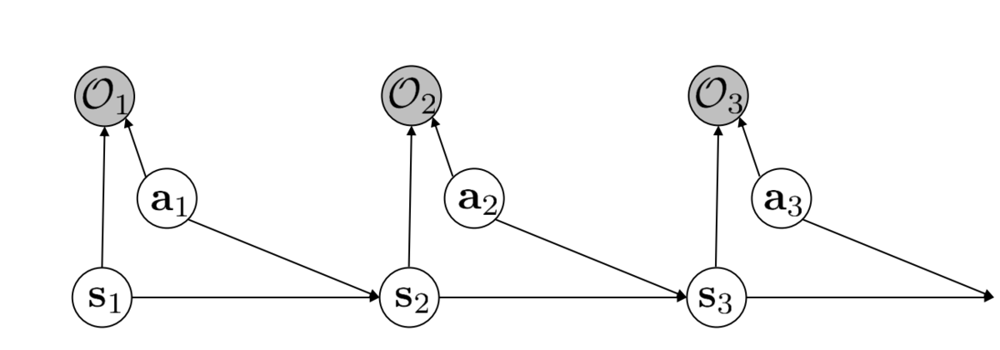

# Maximum a Posteriori Policy Optimization (MPO)

## 目次

- [Maximum a Posteriori Policy Optimization (MPO)](#maximum-a-posteriori-policy-optimization-mpo)
  - [目次](#目次)
  - [概要](#概要)
  - [はじめに](#はじめに)
  - [理論](#理論)
    - [Control as inferenceとは（概要）](#control-as-inferenceとは概要)
      - [最適性確率変数](#最適性確率変数)
    - [最適制御確率の下界の導出](#最適制御確率の下界の導出)
  - [参考文献](#参考文献)
  - [Appendix](#appendix)
    - [用語の解説](#用語の解説)
    - [数式の説明](#数式の説明)
    - [参考文献（Appendix）](#参考文献appendix)

## 概要

**Maximum a Posteriori Policy Optimization**(MPO, [2])とは、**ICLR2018**で発表された、方策が最適である確率の下界を最大化する強化学習手法です。

## はじめに

強化学習で連続値行動環境をコントロールする方策（Policy）を訓練するためには**方策勾配法**が広く使われています。一方で方策勾配法は基本的にオンポリシーであるためにサンプルを使い捨てること（**劣悪なサンプル効率**）、また勾配の分散が大きいこと（**不安定なネットワーク更新**）が問題となります。この改善策として**Trust Region Policy Optimization (2015)**（TRPO, [3]）があり、信頼領域法の導入により安定性は大きく向上しました。ただし依然としてオンポリシーゆえのサンプル効率の悪さは課題として残っています。

MPOは方策勾配法ではなく**Control as Inference**、すなわち確率推論のフレーうワークで制御ポリシーを訓練する手法です。MPOはオフポリシーであるため**サンプル効率が良好**であり、また信頼領域法を用いるため**ロバストな更新**を実現しています。

## 理論

### Control as inferenceとは（概要）

Control as inferenceとは、制御問題を確率的な推論(*inference*)問題として捉えるフレームワークです[4]。このフレームワークは強化学習や最適制御の一般化とみることができ、エージェントは観察と報酬から最適な行動を推論しようとします。エージェントは期待報酬に加えて行動のエントロピーを最大化するため、報酬と不確実性の両方がある行動を好み、探索とロバスト性を確保できます。

はじめにエージェントの行動を表す潜在変数を導入し、状態、行動、報酬に関する同時分布を定義します。次にエージェントは状態と報酬が与えられたときの行動に関する事後分布を求めます。結果として得られる目的は標準的な強化学習の目的と似ていますが、探索を促すエントロピーの項があるという点において異なります。

Control as inferenceは部分観測性などを含めて問題を拡張することを可能にしたり、ナチュラルな探索を可能にする（Maximum Entropy Model）などの利点を持ちます[4]。

#### 最適性確率変数

このフレームワークにいて最も重要なコンセプトは**最適性確率変数**$\mathcal O$です。この手法では行動の最適性を確率分布で表現します。例えばあるトラジェクトリ $\tau$ が与えられたとき、それが最適トラジェクトリである確率は $p(\mathcal O=1|\tau)$、そうでない確率は $p(\mathcal O=0|\tau)$ と表現されます。同様に、状態 $\bm s_t$においてアクション $\bm a_t$ が最適行動である確率は $p(\mathcal O_t=1|\bm s_t, \bm a_t)$ となります。

最適性確率変数導入の最大のメリットは、MDPにおける「最適な制御」をグラフィカルに表現できるようになることです。これにより行動の最適性を明示的に確率分布で表現でき、環境の不確実性を自然に扱えるようになります。また、確率推論のさまざまなツールを利用可能になるのも大きなメリットであり、実際にMPOではEMアルゴリズムやELBOなどを活用しています[1]。

### 最適制御確率の下界の導出

最適性確率変数を $\mathcal O$ とします。MPOの目的は方策 $\pi$で行動決定を実行した際に、それが最適制御である確率 $p_\pi(\mathcal{O}=1)$ を最大化することです。最適制御である確率とは、具体的には

$$\log{p_\pi(\mathcal O=1)}=\log{\int {p_\pi(\tau)p(\mathcal O=1|\tau)d\tau}}$$

すなわちトラジェクトリ $\tau$ が方策 $\pi$ に従って生成されるときに $\tau$ が最適である確率の**期待値**となります。

次にイエンゼンの不等式から、任意の確率分布 $q(\tau)$ について、

$$\begin{align}
&\log{\int {p_\pi(\tau)p(\mathcal O=1|\tau)d\tau}}\\
&\geq \int{q(\tau)\left(\log{p(\mathcal O=1|\tau)+\log \frac{p_\pi(\tau)}{q(\tau)}}\right)d\tau}\\
&=\int{q(\tau)\log{p(\mathcal O=1|\tau)}d\tau}+\int{q(\tau)\log \frac{p_\pi(\tau)}{q(\tau)}d\tau}
\end{align}$$

が成立します。第一項はトラジェクトリ $\tau$ が $q$ に従って生成されるときに、$\tau$ が最適である確率の期待値を意味します。

ここで、トラジェクトリが最適である確率 $p(\mathcal O=1|\tau)$ が $\tau$ の報酬和と指数比例すると想定すると、

$$\begin{align}
&\int{q(\tau)\log{p(\mathcal O=1|\tau)}d\tau}+\int{q(\tau)\log \frac{p_\pi(\tau)}{q(\tau)}d\tau}\\
&=E_{\tau\sim q} \left[\log{\exp {\sum_t \frac{r_t}{\alpha}}} \right] + \int {q(\tau) \log {\frac{p_\pi(\tau)}{q(\tau)}}}d\tau\\
&=E_{\tau\sim q} \left[\sum_t \frac{r_t}{\alpha} \right] + \int {q(\tau) \log {\frac{p_\pi(\tau)}{q(\tau)}}}d\tau
\end{align}$$

このとき、$p,q$ はいずれも方策分布を表します。

## 参考文献

[1] [強化学習 as Inference： Maximum a Posteriori Policy Optimizationの実装](https://horomary.hatenablog.com/entry/2022/07/21/192741)
[2] [Maximum a Posteriori Policy Optimization](https://openreview.net/forum?id=S1ANxQW0b)
[3] [Trust Region Policy Optimization (2015)](https://arxiv.org/abs/1502.05477)
[4] [Control as Inference, mendy, Speaker Deck](https://speakerdeck.com/shunichi09/sergey-levine-lecture-remake-14th-control-as-inference?slide=5)

## Appendix

### 用語の解説

<!-- omit in toc -->
#### objective (目的関数)

*objective*とは強化学習の目的関数のことであり、エージェントが最大化しようとする長期的な報酬の期待値です。一般に、以下のような式で表されます。

$$J(\pi) = E_\pi [\sum_{t=0}^{\infin} \gamma^t r(s_t,a_t)]$$

ここで、$\pi$ はエージェントのポリシー、$\gamma$ は割引率、$r(s_t,a_t)$ は状態 $s_t$ で 行動 $a_t$ を取った時にエージェントが得られる報酬です。

すなわち、目的関数 $J(\pi)$ は、エージェントがポリシー $\pi$ に従って行動したときに、未来に得られる報酬の割引和の期待値を表しています。

### 数式の説明

調べていてわからなかった数式の表現を以下に記載します。

<!-- omit in toc -->
#### $\log{p_\pi(\mathcal{O}=1)}$

方策 $\pi$ の下で最適なアクションを撮る確率は $p_\pi(\mathcal{O}=1)$で表されます。これに対して$\log$ を使用することで、勾配の計算を簡素化し、数値的な問題を回避させています[A1]。より具体的には、勾配と除算を用いた（数学的に同一な）式に比べて、数値的に安定する傾向があるようです。

### 参考文献（Appendix）

[A1] [What is log probability in policy gradient (reinforcement learning)?](https://www.quora.com/What-is-log-probability-in-policy-gradient-reinforcement-learning)