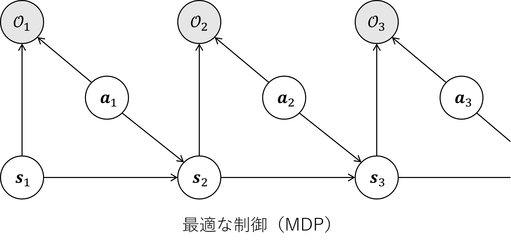

# Maximum a Posteriori Policy Optimization (MPO)

## 目次

- [Maximum a Posteriori Policy Optimization (MPO)](#maximum-a-posteriori-policy-optimization-mpo)
  - [目次](#目次)
  - [概要](#概要)
  - [はじめに](#はじめに)
  - [理論](#理論)
    - [Control as inferenceとは（概要）](#control-as-inferenceとは概要)
      - [最適性確率変数](#最適性確率変数)
    - [最適制御確率の下界の導出](#最適制御確率の下界の導出)
    - [最適制御確率の下界の最大化](#最適制御確率の下界の最大化)
      - [E-step](#e-step)
  - [参考文献](#参考文献)
  - [Appendix](#appendix)
    - [用語の解説](#用語の解説)
      - [補足：KLダイバージェンス ](#補足klダイバージェンス-)
      - [補足：期待値](#補足期待値)
      - [補足：イエンゼンの不等式](#補足イエンゼンの不等式)
    - [数式の説明](#数式の説明)
      - [補足：なぜlog？](#補足なぜlog)
      - [補足：argmaxの意味](#補足argmaxの意味)
      - [補足：イェンセンの不等式を利用した式変形](#補足イェンセンの不等式を利用した式変形)
      - [補足：なぜ報酬和と指数比例？](#補足なぜ報酬和と指数比例)
    - [参考文献（Appendix）](#参考文献appendix)

## 概要

**Maximum a Posteriori Policy Optimization**(MPO, [2])とは、**ICLR2018**で発表された、方策が最適である確率の下界を最大化する強化学習手法です。

## はじめに

強化学習で連続値行動環境をコントロールする方策（Policy）を訓練するためには**方策勾配法**が広く使われています。一方で方策勾配法は基本的にオンポリシーであるためにサンプルを使い捨てること（**劣悪なサンプル効率**）、また勾配の分散が大きいこと（**不安定なネットワーク更新**）が問題となります。この改善策として**Trust Region Policy Optimization (2015)**（TRPO, [3]）があり、信頼領域法の導入により安定性は大きく向上しました。ただし依然としてオンポリシーゆえのサンプル効率の悪さは課題として残っています。

MPOは方策勾配法ではなく**Control as Inference**、すなわち確率推論のフレーうワークで制御ポリシーを訓練する手法です。MPOはオフポリシーであるため**サンプル効率が良好**であり、また信頼領域法を用いるため**ロバストな更新**を実現しています。

## 理論

### Control as inferenceとは（概要）

Control as inferenceとは、制御問題を確率的な推論(*inference*)問題として捉えるフレームワークです[4]。このフレームワークは強化学習や最適制御の一般化とみることができ、エージェントは観察と報酬から最適な行動を推論しようとします。エージェントは期待報酬に加えて行動のエントロピーを最大化するため、報酬と不確実性の両方がある行動を好み、探索とロバスト性を確保できます。

はじめにエージェントの行動を表す潜在変数を導入し、状態、行動、報酬に関する同時分布を定義します。次にエージェントは状態と報酬が与えられたときの行動に関する事後分布を求めます。結果として得られる目的は標準的な強化学習の目的と似ていますが、探索を促すエントロピーの項があるという点において異なります。

Control as inferenceは部分観測性などを含めて問題を拡張することを可能にしたり、ナチュラルな探索を可能にする（Maximum Entropy Model）などの利点を持ちます[4]。

#### 最適性確率変数

このフレームワークにいて最も重要なコンセプトは**最適性確率変数** $\mathcal O$ です。直感的には $\mathcal{O}$ は、（行動を選択することにより）最大の報酬を獲得できるイベントとして解釈可能です。もしくは、強化学習タスクを成功させるイベントとしても捉えられるかもしれません[2]。

この手法では行動の最適性を確率分布で表現します。例えばあるトラジェクトリ $\tau$ が与えられたとき、それが最適トラジェクトリである確率は $p(\mathcal O=1|\tau)$、そうでない確率は $p(\mathcal O=0|\tau)$ と表現されます。同様に、状態 $\pmb{s}_t$においてアクション $\pmb{a}_t$ が最適行動である確率は $p(\mathcal O_t=1|\pmb{s}_t, \pmb{a}_t)$ となります。

最適性確率変数導入の最大のメリットは、MDPにおける「最適な制御」をグラフィカルに表現できるようになることです。これにより行動の最適性を明示的に確率分布で表現でき、環境の不確実性を自然に扱えるようになります。また、確率推論のさまざまなツールを利用可能になるのも大きなメリットであり、実際にMPOではEMアルゴリズムやELBOなどを活用しています[1]。

### 最適制御確率の下界の導出

最適性確率変数を $\mathcal O$ とします。MPOの目的は方策 $\pi$で行動決定を実行した際に、それが最適制御である確率 $p_\pi(\mathcal{O}=1)$ を最大化することです。最適制御である確率とは、具体的には[補足1](#補足なぜlog)

$$\log{p_\pi(\mathcal O=1)}=\log{\int {p_\pi(\tau)p(\mathcal O=1|\tau)d\tau}}$$

すなわちトラジェクトリ $\tau$ が方策 $\pi$ に従って生成されるときに $\tau$ が最適である確率の[**期待値**](#補足期待値)となります。

次にイエンゼンの不等式[補足](#補足イエンゼンの不等式)から、任意の確率分布 $q(\tau)$ について、

$$\begin{align}
&\log{\int {p_\pi(\tau)p(\mathcal O=1|\tau)d\tau}}\\
&\geq \int{q(\tau)\left(\log{p(\mathcal O=1|\tau)+\log \frac{p_\pi(\tau)}{q(\tau)}}\right)d\tau}\\
&=\int{q(\tau)\log{p(\mathcal O=1|\tau)}d\tau}+\int{q(\tau)\log \frac{p_\pi(\tau)}{q(\tau)}d\tau}
\end{align}$$

が成立します[式変形の補足](#補足イェンセンの不等式を利用した式変形)。このうち、第一項はトラジェクトリ $\tau$ が $q$ に従って生成されるときに、 $\tau$ が最適である確率の期待値を意味します。

ここで、 $p(\mathcal{O}=1|\tau) \propto \exp{\sum_t \frac{r_t}{\alpha}}$ となること、すなわちトラジェクトリが最適である確率 $p$ が $\tau$ の報酬和と指数比例することを想定する[補足](#補足なぜ報酬和と指数比例)と、

$$\begin{align}
&\int{q(\tau)\log{p(\mathcal O=1|\tau)}d\tau}+\int{q(\tau)\log \frac{p_\pi(\tau)}{q(\tau)}d\tau} \tag{4}\\
&=E_{\tau\sim q} \left[\log{\exp {\sum_t \frac{r_t}{\alpha}}} \right] + \int {q(\tau) \log {\frac{p_\pi(\tau)}{q(\tau)}}}d\tau\\
&=E_{\tau\sim q} \left[\sum_t \frac{r_t}{\alpha} \right] + \int {q(\tau) \log {\frac{p_\pi(\tau)}{q(\tau)}}}d\tau
\end{align}$$

と変形できます。ここで $\alpha$ は温度パラメータであり、報酬 $r_t$ をスケーリングする役割を持ちます。またこのとき $p, q$ はいずれも方策分布を表します。上式から、報酬和が高いほど最適トラジェクトリである確率が指数的に高まることがわかります。

次に方策のパラメタ $p_\pi(\tau)$ を $p_\pi(\tau)=p(\tau|\pmb\theta)p(\pmb\theta)$ として具体化し、式 $(4)$ の第二項を書き直すと

$$\begin{align}
\int{q(\tau)\log \frac{p_\pi(\tau)}{q(\tau)}d\tau}&=\int{q(\tau)\log \frac{p(\tau|\pmb\theta)p(\pmb\theta)}{q(\tau)}d\tau}\\
&=\int{q(\tau)\log \frac{p(\tau|\pmb\theta)}{q(\tau)}d\tau} + \log p(\pmb\theta)
\end{align}$$

ここで $\int q(\tau)d\tau=1$ です。上式の第一項はKLダイバージェンス[補足](#補足klダイバージェンス) $KL(q(\tau)||p_\pi(\tau|\pmb\theta))$ と同様の形式( $-KL(\cdot)$ )ですが、トラジェクトリ $\tau$ は扱いが困難です。ここでトラジェクトリのKLダイバージェンスは各行動ステップのダイバージェンスに分解できると**想定すれば**（若干ここに無理があるようですが）、上式は

$$\int{q(\tau)\log \frac{p_\pi(\tau)}{q(\tau)}d\tau}=E_{\tau\sim q}\left[-KL(q(\cdot|\pmb s_t)||\pi(\cdot|\pmb s_t, \pmb\theta))\right] + \log p(\pmb\theta)$$

となります。上式および式 $(4)$ から、方策 $\pi$ で行動決定を実行したときにそれが**最適制御である確率** $p_\pi(\mathcal O=1)$ **の下界** $\mathcal J$ を

$$\mathcal J(q,\pmb\theta)=E_{\tau\sim q}\left[\sum_t \frac{r_t}{\alpha}-KL(q(\cdot|\pmb s_t)||\pi(\cdot|\pmb s_t, \pmb\theta))\right] + \log p(\pmb\theta) \tag{10}$$

として規定でき、目的関数[補足](#補足objective-目的関数) $\mathcal J$ を任意の確率分布（今回は方策分布） $q$ と方策パラメータ $\pmb\theta$ で表現することができました。

### 最適制御確率の下界の最大化

この節では**最適制御である確率** $p_\pi(\mathcal O=1)$ **の下界** $\mathcal J$ を最大化するための手法である、**E-step**および**M-step**を説明します。

|ステップ|概要|
|:-:|-|
|E-step| $\pmb\theta$ を定数とみなして $q$ について $\mathcal{J}$ を最大化する|
|M-step| $q$ を定数とみなして $\pmb\theta$ について $\mathcal{J}$ を最大化する|

大まかに各ステップは上記の動作を行い、このステップを繰り返すことで $\mathcal{J}$ を最大化します。
#### E-step

Eステップでは方策パラメータ $\pmb\theta$ を定数とみなし、下界 $\mathcal{J}$ を最大化するような方策分布 $q$ を算出します。前節で導出した式 $(10)$ を用いれば[補足2](#補足argmaxの意味)

$$\begin{align}
&\arg\max_q \mathcal{J}(q,\pmb\theta)\\
=&\arg\max_q {E_{\tau\sim q}\left[\sum_t \frac{r_t}{\alpha}-KL(q(\cdot|\pmb s_t)||\pi(\cdot|\pmb s_t, \pmb\theta))\right] + \log p(\pmb\theta)}
\end{align}$$

となります。ここで、このステップでは $\log p(\pmb\theta)$ は定数であり無視できます。また、温度パラメタ $\alpha$ は非負定数なので、

$$\begin{align}
&\arg\max_q \mathcal{J}(q,\pmb\theta)\\
=&\arg\max_q {E_{\tau\sim q}\left[\sum_t r_t-\alpha KL(q(\cdot|\pmb s_t)||\pi(\cdot|\pmb s_t, \pmb\theta))\right]}
\end{align}$$

さらに、トラジェクトリ期待値 $E_{\tau\sim q}$ を状態行動ステップ期待値 $E_{\mu(s)}$

## 参考文献

[1] [強化学習 as Inference： Maximum a Posteriori Policy Optimizationの実装](https://horomary.hatenablog.com/entry/2022/07/21/192741)

[2] [Maximum a Posteriori Policy Optimization](https://openreview.net/forum?id=S1ANxQW0b)

[3] [Trust Region Policy Optimization (2015)](https://arxiv.org/abs/1502.05477)

[4] [Control as Inference, mendy, Speaker Deck](https://speakerdeck.com/shunichi09/sergey-levine-lecture-remake-14th-control-as-inference?slide=5)

## Appendix

### 用語の解説

<!-- omit in toc -->
#### 補足：objective (目的関数)

> *objective*とは強化学習の**目的関数**のことであり、エージェントが最大化しようとする長期的な報酬の期待値です。一般に、以下のような式で表されます。
> 
> $$J(\pi) = E_\pi [\sum_{t=0}^{\infty} \gamma^t r(s_t,a_t)]$$
>
> ここで、 $\pi$ はエージェントのポリシー、 $\gamma$ は割引率、 $r(s_t,a_t)$ は状態 $s_t$ で 行動 $a_t$ を取った時にエージェントが得られる報酬です。
>
> すなわち、目的関数 $J(\pi)$ は、エージェントがポリシー $\pi$ に従って行動したときに、**未来に得られる報酬の割引和の期待値**を表しています。

#### 補足：KLダイバージェンス <!-- omit in toc-->

> *Kullback-Leivler divergence*（KLダイバージェンス）とは、2つの確率分布がどの程度似ているかを表す尺度です。定義は下記の通りです[A2]。
>
> $$KL(p||q)=\int_{-\infty}^\infty {p(x)\log{\dfrac{p(x)}{q(x)}}}dx$$
> 
> 重要な特性として、**同じ確率分布では0になる**点（ $KL(p||p)=0$ ）、常に0以上の値を取り、**似ていないほど大きな値を取る**点が挙げられます。

#### 補足：期待値

> **期待値**は確率変数を含む関数の実現値に確率の重みをつけた加重平均です。確率変数 $X\sim P_X$ を引数にとる関数 $g(X)$ の $X$ に対する期待値 $\mathbb E_{P_X}\left[g(X)\right]$ は、例えば次のように定義されます[A3]：
>
> $$\mathbb E_{P_X}\left[g(X)\right]=\sum_xP_X(x)g(x)=\int P_X(x)g(x)\mathrm dx$$
>
> 前者は可能な結果の可算集合を持つ確率変数の場合の、後者は密度を持つ確率変数の場合の定義式です。$X$ は**確率変数**であり、結果ごとに値が決定されます（集合ではない）。 $P_X(x)$ は**確率質量変数**といい、 $X$ が特定の値 $x$ を取った場合にその値をとる確率を与えます。 $g(X)$ は確率変数 $x$ の関数です。
>
> 具体例を考えます。2枚のコイン投げで表が出た枚数を数える場合、取りうる値の集合は $\{0,1,2\}$ になります。 $X$ の値はこの集合に含まれますが、 $X$ 自体はこの集合ではありません。 次に、コインを投げたときに合計値が $0,1,2$ になる確率はそれぞれ $0.25,0.5,0.25$ ですが、これはそれぞれ  $P_X(0) = 0.25$, $P_X(1) = 0.5$, $P_X(2) = 0.25$ と表されます。最後に、このコイン投げでプレイヤーはスコアを得るとしましょう。仮に枚数の２倍をスコアとするならば $g(X)=2X$ ですし、２枚以外の場合は０点とするならば $g(X) = \begin{cases} 1 & (X=2) \\ 0 & (X \neq 0) \end{cases}$ などのように定義することができます。後者を採用した場合、スコアの期待値は 
>
> $$\mathbb E_{P_X}\left[g(X)\right]=\sum_{x=0,1,2}P_X(x)g(x)=0.25\space[点]$$
>
> と計算できます。
>
> 期待値 $\mathbb E$ は総和や（ルベーグ）積分により定義されるため、総和や積分の持つ性質をすべて持っています。
>
> > **ルベーグ積分**は、高校までで学習した求積区分法の延長線上の積分（リーマン積分）とは異なり、非連続値であっても計算可能な積分です。
>
> 期待値 "E" の表記方法には $\mathrm E, E, \mathbb E$ などさまざまな表記があり、括弧の表記にも同様に種類があるようですが[A3]、ここでは $\mathbb E[g(X)]$ を使用します。

#### 補足：イエンゼンの不等式

> $f(x)$ が凸関数のとき、
> 
> - 任意の $x_1,...,x_n \in \mathbb R$ と
> - $\lambda_i\ge0,\sum_{i=1}^n\lambda_i=1$ を満たす任意の $\lambda_1, ..., \lambda_n$
>
> に対して次が成立し、これを**イエンゼンの不等式**（凸不等式）と呼びます[A4][A5]。
>
> $$\displaystyle\sum_{i=1}^n\lambda_if(x_i)\ge f\left(\sum_{i=1}^n\lambda_ix_i\right)$$
>
> この不等式は、凸関数上?の任意の $n$ 点が作る凸包上の点（左辺）が、曲線上の点（右辺）よりも上に存在することを示しています。
>
> 
>
> 上図は凸包を橙色の領域で表し、左辺 $\sum_{i=1}^3\lambda_if(x_i)$ に基づく赤い点が、右辺 $f(\sum_{i=1}^3\lambda_ix_i)$ に基づく青い点よりも上に存在していることを示した図です。
>
> > **凸関数**とは、 $f(x)=x^2$ のような、曲線上の任意の2点補足を結ぶ線分が関数の上に存在するような関数です。いわゆる「下に凸な関数」と言えると思います。
> > 
> > ※補足：実際は任意の $x_1,x_2$ に対する２点 $(x_1,f(x_1)), (x_2,f(x_2))$
>
> 連続値の場合にも同様の議論が可能であり、
>
> - 実数 $x$ と
> - 実数上の可積分関数 $p(x)(>0)\space s.t.\space\int p(x)\mathrm dx=1$
>
> に対して次が成立します本当に?（ $y(x)$ は実数上の可積分関数）。
>
> $$\displaystyle\int f(y(x))p(x)dx\ge f\left(\int y(x)p(x)dx\right)$$

### 数式の説明

調べていてわからなかった数式の表現を以下に記載します。

#### 補足：なぜlog？

- $\log{p_\pi(\mathcal{O}=1)}$

方策 $\pi$ の下で最適なアクションを撮る確率は $p_\pi(\mathcal{O}=1)$で表されます。これに対して $\log$ を使用することで、勾配の計算を簡素化し、数値的な問題を回避させています[A1]。より具体的には、勾配と除算を用いた（数学的に同一な）式に比べて、数値的に安定する傾向があるようです。

#### 補足：argmaxの意味

- $\arg\max_q \mathcal J(q,\pmb\theta)$

関数 $\mathcal J(q,\pmb\theta)$ を最大化する $q$ の値を意味します。言い換えれば、これは $\mathcal J$ が目的関数、 $q$ がモデルパラメータである最適化問題の最適解です。

#### 補足：イェンセンの不等式を利用した式変形

- $\log{\int {p_\pi(\tau)p(\mathcal O=1|\tau)d\tau}}\geq \int{q(\tau)\left(\log{p(\mathcal O=1|\tau)+\log \frac{p_\pi(\tau)}{q(\tau)}}\right)d\tau}$

上記の式変形をもう少し詳しく展開します。はじめに、軌跡 $\tau$ に対して任意の確率分布 $q(\tau)$ を導入します。このとき、 $p_\pi(\tau)$ と $p(\mathcal O=1|\tau)$ が $0$ でない $\tau$ に対して、確率分布は $q(\tau)\neq0$ を満たす必要があります。 $q(\tau)$ を用いて、

$$\log{\int {p_\pi(\tau)p(\mathcal O=1|\tau)d\tau}}=\log{\int {\frac{p_\pi(\tau)p(\mathcal O=1|\tau)}{q(\tau)}q(\tau)d\tau}}$$

がわかります。確率分布の性質から $\int q(\tau)d\tau=1$ が恒等的に成立し、イェンセンの不等式を用いることで

$$\log{\int {\frac{p_\pi(\tau)p(\mathcal O=1|\tau)}{q(\tau)}q(\tau)d\tau}}\geq \int{q(\tau)\log{\frac{p_\pi(\tau)p(\mathcal O=1|\tau)}{q(\tau)}}d\tau}$$

を導くことができました。最後に $\log$ の性質を用いることで、冒頭の式を導出することができます。

#### 補足：なぜ報酬和と指数比例？

- $p(\mathcal{O}=1|\tau) \propto \exp{\sum_t \frac{r_t}{\alpha}}$

上記の式は、軌跡 $\tau$ が最適である確率 $p(\mathcal O=1|\tau)$ が 報酬和 $\sum_t r_t$ に指数比例するということを意味しています。このように定義したのは、**報酬の和が大きいほど、その軌道が最適である可能性が高くなる**ことを数式で表す上で、おそらく指数関数を利用するのが都合がよかったのだろうと考えられます。（指数関数を用いることで、報酬和の大きい領域での差に敏感になるように思われる。）

### 参考文献（Appendix）

[A1] [What is log probability in policy gradient (reinforcement learning)?](https://www.quora.com/What-is-log-probability-in-policy-gradient-reinforcement-learning)

[A2] [正規分布間のKLダイバージェンス](https://qiita.com/ceptree/items/9a473b5163d5655420e8)

[A3] [Expected value, Wikipedia](https://en.wikipedia.org/wiki/Expected_value)

[A4] [イェンゼンの不等式の３通りの証明](https://manabitimes.jp/math/600)