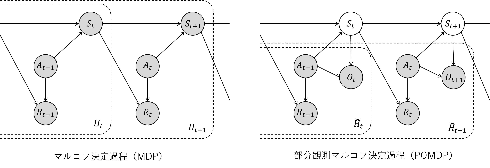

# POMDP

## 目次

- [POMDP](#pomdp)
  - [目次](#目次)
  - [概要](#概要)
  - [理論](#理論)
    - [定義](#定義)
    - [信念状態（belief state）](#信念状態belief-state)
  - [参考文献](#参考文献)
    - [定義と基本的な性質](#定義と基本的な性質)
    - [信念状態](#信念状態)
    - [方策](#方策)
      - [信念状態のマルコフ方策の妥当性](#信念状態のマルコフ方策の妥当性)
      - [続き](#続き)
    - [信念MDP](#信念mdp)
      - [まとめ](#まとめ)
  - [POMDPのプランニング](#pomdpのプランニング)
  - [POMDPの学習](#pomdpの学習)
    - [シミュレータを用いた学習](#シミュレータを用いた学習)
    - [データからの学習](#データからの学習)
    - [参考文献](#参考文献-1)

## 概要

**マルコフ決定過程**（Markov Decision Process; MDP）は現在の行動と状態を**必ず**知ることができる状態遷移が確率的に起こる動的なモデルです。MDPに対して**観測**の要素を取り入れたものが**部分観測マルコフ決定仮定**（Partially Observable Markov Decision Process; POMDP）です。**一部しか観測できない状況**を前提としたモデルのため、**状態を直接取得することはできません**。

他のグラフィカルモデルとの位置づけを比較すると次のようになります[1]。

||決定論|確率論|
|-|-|-|
|状態観測が完全|有限オートマトン|マルコフ連鎖|

||行動なし|行動あり|
|-|-|-|
|状態観測が完全|マルコフ連鎖|MDP|
|状態観測が一部|隠れマルコフモデル|POMDP|

## 理論

### 定義

離散時間の確率過程である（有限）MDPは4つの要素の組 $(\mathcal{S, A}, p_T, r)$ により規定されます。ここで、その要素を

$$\begin{align}
\mathcal{S}=\{s_1,s_2,...,s_N\}&:状態の有限集合\\
\mathcal{A}=\{a_1,a_2,...,a_M\}&:行動の有限集合\\
p_T&:状態遷移関数\\
r&:報酬関数（即時報酬）\\
\end{align}$$

とします。POMDPを離散時間の確率過程 $P$ であると仮定すると、この $P$ は次の通りに定義されます。

$$P\coloneqq \{\mathcal{S, A}, s_{p_0}, p_T, r, \mathcal{O}, p_o\}$$

ここで、 POMDPで追加された要素は以下の通りです。

$$\begin{align}
s_{p_0} &:初期状態の確率\\
\mathcal{O}=\{o_1,o_2,...,o_L\} &:観測の有限集合\\
p_o &:観測遷移確率
\end{align}$$

### 信念状態（belief state）

次に、新しく信念状態（*belief state*）という状態を考えます。環境の状態に関する情報を得るため、エージェントは行動 $a$ と観測 $o$ に基づき信念 $b$ を更新する必要があります。ここで、信念状態 $b(s)\in[0,1]$ は、環境が状態 $s\in\mathcal S$ にいる確率を表します[3]。信念状態は

$$b(s)=P(s|h)$$

で定義され、過去の履歴 $h$ から一意に定まります。また、確率ですので合計すると $\sum_{s\in\mathcal{S}} {b(s)}=1$ となります。加えて、信念状態はマルコフ性を持っており、直前の信念 $b$ 、行動 $a$ 、観測された状態 $o$ から次の信念状態は次のように予測されます。

## 参考文献

[1] [POMDP下での強化学習の基礎と応用](https://www.slideshare.net/yasunoriozaki12/pomdp)

[2] [部分観測マルコフ決定過程と強化学習](https://qiita.com/pocokhc/items/6bf5a9519440fe5bd0d5)

[3] [部分観測マルコフ決定過程, Wikipedia](https://ja.wikipedia.org/wiki/%E9%83%A8%E5%88%86%E8%A6%B3%E6%B8%AC%E3%83%9E%E3%83%AB%E3%82%B3%E3%83%95%E6%B1%BA%E5%AE%9A%E9%81%8E%E7%A8%8B)

> ※注意※
>
> 後で $Pr($ をすべて　$\mathrm{Pr}($ に変換する
>
> ※注意※

### 定義と基本的な性質

POMDPとして $P\triangleq \{\mathcal{S,A},p_{s_0},p_T,g,\mathcal{O},p_o\}$ の7つ組で定義される離散時間の確率過程を考えます。ここで $\{\mathcal{S,A},p_{s_0},p_T,g\}$ はMDPで用いられるものと同じであり、ほかは次の通りです。

- 有限観測集合 $\mathcal O\triangleq\{o^1,...,o^{|\mathcal O|}\}\ni o$
- 観測確率関数 $p_o$ : $\mathcal{O\times A\times S}\to [0,1]$ : $p_o(o|\grave{a},s)\triangleq \mathrm{Pr}(O_t = o|A_{t-1}=\grave{a},S_t=s), \forall t\in \mathbb{N}$

もっとも重要な点として、エージェントは観測（または観測信号）とよばれる値 $o\in \mathcal O$ を環境から観測します。

> POMDPにおける状態 $s$ は観測できない。このような変数を **潜在変数** または **隠れ状態** と呼ぶ。

POMDPでの時間ステップ $t$ までの履歴 $\check{h_t}\in\check{\mathcal{H}_t}$ を次のように定義します。

$$\check{h_t}\triangleq\{a_0,r_0,o_1,...,a_{t-1},r_{t-1},o_t\} \tag1$$

ここで、履歴 $\check{h}$ にチェックがついているのは、POMDPの履歴をMDPの履歴と区別するためである。

図１．MDPとPOMDPのグラフィカルモデル[0]

POMDPのグラフィカルモデルから、 $S_t$ が与えられると $\check{H_t}$ と $\check{H}_{t+1}$ \ $\check{H}_t\space (\triangleq\{A_t,R_t,O_{t+1}\})$ が独立であることがわかります。つまり、

$$\mathrm{Pr}(\check{H}_t,A_t,R_t,O_{t+1}|S_t,P)=\mathrm{Pr}(\check{H}_t|S_t,P)\mathrm{Pr}(A_t,R_t,O_{t+1}|S_t,P)\tag2$$

が成り立ちます。式 $(2)$ のような条件付独立を、Dawid(1979)[41] の記法を用いて

$$\check{H}_t \mathop{\perp\!\!\!\perp} A_t,R_t,O_{t+1}|S_t$$

と表記します。同様に、グラフィカルモデルから次のように様々な条件付独立性を示すことができます。

$$\check{H}_t \mathop{\perp\!\!\!\perp} A_t,R_t,S_{t+1},O_{t+1}|S_t \tag3$$
$$R_t \mathop{\perp\!\!\!\perp} S_{t+1},O_{t+1}|S_t,A_t \tag4$$

POMDPの解法では、このような確率変数の独立性を利用します。

### 信念状態

POMDPを考えるために**信念状態**を導入し、信念状態に基づく方策の性質を説明します。信念状態とはこれまでの履歴から今現在いずれの隠れ状態 $s\in\mathcal S$ にあるかを表す変数で、環境からの観測があるたびに更新されます。具体的には、ある時間ステップ $t\in\mathbb{N}_0$ の信念状態 $b_t$ は履歴 $\check{h}_t$ が与えられたときの状態 $S_t$ の条件付確率関数 $b_t\colon \mathcal{S\times \check{H}_t}\to [0,1]$ として定義されます。

$$b_t(s;\check{h}_t)\triangleq \mathrm{Pr}(S_t=s|\check{H}_t=\check{h}_t,P),\space \forall s\in \mathcal S\tag5$$

以降、簡便化のため、履歴 $\check{h}_t$ の区別が必要でない限り、 $b_t(s;\check{h}_t)$ の $\check{h}_t$ を省略して $b_t(s)$ と表記することにします。信念状態の集合を

$$\mathcal{B}\triangleq\left\{b\colon\mathcal{S}\to[0,1]\colon\sum_{s\in\mathcal{S}}{b(s)}=1\right\} \tag6$$

と表記し、**信念空間**と呼びます。なお、信念状態は確率変数である履歴 $\check{H}$ に依存するので確率変数であり、これまで通り確率変数として扱う場合は $B$ 、実現値の場合は $b$ と表記します。

信念状態の計算方法ですが、その定義から、 $b_{t+1}$ を単純に計算しようとすると、履歴全体 $\check{h}_{t+1}=\{a_0,r_0,o_1,...,a_{t-1},r_{t-1},o_t\}$ から求める必要があり、大変です。しかし、信念状態の重要な特徴として、次式のように $\{b_t,a_t,r_t,o_{t+1}\}$ が $b_{t+1}$ に対する十分統計量となり、 $\check{h}_t$ の代わりに $b_t$ を用いても $b_{t+1}$ が求められること、つまり系列 $B_0,B_1,...$ をマルコフ過程とみなすことができます。任意の $s'\in\mathcal S$ について、

$$\begin{align}
b_{t+1}(s')&=\mathrm{Pr}(S_{t+1}=s'|\check{h}_{t+1})\\
&=\mathrm{Pr}(S_{t+1}=s'|\check{h}_t,a_t,r_t,o_{t+1})\\
&=\frac{\mathrm{Pr}(r_t,S_{t+1}=s' ,o_{t+1}|\check{h}_t,a_t)}{\sum_{s'\in\mathcal{S}}{\mathrm{Pr}(r_t,S_{t+1}=s' ,o_{t+1}|\check{h}_t,a_t)}} \space (\because Bayes' theorem)\\
&=\frac{\sum_{s\in\mathcal{S}}{\mathrm{Pr}(r_t,S_{t+1}=s' ,o_{t+1}|S_t=s,a_t)\mathrm{Pr}(S_t=s|\check{h}_t)}}{\sum_{s'\in\mathcal{S}}{\sum_{s\in\mathcal{S}}{\mathrm{Pr}(r_t,S_{t+1}=s' ,o_{t+1}|S_t=s,a_t)\mathrm{Pr}(S_t=s|\check{h}_t)}}} \space(\because Equ.(3))\\
&=\frac{p_o(o_{t+1}|a_t,s')\sum_{s\in\mathcal{S}}{p_T(s'|s,a_t)\mathbb{I}_{\{g(s,a_t)=r_t\}}b_t(s)}}{\sum_{s'\in\mathcal{S}}{p_o(o_{t+1}|a_t,s')\sum_{s\in\mathcal{S}}{p_T(s'|s,a_t)\mathbb{I}_{\{g(s,a_t)=r_t\}}b_t(s)}}} \space(\because Equ.(4)) \tag7
\end{align}$$

> 指示関数 $\mathbb{I}_B$ : 事象 $B$ が真なら $1$ 、そうでないなら $0$ を出力する。本来は白抜きの $1$ などで記述するが、当環境では再現に難があったため $\mathbb{I}$ で代用している。

簡便化のため、**信念状態作用素** $\Psi\colon\mathcal{B\times A\times R\times O\to B}$ を任意の $s' \in \mathcal S$ に対して

$$(\Psi(b,a,r,o'))(s')\triangleq\frac{p_o(o_{t+1}|a_t,s')\sum_{s\in\mathcal{S}}{p_T(s'|s,a_t)\mathbb{I}_{\{g(s,a_t)=r_t\}}b_t(s)}}{\sum_{s'\in\mathcal{S}}{p_o(o_{t+1}|a_t,s')\sum_{s\in\mathcal{S}}{p_T(s'|s,a_t)\mathbb{I}_{\{g(s,a_t)=r_t\}}b_t(s)}}}\tag8$$

と定義します。

> 右辺の分母が0の場合、 $\Psi$ は定義されません。

このとき、信念状態の再帰式 $(7)$ を

$$b_{t+1}=\Psi(b_t,a_t,r_t,o_{t+1})\tag9$$

と書き直せます。作用素 $\Psi$ は、ベルマン作用素 $\mathrm B$ などと同様に、環境モデル $p_{s_0}, p_T,p_o$ が既知であれば計算可能ですから、信念状態 $b$ を逐次的に更新 $b_{t+1}\coloneqq\Psi(b_t,a_t,r_t,o_{t+1})$ することは、（隠れ状態数 $|\mathcal S|$ が膨大でなければ）簡単です。

なお、ここでは行動 $a$ と観測 $o$ だけでなく報酬 $r$ も考慮して式 $(5)$ のように信念状態を定義していますが、POMDPのベンチマーク課題の多くは状態 $S_t$ と報酬系列 $\{R_0,...,R_t\}$ とが条件つき独立になるような特別な構造をもつため、報酬を考慮しないで信念状態を定義することも多いです。

> 任意の $(\grave{a},s)\in\mathcal{A\times S}$ の状態集合 $\mathcal{S}_{\grave{a},o}\triangleq\{s\in\mathcal{S}\colon p_o(o|\grave{a},s)>0\}$ に対して、報酬関数 $g$ を関数 $\bar{g}\colon\mathcal{A\times O\times A\to R}$ を用いて
>
> $$g(s,a)=\bar{g}(\grave{a},o,a),\space\forall s\in\mathcal{S}_{\grave{a},o},\forall a\in\mathcal{A}$$
>
> と書くことのできるPOMDPであれば、状態と報酬は条件付独立となり、信念状態の計算で報酬を考慮する必要がなくなります。ここで、 $\grave{a}$ は $1$ ステップ前の行動を表します。なぜなら、信念状態 $b$ の更新式 $(7)$ より $\{s\in \mathcal {S}\colon b_t(s)>0\}\subseteq\mathcal{S}_{a_{t-1},o_t}$ なので、仮定より
>
> $$g(s,a_t)=\bar{g}(a_{t-1},o_t,a_t)=r_t,\space\forall s\in\{s\in \mathcal {S}\colon b_t(s)>0\}$$
>
> となり、
>
> $$\mathbb{I}_{\{g(s,a_t)=r_t\}}=1,\space\forall s\in\{s\in \mathcal {S}\colon b_t(s)>0\}$$
>
> となりますので、 $b$ の更新式 $(7)$ を $\bar{b}$ の更新式 $(9)$ に書き換えることができるからです。

つまり、式(1) の履歴 $\check{h}_t$ から報酬を省略した履歴 $\check{h_t}\triangleq\{a_0,r_0,...,a_{t-1},r_{t-1},o_t\}$ を用いて信念状態を

$$\bar{b}_t(s)\triangleq \mathrm{Pr}(S_t=s|\bar{H}_t=\bar{h}_t)$$

と定義します。このときの信念状態 $\bar{b}$ の更新則は

$$\bar{b}_{t+1}(s')\propto p_o(o_{t+1}|a_t,s')\sum_{s\in\mathcal{S}}{p_T(s'|s,a_t)\bar{b}_t(s)}\tag9$$

となり、$b$ の更新式 $(7)$ と比べて簡単です。しかし、状態と報酬が条件付独立とは限らない一般のPOMDPの場合、信念状態の更新に報酬を用いないと、報酬を用いた場合にくらべ信念状態の不確実性が大きくなり、信念状態にもとづく方策の性能が著しく悪くなる場合があることが実験的にも示されています[83]。

### 方策

POMDPにおける方策を定義します。POMDPはMDPとは異なり $s$ を観測できないため、MDPの $\pi^d\in\Pi^d$ や $\pi^h\in\Pi^h$ などの状態 $s$ や履歴 $h$ に関する方策を、次のように信念状態 $b$ やPOMDPでの履歴 $\check h$ に関する方策として再定義します。

$$\left .\begin{array}{r}
\check\Pi\triangleq&\left\{\check{\pi}\colon\mathcal{A\times B}\to[0,1]\colon\displaystyle\sum_{a\in\mathcal{A}}{\check{\pi}(a|b)}=1,\space\forall s\in\mathcal S\right\}\\
\check\Pi^d\triangleq&\left\{\check{\pi}^d\colon\mathcal{B\to A}\right\}\\
\check\Pi^h_t\triangleq&\left\{\check{\pi}^h_t\colon\mathcal{A\times \check{H}_t}\to[0,1]\colon\displaystyle\sum_{a\in\mathcal{A}}{\check{\pi}^h_t(a|\check{h}_t)}=1,\space\forall\check{h}_t\in\check{H}_t\right\}
\end{array}\right.\tag{10}$$

ここで、 $\check{\pi}\in\check\Pi$ と $\check\pi^d\in\check{\Pi}^d$ はそれぞれ信念状態 $b$ の確率的方策と決定的方策であり、それらを単にマルコフ方策と呼ぶこともあります。 $\check{\pi}^h_t\in\check{\Pi}^h_t$ は履歴 $\check{h}_t$ の確率的方策です。明示的には示しませんが、方策系列についても同様に再定義でき、以降チェック $\check{　}$ を付けてマルコフ決定過程のものと区別することにします。

以下、マルコフ方策系列 $\pmb{\check{\pi}}^m\triangleq\{\check\pi_0\in\check\Pi, \check\pi_1\in\check\Pi,...\}$ の特徴を確認します。

#### 信念状態のマルコフ方策の妥当性

任意のPOMDP $\mathrm P$ と、履歴依存の方策系列 $\pmb{\check\pi}^h=\{\check\pi_0^h\in\check\Pi_0^h, \check\pi_1^h\in\check\Pi_1^h,...\}$ に対して、次を満たすような信念状態の確率的方策の系列 $\pmb{\check{\pi}}^m\triangleq\{\check\pi_0\in\check\Pi, \check\pi_1\in\check\Pi,...\}\in\pmb{\check\Pi}^M$ が存在する。

$$\mathrm{Pr}(S_t=s,A_t=a|P(\pmb{\check\pi}^h))=\mathrm{Pr}(S_t=s,A_t=a|P(\pmb{\check\pi}^m)),\space \forall (t,s,a)\in\mathbb{N}_0\times\mathcal{S\times A} \tag{11}$$

#### 続き

以降、方策の集合をひとまとめにして $\pmb{\check\Pi}\triangleq(\pmb{\check\Pi}^H\cup\pmb{\check\Pi}^M)$ と定義します。なお、遷移可能な信念状態はつねに対応する履歴を１つ以上もつので、実質 $\pmb{\check\Pi}^H\supseteq\pmb{\check\Pi}^M$ です。よって $(11)$ から、MDPの場合と同様に目的関数 $f\colon\pmb{\check\Pi}\to\mathbb{R}$ を

$$f(\pmb{\check\pi})=f'(\mathrm{Pr}(S_0,A_0|P(\pmb{\check\pi})),\mathrm{Pr}(S_1,A_1|P(\pmb{\check\pi})),...),\space\forall \pmb{\check\pi}\in\pmb{\check\Pi} \tag{12}$$

のように表現できるのならば、

$$\max_{\pmb{\check\pi}\in\pmb{\check\Pi}^M}{f(\pmb{\check\pi})}=\max_{\pmb{\check\pi}\in\pmb{\check\Pi}^H}{f(\pmb{\check\pi})}$$

が成立することになります。そのため、MDPの場合と同様に、期待リターン

$$f_p(\pmb{\check\pi})\triangleq\mathbb{E}\left[\sum_{t=0}^\infty{\gamma^tR_t|P(\pmb{\check\pi})}\right]$$

を目的関数とすれば、

> $f_p$ は、特定の状態に対する期待リターンではなく、 $s_0\sim p_{s_0}$ の場合の期待リターンを考えていることになります。

$$\left.\begin{array}{r}
f_p(\pmb{\check\pi})=&\displaystyle\sum_{t=0}^\infty\gamma^t\mathbb{E}[g(S_t,A_t)|P(\pmb{\check\pi})]\\
=&\displaystyle\sum_{t=0}^\infty\sum_{s_t\in\mathcal{S}}\sum_{a_t\in\mathcal{A}}{\mathrm{Pr}(S_t,A_t|P(\pmb{\check\pi}))g(S_t,A_t)}
\end{array}\right.$$

のように書き直せ、式 $(12)$ のような構造をもつので、

$$\max_{\pmb{\check\pi}\in\pmb{\check\Pi}^M}f_p(\pmb{\check\pi})=\max_{\pmb{\check\pi}\in\pmb{\check\Pi}^H}f_p(\pmb{\check\pi})\tag{14}$$

が成立します。したがって、目的関数が式 $(13)$ の場合、履歴依存の方策系列の集合 $\pmb{\check\Pi}^H$ まで考える必要はなく、信念状態に基づくマルコフ方策系列の集合 $\pmb{\check\Pi}^M$ を考えれば十分です。つまり、POMDPにおける期待リターンの最大化問題は次の最適方策 $\pmb{\check\pi}^*$ の探索問題に帰着できます。

$$\pmb{\check\pi}^*=\argmax_{\pmb{\check\pi}\in\pmb{\check\Pi}^M}f_p(\pmb{\check\pi})\tag{15}$$

以降は、POMDP問題として上式の最適化問題を考えます。

### 信念MDP

式 $(7)$ で示したように信念状態の系列 $B_0,B_1,...$ はマルコフ性を持つ確率過程であり、行動選択に依存するので、信念状態を状態とするMDPを考えることができます。これは**信念マルコフ決定過程**もしくは**信念MDP**とよばれ、基本的にはベルマン方程式の解の一意性などの性質を持ちます。ただし、これまで扱ってきたMDPでは状態数 $|\mathcal S|$ が有限だったのに対して、信念状態の定義域である信念空間 $\mathcal B$ （式 $(6)$ ）は実数空間であり、状態数は発散しうるため、信念MDPは従来のMDPとすこし異なります。とくに、価値関数の扱いが難しく、後述の近似的アプローチが必要です。また、本来であれば信念MDPを厳格に扱うため、可算無限大の状態を持つMDPの数理の確認が必要ですが、考え方は有限状態のMDPとほとんど変わりませんので省略します。以下、信念MDPを定義し、価値関数 $V_b$ を導入し、 $V_b$ とPOMDPにおける目的関数 $f_p$ との関係性を明らかにして、式 $(15)$ のPOMDP問題を解くためい信念MDPを扱うことが妥当であることを示します。

信念MDPの状態である信念状態の遷移確率ですが、状態が連続空間にあるので、確率分布関数ではなく確率密度関数 $p_b\colon\mathcal{B\times B\times A}\to\bar{\mathcal{R}}_{\geq 0},\space \int_{b'\in\mathcal{B}}{p_b(b'|b,a)db'}=1$ として、式 $(8)$ の信念状態作用素 $\Psi$ を用いれば、任意の $(b',b,a)\in\mathcal{B\times B\times A}$ について、次のように定義できます。

$$\begin{aligned}
p_b(b'|b,a)\triangleq&\lim_{\varepsilon\to\infty}{\frac{Pr(b'\leq B_{t+1}\leq b'+\varepsilon|B_t=b, A_t=a)}{\varepsilon}}\\
=&\sum_{s'\in\mathcal S}\sum_{o'\in\mathcal O}\sum_{o'\in\mathcal {R}}\sum_{s\in\mathcal S}\delta_{\{b'=\Psi(b,a,r,o')\}}p_o(o'|a,s')p_T(s'|s,a)\mathbb{I}_{\{g(s,a)=r\}}b(s)
\end{aligned}\tag{16}$$

ここで、$\delta_{\{x\}}$ はディラックのδ関数で、

$$\delta_{\{x\}}=\left\{\begin{aligned}&+\infty\space&(x=0)\\&0\space&(x\neq0)\end{aligned}\right.$$

であり、 $\int_{-\infty}^\infty \delta_{\{x\}}dx=1$ を満たす関数です。信念MDPにおける報酬関数 $g_b\colon\mathcal{B\times A}\to\mathbb R$ としては、もとの報酬関数 $g$ の信念状態 $b$ による線形和

$$g_b(b,a)\triangleq\sum_{s\in\mathcal{S}}{b(s)g(s,a)}\tag{17}$$

を用いることにします。また、初期状態（時間ステップ $t=0$ の信念状態）は $b_0$ とします。以上より、信念MDPを $M_b\triangleq\{\mathcal{B,A,}b_0,p_b,g_b\}$ の５つ組として定義できます。また、 $M_b$ において方策 $\check\pi$ に従い行動選択する確率過程を $M_b(\check\pi)$ として表記することにします。

ここで簡単化のため、行動 $a_t$ を選択し実行し、次に行動 $a_{t+1}$ を実行するまでに観測される情報 $r_t$ と $o_{t+1}$ を纏めて $z_t\triangleq(r_t,o_{t+1})\in\mathcal{Z}\triangleq\mathcal{R\times O}$ と表記することにします。確率変数 $Z$ に関する条件付確率分布関数を次のように定義します。

- 条件 $(s,a)$ のもとでの $(z,s')$ の確率 $p_{zs'}^{sa}\colon\mathcal{Z\times S\times S\times A}\to[0,1]$ ;

$$\begin{aligned}
p_{zs'}^{sa}(z=(r,o'),s'|s,a)\triangleq& Pr(Z_t=z,S_{t+1}=s'|S_t=s,A_t=a)\\
=&p_o(o'|a,s')p_T(s'|s,a)\mathbb{I}_{\{g(s,a)=r\}}\tag{18}
\end{aligned}$$

- 条件 $(s,a)$ のもとでの $z$ の確率 $p_z^{sa}\colon\mathcal{Z\times S\times A}\to[0,1]$ ; 

$$\begin{aligned}
p_z^{sa}(z|s,a)\triangleq& Pr(Z_t=z|S_t=s,A_t=a)\\
=&\sum_{s'\in\mathcal{S}}p_o(o'|a,s')p_T(s'|s,a)\mathcal{I}_{\{g(s,a)=r\}}\\
=&\sum_{s'\in\mathcal{S}}p_{zs'}^{sa}(z,s'|s,a)
\end{aligned}\tag{19}$$

- 条件 $(b,a)$ のもとでの $z$ の確率 $p_{z}^{ba}\colon\mathcal{Z\times B\times A}\to[0,1]$ ;

$$\begin{aligned}
p_z^{ba}(z|b,a)\triangleq& Pr(Z_t=z|B_t=b,A_t=a)\\
=&\sum_{s'\in\mathcal{S}}p_o(o'|a,s')\sum_{s\in\mathcal{S}}p_T(s'|s,a)\mathbb{I}_{\{g(s,a)=r\}}b(s)\\
=&\sum_{s\in\mathcal{S}}p_z^{sa}(z|s,a)b(s)
\end{aligned}\tag{20}$$

また、生起確率がゼロでない $\mathcal Z$ の要素のみからなる部分集合を

$$\tilde{\mathcal Z}\triangleq\left\{z\in\mathcal{Z}\colon\sum_{s\in\mathcal{S}}\sum_{a\in\mathcal{A}}p_z^{sa}(z|s,a)>0\right\}$$

と定義します。以上の定義を用いることで、式の見通しがよくなります。例えば、式 $(20)$ から、式 $(16)$ の信念状態の遷移の確率密度を

$$p_b(b'|b,a)=\sum_{z\in\tilde{\mathcal Z}}\delta_{\{b'=\Psi(b,a,z)\}}p_z^{ba}(z|b,a)\tag{21}$$

と書き直すことができ、 $p_b$ は実質 $z$ の条件付生起確率 $p_z^{ba}$ であることがわかります。

次に、信念MDPにおける価値関数を導入し、POMDP問題との関連性を明らかにします。価値関数とは初期状態と方策が与えられたときの期待リターンのことなので、信念MDPにおける方策系列 $\check{\pmb{\pi}}\in\check{\pmb\Pi}$ の価値関数 $V_b^{\check{\pmb\pi}}\colon\mathcal B\to\mathbb R$ を

$$V_b^{\check{\pmb\pi}}\triangleq\mathbb{E}\left[\sum_{t=0}^\infty{\gamma^t g_b(B_t,A_t)|B_0=b,M_b(\check{\pmb\pi})}\right],\space\forall b\in\mathcal{B}\tag{22}$$

と定義します。このとき、信念状態の定義（式 $(5)$ ）から、

$$\begin{aligned}
\mathbb{E}\left[B_t(s)|B_0=b,M_b(\check{\pmb\pi})\right]=&\sum_{h\in\check{\mathcal H}_t}{b_t(s;h)Pr(\check{H_t}=h|p_{s_0}=b,P(\check{\pmb\pi}))}\\
=&\sum_{h\in\check{\mathcal H}_t}{Pr(S_t=s|\check{H_t}=h,P)Pr(\check{H_t}=h|p_{s_0}=b,P(\check{\pmb\pi}))}\\
=&Pr(S_t=s|p_{s_0}=b,P(\check{\pmb\pi})), \forall(s,b,\pmb\pi)\in\mathcal{S\times B}\times \check{\pmb \Pi}
\end{aligned}$$

が成り立ちますので、任意の $\check{\pmb\pi}\in\check{\pmb\Pi}$ について、式 $(22)$ の価値関数を

$$\begin{aligned}
V_b^{\check{\pmb\pi}}(b)=&\sum_{t=0}^\infty{\gamma^t\mathbb{E}[g_b(B_t,A_t)|B_0=b,M_b(\check{\pmb\pi})]}\\
=&\sum_{t=0}^\infty{\gamma^t\mathbb{E}\left[\sum_{s\in\mathcal{S}}{B_t(s)g(s,A_t)|B_0=b,M_b(\check{\pmb\pi})}\right]}\\
=&\sum_{t=0}^\infty{\gamma^t\mathbb{E}\sum_{s\in\mathcal{S}}\sum_{a\in\mathcal{A}}{Pr(S_t=s,A_t=a|p_{s_0}=b,P(\check{\pmb\pi}))g(s,a)}}\\
=&\mathbb{E}\left[\sum_{t=0}^\infty{\gamma^tR_t|p_{s_0}=b,P(\check{\pmb\pi})}\right],\space\forall b\in\mathcal{B}
\end{aligned}\tag{23}$$

と書き直すことができます。よって、任意の $\pmb{\check\pi}\in\pmb{\check\Pi}$ について、POMDPの目的関数（式 $(13)$ ）を信念状態の価値関数 $V_b^{\check\pi}$ を用いて

$$f_p(\pmb{\check\pi})=V_b^{\check\pi}(p_{s_0})\tag{24}$$

とかくことができ、POMDP問題（式 $(15)$ ）を信念MDPにおける最適方策

$$\pmb{\check\pi}^*=\argmax_{\pmb{\check\pi}\in\pmb{\check\Pi}^M} {V_b^{\check\pi}(p_{s_0})}$$

の探索問題に帰着できます。

> 命題 2.7（最適方策の存在性と必要十分条件）
>
> 最適方策になりうる定常な決定的方策 $\pi^*\in\Pi^d\space(\subset\Pi)$ が存在し、ある $\pi^*$ が最適方策であることの必要十分条件は、 $\pi^*$ のベルマン期待作用素 $B_{\pi^*}$ によるベルマン期待方程式 $(2.10)$ の不動点 $V^{\pi^*}$ が最適価値関数 $V^*$ （式 $(2.2)$ ）であること、つまり
>
> $$V^*(s)=(B_{\pi^*}V^*)(s),\space\forall s\in\mathcal{S}\tag{2.28}$$
>
> が成立することである。

> ベルマン期待方程式
>
> $$V^\pi(s)=(B_\pi V^\pi)(s),\space\forall s\in\mathcal S\tag{2.10}$$
> 
> $$V^*(s)=(B_* V^*)(s),\space\forall s\in\mathcal S\tag{2.10}$$

> 最適価値関数： $V^*\colon\mathcal{S}\to\mathbb{R}$ 
>
> $$V^*(s)\triangleq\max_{\pmb\pi\in\pmb\Pi^H}V^{\pmb\pi}(s)\tag{2.2}$$
>
> ここで最適価値関数は、価値関数の重み付き和 $f_w$ の特別な場合である、状態 $s$ の期待リターン $f_w(\pmb\pi;e^{|\mathcal S|}_s)=\mathbb{E}^\pi[C_0|S_0=s]=V^{\pmb\pi}(s)$ を目的関数とした場合の、その最適値を意味します。

上記は非常に有益な結果で、隠れ状態のある一見取り扱いが難しそうなPOMDPを直接扱う必要がなくなります。また、アルゴリズムの設計に有用なMDPの理論解析結果を利用でき、特に、命題2.7から、非定常な方策（方策系列） $\check{\pmb\pi}\in\check{\pmb\Pi}^M$ でなくても定常な決定方策 $\check\pi^d\in\check\Pi^d$ （式 $(10)$ ）でも最適方策を達成できます。つまり、

$$\max_{\check\pi^d\in\check\Pi^d}{V_b^{\check\pi^d}(p_{s_0})}=\max_{\check{\pmb\pi}\in\check{\pmb\Pi^M}}{V_b^{\check{\pmb\pi}}(p_{s_0})}=\max_{\check{\pmb\pi}\in\check{\pmb\Pi^M}}{f_p(\check{\pmb\pi})}\tag{25}$$

が成立します。さらに、命題2.7から、信念MDPにおける最適価値関数

$$V_b^*(b)\triangleq\max_{\check\pi\in\check\Pi^d}V_b^{\check\pi}(b),\space\forall b\in\mathcal{B}\tag{26}$$

に対して、

$$V_b^*(b)=V_b^{\check\pi^{d*}}(b),\space\forall b\in\mathcal{B}$$

> 定常な決定的方策 $\pi^{d*}\in\Pi^d$ を
>
> $$\pi^{d*}(s)\coloneqq\argmax_{a\in\mathcal{A}}\left\{g(s,a)+\gamma\sum_{s'\in\mathcal{S}}p_T(s'|s,a)V^*(s')\right\}\tag{2.29}$$
>
> のように設計すれば、ベルマン作用素の定義式 $(2.7)$ と $(2.8)$ から、 $B_{\pi^{d*}}=B_*$ が成り立ちます。ただし、 $\argmax_{a\in\mathcal{A}}$ の計算において、同一の最大値を持つ複数の行動 $a$ がある場合、あるきまった順序で扱うものとします（確率的に選択することも許される）。

を満たす最適方策 $\check\pi^{d*}\in\check\Pi^d$ が存在します。また、式(2.29)から、次のように最適方策 $\check\pi^{d*}\colon\mathcal{B\to A}$ を求めることができます。

$$\check\pi^{d*}\coloneqq\argmax_{a\in\mathcal{A}}\left\{g_b(b,a)+\gamma\int_{b'}{p_b(b'|b,a)V_b^*(b')db'}\right\},\space b\in\mathcal{B}\tag{27}$$

また、命題2.4から、 $V_b^*$ は次の信念MDPにおけるベルマン最適方程式の唯一の解となります。

$$V_b^*(b)=\max_{a\in\mathcal{A}}\left\{g_b(b,a)+\gamma\int_{b'}{p_b(b'|b,a)V_b^*(b')db'}\right\},\space\forall b\in\mathcal{B}$$

> 命題 2.4
>
> a. ベルマン最適方程式 $(2.11)$ の解になる関数 $v\colon\mathcal{S}\to\mathbb{R}$ は
>
> $$(B_*v)(s)=v(s),\space\forall s\in\mathcal{S}\tag{2.19}$$
>
> を満たすが、それは最適価値関数 $V^*$ ただ１つである。
>
> b. 定常方策 $\pi\in\Pi$ のベルマン期待方程式 $(2.10)$ の解になる関数 $v\colon\mathcal{S}\to\mathbb{R}$ は
>
> $$(B_\pi v)(s)=v(s),\space\forall s\in\mathcal{S}$$
>
> を満たすが、それは $\pi$ の価値関数 $V^\pi$ ただ１つである。

#### まとめ

以上より、POMDPにおける最適方策の探索問題は、基本的には、MDPにおける価値反復法のように、式 $(28)$ のベルマン最適方程式を解くことで $V_b^*$ を求めて、式 $(27)$ にもとづいて $V_b^*$ から最適方策 $\check\pi^{d*}$ を求めればよいことがわかります。

ただし注意すべきことは、通常の有限状態数のMDPとことなり、信念MDPでは状態数が有限でないため、テーブル形式の関数で価値関数を正確に表現することはできず、また式 $(27),(28)$ は $b$ に関する積分を含むため、従来の価値反復法などをそのまま適用することはできません。そのため、次節で紹介するような信念MDPの特徴を利用して、プランニング方法を設計する必要があります。

## POMDPのプランニング

> MDPの場合のプランニング方法の確率的近似としてTD学習やQ学習などがある。これらが「確率的近似」であるのは、厳密法は計算量が問題になるため。

POMDPの環境モデルPが基地であるとして、プランニング（最適方策を求める）方法を説明します。前節でPOMDPを信念MDPの問題に帰着できることを確認しましたが、信念状態が連続空間にあるため、離散状態のMDPのプランニング方法をそのまま利用することはできません。そこで、[信念MDPの特徴]節でプランニング方法を導出する上での大切な信念MDPの特徴を示し、[動的計画法に基づくプランニング]節で動的計画法に基づくプランニングを説明します。実装例として、厳密法（[厳密法]節）と計算量を抑えて近似的にプランニングを行う**点近似の価値反復法**（[近似法]節）を紹介します。

## POMDPの学習

前節ではPOMDPのモデル $P$ を既知としていましたが、ここでは未知とし、方策を学習することを考えます。これまで重要な役割を果たしていた信念状態ですが、求めるには $P$ の知識が必要なため、本問題設定では信念状態によらない方策のあつかいや信念状態の推定などが必要になります。以降、ブラックボックスなシミュレータから学習する方法を[シミュレータを用いた学習]節、データから学習する方法を[データからの学習]節で説明します。

### シミュレータを用いた学習

POMDPのモデル $P$ は未知ですが、シミュレータもしくはブラックボックス生成モデルが与えられているとして、MDPの場合（5.3節）と同じように、木探索などを用いて最適方策を推定するアプローチが考えられます。その代表的な方法として、**POMCP**（partially observable Monte Carlo plannning; 部分観測モンテカルロプランニング）法があります[184]。これはMCTS法（5.3.3節）に基づく方法で、シミュレータとして確率的な生成モデル $\mathcal{G}\colon\mathcal{S\times A}\to\mathcal{R\times S\times O}$

$$(r_t,s_{t+1},o_{t+1})\sim\mathcal{G}(s_t,a_t)\tag{49}$$

が利用可能である状況を想定しています。

（時間が足りなくて写せていない）

このサンプリングされた状態はパーティクルとよばれ、あるノード $n$ に $K$ 回訪問しているなら、ノード $n$ は $K$ 個のパーティクル $\{\zeta_k^{(n)}\in\mathcal{S}\}^K_{k=1}$ をもち、信念状態 $b^{(n)}$ は

$$\hat{b}^{(n)}(s)\coloneqq\frac1{K}\sum_{k=1}^{K}\mathbb{I}_{\{\zeta_k^{(n)}=s\}}$$

と近似されます。なお、近似器 $\hat{b}^{(n)}$ の作成方法は標準的なモンテカルロ法であり
極限 $K\to\infty$ で $\hat{b}^{(n)}$ は真の信念状態 $b^{(n)}$ に収束します。

> $\zeta$ は本来は $\stigma$ (stigma)

（時間が足りなくて写せていない）

### データからの学習

マルコフ決定過程についての強化学習法の場合と同様に、モデルベース型とモデルフリー型のアプローチが考えられます。ただし、MDPの場合と異なり、POMDPの複雑性から事前知識なしにデータのみからPOMDP問題を解くことは非常に難しく、筆者の知る限り実応用されている事例は限られており、今後の研究の進展が期待されます。以下、簡単にモデルベース型とモデルフリー型の研究事例を紹介します。

モデルベース型のアプローチでは、MDPの場合（5章）と同様、データからPOMDPを推定して、推定したPOMDPモデルに対して[]節や[]節のプランニング方法を適用して最適方策を学習します。POMDPモデルの推定法として、HMMの代表的な学習法であるバウム・ウェルチ（Baum-Welch）アルゴリズムに基づく方法[99]や、ノンパラメトリックベイズのビームサンプリング（beam sampling）[60]に従い、隠れ状態数 $|\mathcal S|$ も含めてPOMDPモデルを推定する方法があります。また、POMDPを動的意思ネットワーク（dynamic dedision network;DNN）として再定式化し、モデルベースのベイズ強化学習[160]を拡張して、最適方策を推定するアプローチもあります[159]。

モデルフリー型のアプローチとしては、直近の観測 $o$ もしくは直近数ステップの観測を単純に状態とみなしてマルコフ方策を学習する**メモリなし**(memoryless)のアプローチと、履歴考慮の非マルコフ方策を学習する**メモリあり**のアプローチがあります。メモリなしのアプローチとして、 $(s,a)$ ではなく $(o,a)$ の行動価値関数を悪臭ことになり、エリジビリティ・トレースを用いる**SARSA**(λ)法が実験的に有効であることが示されています[113]。これはエリジビリティ・トレースが現在の経験を過去に伝播させる効果を持つために、部分的に履歴を考慮した行動価値の推定になっているからだと考えられています。別の言い方をすれば、行動価値の推定値の偏りが大きいため、エリジビリティ・トレースを用いて偏りを減らす必要があるということです。また観測 $o$ を状態として扱うと、ベルマン最適方程式が成り立たず、一般に命題2.7は成立せず、決定的方策では十分ではなく、確率的方策のほうが大きい期待リターンを得られる可能性があります。そのため、確率的方策の学習が可能なアクタークリティック法や、方策勾配法を用いることも多いです。

メモリありのアプローチでは履歴依存の方策を学習しますが、完全な履歴をそのまま入力とするような方策は自由度が高すぎて扱えません。そこで、履歴を**内部状態**（internal state） と呼ばれる何かしら簡潔な値に変換して、内部状態を入力とするような方策の学習を扱うことが多いです。この内部状態はPOMDPのプランニングで利用される信念状態に対応し、信念状態のように可能な限りマルコフ性を満たすように設計されます。たとえば、接尾辞木（suffix-tree）を用いて内部状態を構成するアプローチ[79,122]や、LSTM（long short-term memory; 長短期記憶）の構造をもつ再帰型ニューラルネットワークモデルの内部変数を内部状態に用いるアプローチ[12]などがあります。なお、接尾辞木など離散構造のモデルであれば、動的計画法に基づく方法で最適方策を推定することも可能です[122,177]

### 参考文献

[0] [メイン] 強化学習, 森村哲郎, MLP 機械学習プロフェッショナルシリーズ, 講談社, 第一刷
おもにChapter 7.1

[12] B. Bakker. Reinforcement learning with long short-term memory. In *Advances in Neural Information Processing Systems*, 2002.

[41] A.P. Dawid. Conditional independence in statistical theory. *Journal of the Royal Statistical Society, Series B*, 41(1):1-31, 1979.

[44] D.P. de Farias and B. Van Roy. On constraint sampling in the linear programming approach to approximate dynamic proramming. *Mathematics of Operations Research,* 29(3):462-478, 2004

[60] J.V. Gael, Y. Sattci, Y. W. Teh, and Z. Ghahramani. Beam sampling for the infinite hidden Markov model. In *International Conference on Machine Learning*, pages 1088-1095, 2008.

[79] N. hernandez-Gardiol and S. Mahadevan. Hierarchical memory-based reinforcement learning. In *Advances in Neural Information Processing Systems*, 2000.

[83] M.T. Izadi and D. Precup. Using rewards for belief state updates in partially observable Markov decision proess. In *European Conference on Machine Learning*, pages 593-600, 2005.

[99] S. Koenig and R.G. Simmons. Unsupervised learning of probabilistic models for robot navigation. In *International Conference in Robotics and Automation*, pages 2301-2308, 1996.

[113] J. Loch and S. Singh. Using eligibility traces to find the best memoryles policy in partially observable Markov decision processes. In *International Conference on Machine Learning*, 1998.

[122] A. McCallum. *Reinforcement Learning with Selective Perception and Hidden State*. PhD thesis, University of Rochester, 1995.

[159] P. Poupart and N. Vlassis. Model-based Baysian reinforcement learning inpartially observable domains. In *International Symposium on Artificial intelligence and Mathematics*, 2008.

[160] P. Poupart, N. Vlassis, J. Hoey, and K. Regan. An analytic solution to discrete bayesian reinforcement learning. In *International Conference on Machine Learning*, pages 697-704, 2006.

[177] G. Shani, R. I. Brafman, and S. E. Shimony. Model-based online learning of POMDPs. In *European Conference on Machine Learning*, 2005.

[184] D. Silver and J. Veness. Monte-Carlo plannning in large POMDPs. In *Advances in Neural Information Processing Systems*, pages 2164-2172, 2010.