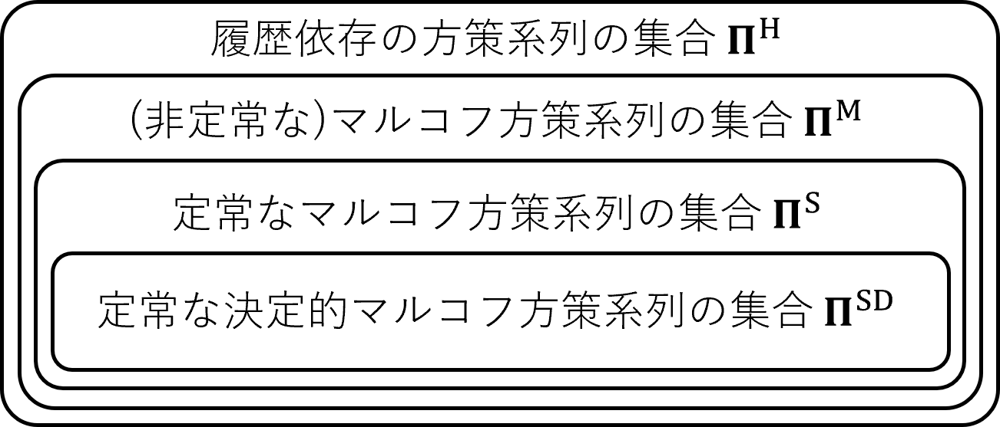

# 準備

強化学習は機械学習の一種であり、報酬という概念が出てくるという点、その期待値を最大化するような逐次的意思決定ルールを学習することを目的とする点が特徴的です。ここで、逐次的意思決定ルールは**方策**（*policy*）と呼ばれます。また一般に、強化学習ではその学習環境に**マルコフ性**という仮定をおきます。本項では、これらについて順を追って説明を行っていきます。

## 目次

- [目次](#目次)
- [逐次的意思決定問題](#逐次的意思決定問題)
  - [マルコフ性](#マルコフ性)
  - [マルコフ決定過程](#マルコフ決定過程)
- [方策](#方策)
  - [方策の分類](#方策の分類)
  - [方策の要素数](#方策の要素数)
  - [方策の十分性](#方策の十分性)
- [定式化](#定式化)
  - [概観：逐次的意思決定問題](#概観逐次的意思決定問題)
  - [MDPの表現の統一](#mdpの表現の統一)
    - [エルゴード性](#エルゴード性)
  - [リターン（累積報酬）](#リターン累積報酬)
  - [目的関数](#目的関数)
- [参考文献](#参考文献)

## 逐次的意思決定問題

はじめに、強化学習が目的とする方策の最適化問題、すなわち**逐次的意思決定問題**（*sequential decision-making problem*）を解くために必要な概念について学習していきます。

### マルコフ性

何らかの事象 $A$ の確率を $\mathrm{Pr}(A)$ と書くとしましょう。取りうる値とその値になる確率が定められている変数は**確率変数**と呼ばれ、実際に取った値は**実現値**と呼ばれます。理想的な６面さいころを例に取ってこれを説明すると、

$$\mathrm{Pr}(X=x)=\frac16,\space\forall x\in\mathcal{X}\triangleq\{1,2,3,4,5,6\}$$

と書けます。ここで、以下では確率変数を大文字（ $X$ ）で、実現値を小文字（ $x$ ）で、確率変数の取る値の集合をカリグラフ体（ $\mathcal X$ ）を用いて区別することににします。このような確率変数と確率との対応関係のことを**確率分布**（*probability distribution*）と呼びます。

さて、**マルコフ性**ですが、確率変数の並びを考えた場合に、将来の確率変数の条件付確率分布が、現時点のステップ（ $t$ ）にのみ依存する（すなわち $t-1$ 以前の値 $x_1,...,x_{t-1}$ には依存しない）という性質です。マルコフ性を持つ場合、それらは

$$\mathrm{Pr}(X_{t+k}=x|X_s=x_s,\forall s\leq t)=\mathrm{Pr}(X_{t+k}=x|X_t=x_t)$$

を満たします。ここで $t,k$ は任意の自然数であり、また $x_s,x\in\mathcal{X}$ です。

> 確率変数の並び：確率変数の系列のことであり、**確率過程**と呼ばれます。

確率変数 $X$ を状態変数とみなせば、 $\mathrm{Pr}(X_{t+1}=x'|X_t=x)$ は状態 $x$ が次のステップで $x'$ に遷移する確率を表すので、一般に**状態遷移確率**（*state transition probability*）と呼ばれます。また、マルコフ性を持つ確率過程を **マルコフ過程** といい、状態変数の取りうる値が離散的である場合には**マルコフ連鎖**と呼ばれます。

### マルコフ決定過程

強化学習においては何らかの選択や行動を行いますから、その**行動**（action）と、その良し悪しを判断させるための**報酬**（reward）をマルコフ連鎖に加えます。このような過程を**マルコフ決定過程**（Markov decision process; MDP）と呼び、次の組 $(\mathcal{S,A},p_{s_0},p_T,r)$ で定義します[0]。

|名称|定義|
|:-:|-|
|有限状態集合| $\mathcal{S}\triangleq\{s_1,...,s_{\|\mathcal{S}\|}\}\ni s$ |
|有限行動集合| $\mathcal{A}\triangleq\{a_1,...,a_{\|\mathcal{A}\|}\}\ni a$ |
|初期状態確率関数| $p_{s_0}\colon\mathcal{S}\to[0,1]\colon p_{s_0}(s)\triangleq\mathrm{Pr}(S_0=s)$ |
|状態遷移確率関数| $p_T\colon\mathcal{S\times S\times A}\to[0,1]\colon$ |
|〃| $p_T(s'\|s,a)\triangleq\mathrm{Pr}(S_{t+1}=s'\|S_t=s,A_t=a),\space\forall t\in\mathbb{N}_0$ |
|報酬関数| $r\colon\mathcal{S\times A}\to\mathbb{R}$ |

> $\mathbb{N}_0 \coloneqq \mathbb{N}\cup\bold{0}$ 、 $|\mathcal{X}|$ は $\mathcal X$ の要素数としました。

ここで、確率変数 $S_t$ と $A_t$ は時間ステップ $t\in\mathbb{N}_0$ での状態変数と行動変数を表します。上からわかるように、このMDPは「有限状態集合、有限行動集合の離散時間MDP」です。

定義から、報酬関数 $r$ は有界関数（ $\plusmn\infty$ に飛ばない）であり、

$$|r(s,a)|\leq R_{max},\space\forall (s,a)\in\mathcal{S\times A}\tag 1$$

を満たす $R_{max}\in\mathbb R$ が存在することを仮定していることになります。また、報酬の集合 $\mathcal R$ を次のように定義します。

$$\mathcal{R}\triangleq\{R\in\mathbb{R}\colon R=r(s,a),\exist (s,a)\in\mathcal {S,A}\}$$

ここで、報酬にマイナスを掛けたものを**損失**（cost）と呼ぶことがありますが、累積損失の最小化を目的とした問題は累積報酬の最大化を目的とした問題と同様であることに注意したいです。

次に、MDPにおいて行動を選択する基準である**方策**（*policy*）を定義します。方策は関数であり、ここでは現ステップの状態 $s にのみ依存して確率的に行動を選択する**確率的方策**を

$$\pi\colon\mathcal{A\times S}\to[0,1]\colon\pi(a|s)\triangleq\mathrm{Pr}(A=a|S=s)\tag2$$

のように定義します。ここで、方策 $\pi$ を含めたMDP; $\mathrm{M}$ を、

$$\mathrm{M}(\pi)\triangleq\{\mathcal{S,A},p_{s_0},p_T,r,\pi\}\tag3$$

と表記することにします。また（すべての）方策を含む方策集合 $\Pi$ を次のように定義します。

$$\Pi\triangleq\left\{\pi\colon\mathcal{A\times S}\to[0,1]\colon\sum_{a\in\mathcal A}\pi(a|s)=1,\space\forall s\in\mathcal S\right\}$$

最後に、マルコフ決定過程 $\mathrm{M}(\pi)$ がどのようにステップを進めるかについて下記に示します。

> マルコフ決定過程 $\mathrm{M}(\pi)=\{\mathcal{S,A},p_{s_0},p_T,r,\pi\}$
>
> 0. 時間ステップ $t=0$ で初期化を行い、（初期状態確率 $p_{s_0} に従い）初期状態 $s_t\space(\sim p_{s_0})$ を決定する
> 1. 状態 $s_t$ と 方策 $\pi(\cdot|s_t)$ から、行動 $a_t$ を選択する
> 2. 行動 $a_t$ に対する報酬 $R_t=r(s_t,a_t)$ を受け取る
> 3. 現在の状態 $s_t$ と行動 $a_t$ から状態遷移確率 $p_T(\cdot|s_t,a_t)$ により、状態を次の $s_{t+1}$ へ遷移させる
> 4. 時間ステップを $t$ から $t+1$ に進め、1. に戻る

> $s_t\sim p_{s_0}$ は確率変数 $s_t$ が確率分布 $p_{s_0}$ に従うことを意味します。

## 方策

上で述べたように、エージェントは方策に従い行動を決定します。以下ではこの方策について分類を行い、一部については簡易的にその特徴を記述します[1]。

> 一般的に機械学習の分野では、上記のような行動や選択を行う学習者のことを**エージェント**（*agent*）と呼びます。また、学習で扱う系全体のことは**環境**（*environment*）と呼びます。例として、家でハイハイを学習する赤ちゃんをこれに見立てれば、赤ちゃんはエージェントであり、その環境は家といえます。

本章は全体に大きく影響はしません。したがって、方策を分類する基準には次のようなものが設けられること（図１）、

- **定常**か**非定常**か
- **マルコフ性**の有無（無し：履歴依存）
- **決定的**か**確率的**か

および方策の最適化を容易にするために極力小さい集合（*subset*; 部分集合）の方策を取り扱いたいこと、大きくても非定常のマルコフ方策で十分であること、の３点を理解できれば十分だと思います。

### 方策の分類

はじめに、方策の系列 $\pmb{\pi}$ およびその集合 $\pmb{\Pi}$ 

$$\pmb{\pi}\triangleq\{\pi_0,\pi_1,...\}\in\pmb{\Pi}$$

を考えます。ここで、 $\pi_k$ は時間ステップ $t=k\in\N_0$ の方策であり、方策系列は時々刻々と変化するような方策の全体を捉えることができます。この方策系列の集合 $\pmb{\Pi}$ という観点から、方策全体について分類を行います。

式 $(2)$ で定義した方策は時間依存ではない、すなわち**定常**（*stationary*）な確率的方策でした。この系列を $\pmb{\pi}^s$ 、その集合を $\pmb{\Pi}^{\mathrm{S}}$ とすれば次のように書けます。

$$\pmb{\pi}^s\triangleq \{\pi,\pi,...\}\in\pmb{\Pi}^{\mathrm{S}}\tag{7}$$

次に、上の方策系列の集合のうち、**決定的**（*deterministic*）な方策 $\pi^d$ による系列を $\pmb{\pi}^{sd}$ 、その集合を $\pmb{\Pi}^{\mathrm{SD}}$ とすれば、

$$\pmb{\pi}^{sd}\triangleq \{\pi^d,\pi^d,...\}\in\pmb{\Pi}^{\mathrm{SD}}\tag{8}$$

> 決定的な（マルコフ）方策：確率分布 $\pi\colon\mathcal{S\times A}\to[0,1]$ ではなく $\pi\colon\mathcal{S\to A}$ で定義される方策です。次のように書けることから、 $\pmb{\Pi}^{\mathrm{SD}}\subset\pmb{\Pi}^{\mathrm{S}}$ です。
>
> $$\pi(a|s)\coloneqq\left\{\begin{aligned}
&1\space&(a=\pi^d(s))\\
&0\space&(それ以外)
\end{aligned}\right.,\space\forall (s,a)\in\mathcal{S\times A}$$

次に、式 $(7)$ をもとに**非定常な**、すなわち時間ステップごとに方策が変化するような方策系列 $\pmb{\pi}^m$ と、その集合 $\pmb{\Pi}^{\mathrm{M}}$ を次のように定義します。

$$\pmb{\pi}^m\triangleq\{\pi_0,\pi_1,...\}\in\pmb{\Pi}^\mathrm{M}$$

ここで、すべての方策 $\pi_0,\pi_1,...\colon\mathcal{S\times A}\to[0,1]$ はマルコフ性を持った方策です。

最後に、マルコフ性を持たない、すなわち**履歴依存な**方策を考えます。ある時間ステップ $t$ における履歴を $h_t$ 、その集合を $\mathcal{H}_t$ とすれば、履歴依存な方策は

$$\pi_t^h\colon\mathcal{A}\times\mathcal{H}_t\to[0,1],
\space\pi_t^h(a|h_t)\triangleq\mathrm{Pr}(A=a,|H_t=h_t)\tag{10}$$

で定義でき、履歴依存な方策系列 $\pmb{\pi}^h$ および集合 $\pmb{\Pi}^{\mathrm{H}}$ は、

$$\pmb{\pi}^h\triangleq\{\pi_0^h,\pi_1^h,...\}\in\pmb{\Pi}^\mathrm{H}$$

と定義することができます。

> 環境がMDPでモデル化された場合、時刻 $t$ までの（すべての経験の）履歴は次のように書くことができます。
>
> $$h_t=\{s_0,a_0,r_0,...,s_{t-1},a_{t-1},r_{t-1},s_t\}$$

以上から、方策（の系列）を $\pmb{\Pi}^{\mathrm{SD}},\pmb{\Pi}^\mathrm{S},\pmb{\Pi}^\mathrm{M},\pmb{\Pi}^\mathrm{H}$ のもとで分類した場合、方策系列の集合は次のような包含関係を持つことがわかります。

$$\pmb{\Pi}^{\mathrm{SD}}\subseteq\pmb{\Pi}^\mathrm{S}\subseteq\pmb{\Pi}^\mathrm{M}\subseteq\pmb{\Pi}^\mathrm{H}\tag{13}$$

図１．４分類 $\pmb{\Pi}^{\mathrm{SD}},\pmb{\Pi}^\mathrm{S},\pmb{\Pi}^\mathrm{M},\pmb{\Pi}^\mathrm{H}$ のもとでの方策の包含関係

### 方策の要素数

図１から、$\pmb{\Pi}^\mathrm{H}$ に含まれる方策（系列）のなかで最もすぐれた方策を探し出せば、それ以上によい方策は存在しないことがわかります。また、包含関係 $(13)$ から、方策系列を引数とする任意の目的関数について

$$\max_{\pmb{\pi}\in\pmb{\Pi}^{\mathrm{SD}}}f(\pmb{\pi})\leq\max_{\pmb{\pi}\in\pmb{\Pi}^{\mathrm{S}}}f(\pmb{\pi})\leq\max_{\pmb{\pi}\in\pmb{\Pi}^{\mathrm{M}}}f(\pmb{\pi})\leq\max_{\pmb{\pi}\in\pmb{\Pi}^{\mathrm{H}}}f(\pmb{\pi})$$

がいえ、より大きな方策系列の集合から方策（系列）を探したほうがよいように見えます。では、探索の容易さはどのように変わるでしょうか。状態数 $|\mathcal{S}|$ 、行動数 $|\mathcal{A}|$ である有限の $T$ 時間ステップ長のMDPの下で、決定的な方策系列 $\pmb{\Pi}^{\mathrm{SD}},\pmb{\Pi}^{\mathrm{MD}},\pmb{\Pi}^{\mathrm{HD}}$ の要素数を考えます。これらは、

$$\begin{aligned}
  |\pmb{\Pi}^{\mathrm{SD}}|=&|\mathcal{A}|^{|\mathcal{S}|}\\
  |\pmb{\Pi}^{\mathrm{MD}}_{0:T}|=&\prod_{t=0}^T|\pmb{\Pi}^{\mathrm{SD}}|=\left(|\mathcal{A}|^{|\mathcal{S}|}\right)^{T+1}\\
  |\pmb{\Pi}^{\mathrm{HD}}_{0:T}|=&\prod_{t=0}^T|\Pi_t^{h,d}|=\prod_{t=0}^T|\mathcal{A}|^{|\mathcal{H}_t|}=\prod_{t=0}^T|\mathcal{A}|^{|\mathcal{S}|^{t+1}|\mathcal{A}|^t}
\end{aligned}$$

のように計算できます。ここで、 $\Pi_t^{h,d}$ は時間ステップ $t$ での履歴依存の決定的方策の集合であり、履歴依存の方策 $\pi^{h,d}$ を用いて次のように定義されます。

$$\Pi_t^{h,d}\triangleq\{\pi^{h,d}\colon\mathcal{H}_t\to\mathcal{A}\}$$

> $\pmb{\Pi}^{\mathrm{MD}},\pmb{\Pi}^{\mathrm{HD}}$ : それぞれ $\pmb{\Pi}^{\mathrm{M}},\pmb{\Pi}^{\mathrm{H}}$ のうち決定的な方策系列の部分集合です。決定的でない（確率的な）方策系列の集合の要素数は可算個ではないため、簡便のために決定的な方策のみ扱いました。

> $\pmb{\Pi}^{\mathrm{MD}}_{0:T},\pmb{\Pi}^{\mathrm{HD}}_{0:T}$ : それぞれ時刻 $0$ から　$T$ で定義された（時間ステップ長 $t$ の） $\pmb{\Pi}^{\mathrm{MD}},\pmb{\Pi}^{\mathrm{HD}}$ です。

上に計算した要素数をもとに、 $|\mathcal{A}|=2,|\mathcal{S}|=2$ とした場合について、方策系列の数がどのようになるかを下表に示します。

表１．状態数 $|\mathcal{S}|=2$ 、行動数 $|\mathcal{A}|=2$ の有限長 $T$ MDPにおける方策のサイズ[0]

|時間ステップ長 $T$ | $0$ | $1$ | $2$ | $3$ ||
|:-:|:-|:-|:-|:-|-|
| $\|\pmb{\Pi}^{\mathrm{SD}}\|$ | $2^2$ | $2^2$ | $2^2$ | $2^2$ | $=4$ |
| $\|\pmb{\Pi}^{\mathrm{MD}}_{0:T}\|$ | $2^2$ | $2^4$ | $2^6$ | $2^8$ | $=256$ |
| $\|\pmb{\Pi}^{\mathrm{HD}}_{0:T}\|$ | $2^2$ | $2^{10}$ | $2^{42}$ | $2^{170}$ | $\simeq 10^{51}$ |

表１を見ると、より上位の集合ほど（*superset*; 図１or式 $(13)$ ）その要素数が爆発的に増大しています。上表で取り扱ったのはごく小規模のMDPでしたが、これですらも上位の方策系列の集合を対象とするのは現実的でないことがわかります。したがって、できるだけ下位の方策集合（*subset*; 部分集合）を対象にして探索を行う必要があると言えます。

> ある時間ステップ $t$ で到達確率が $0$ である状態 $s_t\in\mathcal{S}$ や、発生確率が $0$ になるような履歴 $h_t\in\mathcal{H}_t$ が存在する可能性があり、その下ではそれぞれの集合のサイズを小さくすることができます。これらは初期状態確率 $p_{s_0}$ や状態遷移確率 $p_T$ によりますが、依然として大小関係 $|\pmb{\Pi}^{\mathrm{SD}}|\leq|\pmb{\Pi}^{\mathrm{MD}}_{0:T}|\leq |\pmb{\Pi}^{\mathrm{HD}}_{0:T}|$ は変わりません。

### 方策の十分性

任意のMDP $\mathrm{M}=\{\mathcal{S,A},p_{s_0},p_T,r\}$ と履歴依存の方策系列 $\pmb{\pi}^h=\{\pi^h_0,\pi^h_1,...\}\in\pmb{\Pi}^\mathrm{H}$ に対して、次をみたすようなマルコフ方策の系列 $\pmb{\pi}^m=\{\pi_0^m,\pi_1^m,...\}\in\pmb{\Pi}^\mathrm{M}$ が存在します。

$$\begin{aligned}\mathrm{Pr}(S_t=s,A_t=a|\mathrm{M}(\pmb{\pi}^h))=\mathrm{Pr}(S_t=s,A_t=a|\mathrm{M}(\pmb{\pi}^m)),&\\\forall (t,s,a)\in\N_0\times\mathcal{S\times A}&\end{aligned}\tag{15}$$

詳細は省きますが、行動選択確率 $\pi_t^{m*}(a|s)\coloneqq \frac{\mathrm{Pr}(S_t=s,A_t=a|\mathrm{M}(\pmb{\pi}^h))}{\mathrm{Pr}(S_t=s|\mathrm{M}(\pmb{\pi}^h))},\forall a\in\mathcal{A}$ をもつマルコフ方策系列 $\pmb{\pi}^{m*}$ を定義し、$\sum_{s\in\mathcal{S}_0}\mathrm{Pr}(S_t=s|\mathrm{M}(\pmb{\pi}^h))=1,\forall t\in\N_0$ を用いて帰納法から式 $(16)$ が成り立つことを示せば証明は可能です。また、状態を観測に置き換えても上の議論は成立することから、POMDPにおいても同様の議論が可能です。

式 $(15)$ から、各時間ステップ $t$ での $S_t,A_t$ の同時確率については、（履歴依存）非マルコフ方策とマルコフ方策において等しいことがわかりました。ただし、系列全体 $(S_0,A_0,...,S_t,A_t)$ の同時確率については必ずしも一致するとは限りません。

次に、同時周辺確率関数 $\varphi^{\pmb{\pi}}_t\colon\mathcal{S\times A\times S}\to [0,1]$ を

$$\begin{aligned}\varphi^{\pmb{\pi}}_t(s,a|s_0)\triangleq&\mathrm{Pr}(S_t=s,A_t=a|S_0=s_0,\mathrm{M}(\pmb{\pi}))\\=&\mathbb{E}\left[\mathbb{I}_{\{S_t=s\}}\mathbb{I}_{\{A_t=a\}}|S_0=s_0,\mathrm{M}(\pmb{\pi})\right]\end{aligned}$$

と定義します。同時周辺確率の系列 $\varphi^{\pmb{\pi}}_0,\varphi^{\pmb{\pi}}_1,...$ の関数 $\tilde{f}$ を用いて、任意の方策 $\pmb{\pi}\in\pmb{\Pi}^\mathrm{H}$ の目的関数 $f$ を

$$f(\pmb{\pi})=\tilde{f}(\varphi^{\pmb{\pi}}_0,\varphi^{\pmb{\pi}}_1,...)\tag{17}$$

と書けるとき、次式が成立します。

$$\max_{\pmb{\pi}\in\pmb{\Pi}^\mathrm{M}}f(\pmb{\pi})=\max_{\pmb{\pi}\in\pmb{\Pi}^\mathrm{H}} f(\pmb{\pi})\tag{18}$$

ここから、式 $(17)$ で書ける目的関数を用いる場合、（履歴依存の方策系列を探索対象とする必要はなく）マルコフ方策系列のみを対象とすればよいことがわかります。一般に目的関数として用いられる期待累積報酬や、期待割引累積報酬は式 $(17)$ のようにかくことができ、最適化対象をマルコフ方策 $\pmb{\Pi}^\mathrm{H}$ のみとして最適化問題を解けばよいことがわかります。

> 式 $(17)$ のように書けない関数として、累積報酬の**中央値**（*median*）や**分位点**（*quantile*）などがあります。

> 例）時間ステップ長 $T$ のMDPにおける期待累積報酬を考えると
>
> $$\begin{aligned}\mathcal{J}(\pmb{\pi})=\mathbb{E}^{\pmb\pi}\left[\sum_{t=0}^T{R_t}\right]=&\mathbb{E}^{\pmb{\pi}}\left[\sum_{t=0}^T r(S_t,A_t)\right]\\
=&\sum_{t=0}^T\mathbb{E}^{\pmb{\pi}}\big[r(S_t,A_t)\big]\\
=&\sum_{t=0}^T\sum_{s\in\mathcal{S}}\sum_{a\in\mathcal{A}}\sum_{s_0\in\mathcal{S}}{p_{s_0}(s_0)\varphi^{\pmb{\pi}}_t(s,a|s_0)r(s,a)}\\
=&\tilde{f}(\varphi^{\pmb{\pi}}_0,...,\varphi^{\pmb{\pi}}_T)\end{aligned}$$

## 定式化

### 概観：逐次的意思決定問題

逐次的意思決定問題の学習においては方策 $\pi$ のみを調整します。環境（MDPの場合は $\{\mathcal{S,A},p_{s_0},p_T,r\}$ ）は一般に時間不変であり、最初に課題を設定した時点で決定されます。環境のモデルが既知である場合（モデルベース）はそれ自体から方策を最適化することが可能であり、このようなケースは**学習**（*learning*）の代わりに**プランニング**（*planning*）とよぶことも多いです。プランニングの場合に用いられる基礎的な最適化手法としては動的計画法や線形計画法などがあります。

一方環境のモデルが未知である場合はデータからの学習が必要です。バッチ学習の場合は与えられたデータを利用することのみを考えればよいですが、オンライン学習では局所最適解に陥ることを防ぐため**探索と活用のトレードオフ**（*exploration-exploitation trade-off*）を考慮しながらデータを収集することになります。

### MDPの表現の統一

対象とする逐次的意思決定問題の設定により、MDPの終了条件は

1. 状態が一定条件を満たしたら終了
2. 一定時間ステップの時点で終了
3. 終了しない（無限時間長のMDP）

などが考えられます。このうち、**吸収状態**（*absorbing state*）を設定することで条件 1,2 はいずれも条件 3 に統合することができます。ここで、吸収状態とは他の状態に遷移しない状態のことで、他の状態への遷移時報酬を $0$ とすることで実現できます。

> - 1→3 : 条件を満たした以降を吸収状態とする
> - 2→3 : ステップ数を状態として持たせ、規定時間以降を吸収状態とする

また条件1,2のMDPは、条件３に統合しない場合に一連の状態推移の終わりを持つこととなります。このようなMDPを**エピソディック**（*episodic*）なMDPとよび、その一連の状態遷移を**エピソード**と呼びます[1]。例えば囲碁を学習対象とした場合、打ち始めから終局までが１つのエピソードとなります。

#### エルゴード性

MDPの状態の確率過程はマルコフ連鎖として捉えることが可能です。マルコフ連鎖は状態変数が離散的なマルコフ過程でしたが、この過程は**エルゴード性**（*ergodic property*）と呼ばれる性質を持っています。エルゴード性は既約性と非周期性からなり、マルコフ連鎖を $\mathrm{MC}(\pi)$ とすれば次のように説明できます[0]。

1. **既約的**（*irreducibility*）: $\mathrm{MC}(\pi)$ のすべての状態が互いに行き来可能 　 $\mathrm{Pr}(S_t=j|S_0=i,\mathrm{MC}(\pi))>0,\space\forall i,j\in\mathcal{S},\exist t\in\R$
2. **非周期的**（*aperiodicity*）: 任意の２状態間の推移について推移パターンの繰返しがない 　 $\gcd{\mathcal{T}(s)}=1\space s.t. \space \mathcal{T}(s)\triangleq\{t\geq1\colon\mathrm{Pr}(S_t=s|S_0=s)>0\}$

方策勾配法などではMDPのマルコフ連鎖が常にエルゴード性を満たすと仮定して議論を進めることが多いですが、上の条件1,2に基づくMDPは明らかに既約ではありません。したがって、これらのMDPは条件３のMDPとして拡張してもエルゴード性をもつことはなく、エルゴード性に基づいた議論（**定常分布**の存在や**ベルマン期待方程式**など）を利用することはできません。

### リターン（累積報酬）

逐次的意思決定問題では、一般に各時間ステップ $t$ から得られる報酬の和を取った確率変数、**リターン**について何らかの最大化を行うことで最適化を行います。多くの場合、リターンには以降のステップの単純な報酬和 $\sum_{k=0}^\infty{R_{t+k}}$ ではなく、

$$C_t\triangleq\sum_{k=0}^\infty{\gamma^k R_{t+k}}\tag{20}$$

を用いることが多いです。この式は**割引率**（*discounted rate*） $\gamma\in[0,1)$ による報酬和を取っていることから**割引累積報酬**（*discounted cumulative reward*）と呼ばれます。割引率 $\gamma$ は課題の目的ごとにあらかじめ設定される**ハイパーパラメタ**であり、0に近づけると短期的な報酬を、1に近づけると長期的な報酬を重要視して学習を行うようになります。

上の定義からリターンは**再帰的に**定義でき、

$$C_t = R_t+\gamma C_{t+1}\tag{21}$$

報酬が有界であることから（ $|R|\leq R_{max}$ ; 式 $(1)$ ）リターンも有界となります。

$$|C_t|\leq \sum_{k=0}^\infty{\gamma^k R_{max}}=\frac{R_{max}}{1-\gamma},\space\forall t\in\N_0$$

> $\N_0$ : $0$ を含む自然数

### 目的関数

上に述べたように、逐次的意思決定問題では最適化のためにリターンについて何らかの最大化を行います。ここで、方策 $\pmb{\pi}$ に基づくMDP $\mathrm{M}(\pmb\pi)$ のもとで、統計量 $\mathcal{F}[C|\mathrm{M}(\pmb\pi)]$ について

$$\mathcal{J}(\pmb\pi)\triangleq\mathcal{F}[C|\mathrm{M}(\pmb\pi)]$$

を満たすような関数 $\mathcal{J}\colon\pmb{\Pi}\to\R$ を考えます。この関数を**目的関数**（*objective function*）といい、方策についての最適化問題はこの関数や制約条件の下で解かれることになります。制約条件なしの下では、逐次的意思決定問題は

$$\pmb{\pi}^*\triangleq\argmax_{\pmb{\pi}\in\pmb{\Pi}}{f(\pmb\pi)}$$

の探索問題と解釈できます。

> ここからわかるように、必ずしも最適方策は１つではなく、複数存在することがあります。

目的関数としては、ステップ全体を通したリターンの期待値

$$\mathcal{J}(\pmb{\pi})=\mathbb{E}^{\pmb\pi}[C_0]=\mathbb{E}^{\pmb\pi}\left[\sum_{t=0}^\infty{\gamma^t R_t}\right]\tag{23}$$

が用いられることが多いです。

> **価値関数**（*value function*） $V^{\pmb\pi}\colon\mathcal{S}\to\R$ を導入すると、式 $(23)$ の目的関数は
>
> $$\mathcal{J}(\pmb\pi)=\sum_{\pmb{s}\in\mathcal{S}}{p_{s_0}(s)V^{\pmb\pi}(s)}$$
>
> すなわち初期状態分布 $p_{s_0}$ による価値関数 $V^{\pmb\pi}(s)$ の重み付き和と解釈できます。ここで、価値関数は次で定義される、方策 $\pmb{\pi}$ の下での、初期状態を $s$ とした期待リターンです。
>
> $$V^{\pmb\pi}(s)\triangleq\mathbb{E}^{\pmb{\pi}}[C_0|S_0=s]$$

> 最適化対象の単純化：少し細かい話になりますが、式 $(23)$ の目的関数 $\mathcal{J}(\pmb{\pi})$ は、履歴依存の方策系列の集合 $\pmb{\Pi}^\mathrm{H}$ ではなく、より単純な方策集合である時間不変の決定的方策の集合 $\pmb{\Pi}^\mathrm{SD}$ のみを最適化の対象としてもその値が真に最大化できるという特徴があるようです[0]。すなわち、次を満たします。
>
> $$\max_{\pmb{\pi}\in\pmb{\Pi}^\mathrm{H}}\mathcal{J}(\pmb{\pi})=\max_{\pmb{\pi}\in\pmb{\Pi}^\mathrm{SD}}\mathcal{J}(\pmb{\pi})$$

## 参考文献

[0][メイン] 強化学習, 森村哲郎, MLP 機械学習プロフェッショナルシリーズ, 講談社, 第一刷（Chapter 1）

[1] 現場で使える！ Python深層学習入門, 伊藤多一ほか, 翔泳社, 第1刷