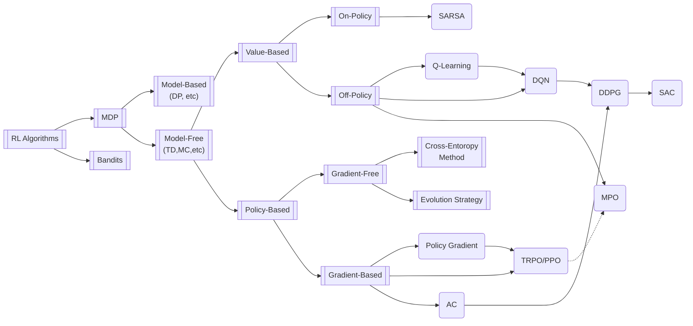
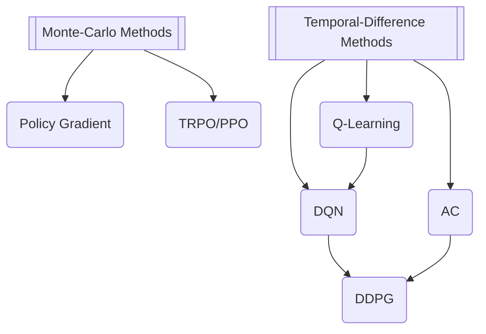

# MPOのための強化学習の分類

## いくつかの手法についての説明

### **DQN** [4]

- 強化学習に深層CNNを導入した
- Q学習はMDPを前提としている
  - ⇒POMDPはMDPっぽくして渡す必要がある
    - ⇒RNNの導入（R2D2）などで可用性を高められる
- ε-Greedy方策による行動決定（貪欲方策ではなく）

### **DDPG** (決定論的方策勾配法; Deep Deterministic Policy Gradient)[3]

- Q値を最大化するように方策を最適化する（獲得報酬期待値の最大化でなく）
- 決定論的：方策分布がスカラ値（確率分布でなく）
  - ⇒（似たような値ばかり渡され）Q関数が過学習気味になる

### **TRPO** (Trust Region Policy Optimization)
- 方策勾配法（方策勾配定理）の改善
- 後継手法PPOの方が実装も容易で安定性も高い

### **SAC** (Soft-Actor-Critic)[2]
- 確率的方策を利用可能にしたDDPG
- Soft-Q学習の導入
  - ⇒Soft-Q学習は「報酬最大化」も「探索」も目的とした報酬を形成

### **MPO** [5]
- オフポリシー
- TRPOのような信頼領域法（⇒ロバストな更新）
- 方策関数の形状をQ関数に似せる（SACに類似）

## 強化学習と教師あり/なし学習

強化学習はデータ探索を繰り返すことで目的を達成しようとするため、教師あり学習に比べ与えられたデータ量あたりの学習時間は長くなる傾向があります。一方で問題に対する知識が少ない状態から学習を行うことができ、例えばルールのみを与えて最強の囲碁マシンを作るようなことも可能です。

強化学習は教師あり学習のように「正解の」データを与えることが難しいような、複雑な問題を解くケースにその威力を発揮します。また、与えられた条件にかなう程度の尤もらしい解を短時間で得たいケースにも適用できると言えます。

## 強化学習の分類

下図は主だった強化学習の分類を行ったグラフです[1]。

これに対してMPOを配置させたグラフがおそらく次のようになります[5]。ここで、MPOを説明する上で必要でないと考えたノードは削除しました。

### バッチ学習とオンライン学習

強化学習問題の設定としては大きく２つあり、１つは従来の機械学習に似て、既にある大量のデータから方策を学習する**バッチ学習**（オフライン学習）とよばれる手法です。ここで利用するのは環境との相互作用などに関するデータとなります。もう１つは逐次的に環境と相互作用し、そのデータから学習する**オフライン学習**です[6]。

一般に強化学習はオンライン学習であることが多いですから、それに基づき強化学習を、モデルベース法とモデルフリー法、価値ベース法と方策ベース法、オンポリシーとオフポリシーの観点から分類します[1]。

### モデルベースとモデルフリー

深層学習においては、モデルという語は初期化や学習されたパラメタを持つ特定の関数を意味します。一方で強化学習においては、モデルとはすなわち獲得した**環境に関する知識の集合体**を意味します。

例えばMDPの場合、環境は $(\mathcal {S}, \mathcal {A}, \boldsymbol {P}, R, \gamma )$ の組で規定されます。**モデルフリー**法においては、これら（のうち遷移関数 $\boldsymbol{P}$ や報酬関数 $R$ ）の値はエージェントが学習することにより得られ、一方**モデルベース**法においてはこれらの値は初めから与えられます。

モデルフリー法は環境を常にブラックボックスとして扱うため、環境の（確率的）反応も内包した方策などを学習可能です。したがって限られたデータから学習することが可能ですが、学習には時間がかかる傾向があります。モデルベース法では環境に沿った詳細な学習が可能である一方で、その環境のモデル化に多大な労力を要するといった欠点があります。したがって、全状態や行動の数が少ない場合はモデルベース法で、囲碁や将棋のような課題に対してはモデルフリー法で、問題を解くことが多いようです。またAlphaGoなどのように、この２つを組み合わせる手法も登場しています。

### 価値ベースと方策ベース

深層学習は方策を最適化することを目的としますが、この際にどのように最適化するかにより価値ベースと方策ベースかを分類できます。

**価値ベース**法では一般に、Ｑ関数の最適化により方策を最適化させます。この手法ではサンプル効率が高く、また局所最適解に陥る可能性が低いため、学習が安定しやすいです。一方で連続行動空間の問題を処理できなかったり、（DQNで用いられるような）ε-greedy方策やmax演算子が過大評価されやすいといった欠点もあります。また、本来の目的である方策を、二次的に表現するという迂遠さも一つの欠点といえるかもしれません。

**方策ベース**法では、方策が直接最適化されます。価値ベース法と比較し、方策のパラメタ化が容易、収束性が高い、連続や高次元の行動空間に適すといった特徴があります。一方で学習データへの依存が大きくなる傾向にあり、ハイパーパラメタへの依存性が大きくなったり、局所最適解に陥りやすくなる傾向があるようです。

これら単純な価値/方策ベースの手法に加え、2つを組み合わせた**Actor-Critic**法も存在します。これはより一般的に用いられている手法であり、いずれの長所も引継ぎながらも離散的/連続的な行動空間に適用できるようになっています。他方でそれぞれの欠点も引き継いでおり、Criticは過大評価の問題を、Actorは探索不足の問題を抱えています。

### TD（時間差分）とMC（モンテカルロ）

強化学習においては、動的計画法、TD（時間差分）法、MC（モンテカルロ）法の3分類がひとつの分類手法といえます[Suttonの分類]。このうち、TD法は動的計画法とMC法の中間的な形式です。TDとMCはどちらも環境に関する完全な知識を必要としませんが、学習の更新方法という面で大きな違いが存在します。

**MC**法はエピソードあ終了するまで更新を待つ必要がありますが、**TD**法（というより動的計画法）は各タイムステップで更新を行うことができます。これにより、TD法は大きなバイアスを、MC法は大きな分散を持つことになります。以下にその関係性を示します[1]。

### オンポリシーとオフポリシー

**オンポリシー**の手法では、意思決定に使用される方策の評価/改善を行います。この手法ではエージェント自体が環境と直接対話する、すなわち環境と相互作用するポリシーそのものを改善することになります。

**オフポリシー**の手法ではデータの生成に仕様された方策とは異なる方策を評価/改善します。したがって、環境と対話する**他のエージェントの経験もポリシーの改善に使用する**ことができます。

## 参考文献

[1] Zhang, H., Yu, T. (2020). Taxonomy of Reinforcement Learning Algorithms. In: Dong, H., Ding, Z., Zhang, S. (eds) Deep Reinforcement Learning. Springer, Singapore. https://doi.org/10.1007/978-981-15-4095-0_3

[2] [Soft-Actor-Critic (SAC) ①Soft-Q学習からSACへ](https://horomary.hatenablog.com/entry/2020/12/20/115439)

[3] [DDPGでPendulum-v0（強化学習, tensorflow2）](https://horomary.hatenablog.com/entry/2020/06/26/003806)

[4] [DQNの進化史 ①DeepMindのDQN](https://horomary.hatenablog.com/entry/2021/01/26/233351)

[5] [強化学習 as Inference： Maximum a Posteriori Policy Optimizationの実装](https://horomary.hatenablog.com/entry/2022/07/21/192741)

[6] 強化学習, 森村哲郎, MLP 機械学習プロフェッショナルシリーズ, 講談社, 第一刷

[7] 現場で使える！ Python深層学習入門, 伊藤多一ほか, 翔泳社, 第1刷