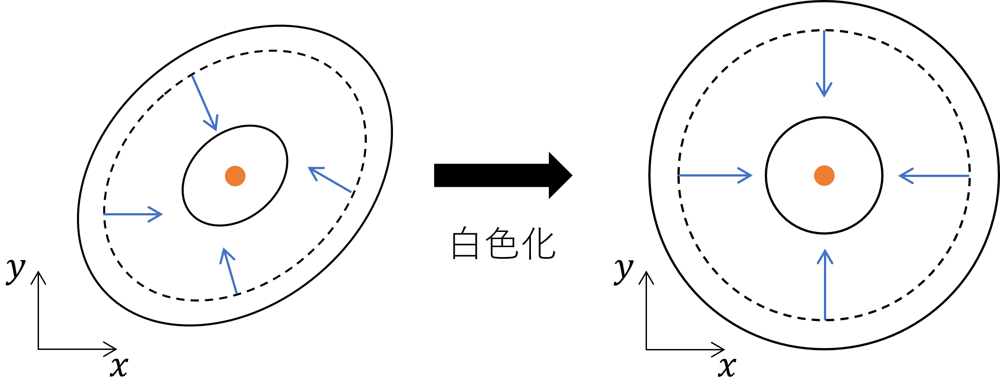

# TRPO/PPO

## 目次

- [目次](#目次)
- [ひとくちTRPO/PPO](#ひとくちtrpoppo)
  - [ひとくちTRPO](#ひとくちtrpo)
  - [ひとくちPPO](#ひとくちppo)
- [もうすこしくわしくTRPO/PPO](#もうすこしくわしくtrpoppo)
  - [EMアルゴリズム](#emアルゴリズム)
  - [信頼領域・白色化](#信頼領域白色化)
  - [そこそこTRPO/PPO](#そこそこtrpoppo)
    - [参考文献](#参考文献)

## ひとくちTRPO/PPO

### ひとくちTRPO

**TRPO**（*Trust Region Policy Optimization*; 信頼領域による方策最適化; 信頼領域方策勾配法）従来の方策勾配法によるアルゴリズムの、学習が安定しないという欠点を**信頼領域法**の導入により解決した手法です。この手法のメインアイデアは、学習の安定化のために**確率的方策が更新前後で大幅に変化することを防ぐ**というものであり、次のような制約を与えます。

$$\mathbb{E}\Big[\mathrm{KL}\big[\pi_{\theta_{old}}(\cdot|S_t)|\pi_{\theta_{new}}(\cdot|S_t)\big]\Big]\leq\delta$$

すなわち、更新前後の確率的方策が離れすぎないように、KL情報量が閾値 $\delta$ 以下となるように規制しています。

またTRPOでは通常の方策勾配アルゴリズムと異なり、その目的を**代理アドバンテージ**（*surrogate advantage*）

$$\mathbb{E}\left[\frac{\pi_{\theta_{new}}(a|S_t)}{\pi_{\theta_{old}}(a|S_t)}A_{\theta_{old}}(S_t,A_t)\right]$$

としています。したがって、代理アドバンテージに対して上の制約式を正則化項として加えた

$$\mathbb{E}\left[\frac{\pi_{\theta_{new}}(a|S_t)}{\pi_{\theta_{old}}(a|S_t)}A_{\theta_{old}}(S_t,A_t)\right]-\beta \mathrm{KL}\big[\pi_{\theta_{old}}(\cdot|S_t)|\pi_{\theta_{new}}(\cdot|S_t)\big]\tag1$$

を目的関数とし、ソフト制約付き最適化問題として目的関数 $1$ の最大化問題を解くというのがTRPOの概要です。

### ひとくちPPO

上記TRPOをもとに、その実装を容易にした上で安定性も向上させた手法に**PPO**（*Proximal Policy Optimization* Algorithms, ~~近位方策最適化~~）が存在します。

更新前後の確率的方策の比率を $r_t(\theta)$ とします。

$$r_t(\theta) = \frac{\pi_{\theta_{new}}(a|S_t)}{\pi_{\theta_{old}}(a|S_t)}$$

更新前後で方策が大幅に変化した場合、 $r_t(\theta)$ は $1$ から大きく離れることになります。このため、目的関数 $(A1)$ には $r_t(\theta)$ の値に依存しやすくなるという欠点が存在します。そこでPPOでは $r_t(\theta)$ の値が $(1-\epsilon, 1+\epsilon)$ の範囲に収まるように制限することでその安定性を向上させています。ここで、実装においては $r_t(\theta)$ と $\mathrm{clip}(r_t(\theta),1-\epsilon,1+\epsilon)$ のうち小さいものを目的関数の $r_t(\theta)$ の値に採用します。

## もうすこしくわしくTRPO/PPO

### EMアルゴリズム

はじめに、最適解を求める手法として**EMアルゴリズム**がありました。EMアルゴリズムは機械学習分野で一般的に用いられている手法ですが、これは複雑なモデルに対して最急勾配降下法が適さないという弱点を解決したためでもあります。

最急勾配降下法では目標関数の最大値を求めるために通常の勾配をそのまま利用していました。EMアルゴリズムではM-stepとE-stepを用いて目標関数 $\ell_c(\theta)$ を最大化しました。このときのイメージを下図に示します。

図１．EMアルゴリズム概念図[2]（左）通常の状態（右）M-stepの「歩幅」が大きすぎる状態

EMアルゴリズムの適用においてはM-stepの「歩幅」が重要になります。M-stepにおいては**代理関数**（*Surrogate function*）である $Q$ 関数を用いて

$$\theta^{(t+1)}=\argmax_{\theta\in\Omega_\theta}Q(\theta|\theta^{(t)})$$

として最大化探索を行いました。このとき、その歩幅が図１左のように大きすぎると、生成されたベクトルがなかなか最適解がある場所を向かないという問題が生じます。一般に歩幅はM-stepにおいて誤差関数の勾配によって決定されますが、誤差関数の形状によってはほとんどの点の勾配が最適解の方向を向かないといったことがありえます。

### 信頼領域・白色化

EMアルゴリズムにでは目的に比して歩幅が大きい場合に、上に述べたように最適化の非効率化が生じることがわかりました。この問題に対する解決策として、代表的なものが２種類存在します[2]。

- パラメタ更新の際に、探索領域を小さく（ $\delta$ ）制限する（**信頼領域**）
- 誤差関数の形に「相関」という概念を導入し、これを操作することで勾配の向きを制御する

前者はTRPO手法に取り入れられている手法であり、KL情報量に基づき変化前後で方策が十分近くなるように制限しています。後者は誤差関数に自身の（各軸間の）相関を０にするような行列をかけることで、誤差関数の各点の勾配が最適点の方向を向くようにするような手法です。これを**白色化**といい、イメージとしては下図のようなものと言えます。

図２．誤差関数の白色化[2]．白色化により各点の勾配（青）が最適点（橙）の方向を向いている．ここで、誤差関数は2変数 $x,y$ の関数であるとしている．

本質的には上の２手法は同一であり[2]、白色化について理解すれば信頼領域についても理解したことになるといえます。

> 誤差関数の白色化については、文献[3]が詳しいです。

### そこそこTRPO/PPO

**TRPO**法は信頼領域を考慮したパラメタ更新手法と、最適解を探索するEM法とを融合した学習手法です[2]。２目的を保証する報酬関数 $\eta(\theta)$ の代理関数は、

$$\mathcal{L}=L(\theta)-C\cdot\mathrm{KL}\tag{2}$$

で定義されます。ここで、第２項は旧方策 $\pi_\theta$ と新方策 $\tilde{\pi}_\theta$ のKL情報量です。また第１項は

$$\begin{aligned}&L_\pi(\tilde{\pi})=\eta(\pi)+\sum_s{\rho_pi(s_t)\sum_a{\tilde{\pi}(a_t|s_t)A_\pi(s_t,a_t)}}\\
&s.t.A_\pi(s,a)=Q_\pi(s,a)-V_\pi(s)\space\end{aligned}$$

で定義されます。ここで、 $\rho_\pi(s)$ は状態訪問頻度、 $A_\pi(s,a)$ はアドバンテージ（*advantage*）関数です。

実装においては代理関数 $\mathcal{L}$ は近似され、 $t$ ステップのパラメタ $\theta_t$ から次の $\theta_{t+1}$ は直接的に計算されます。したがってTRPO法の本質は、**一種の自然勾配計算**といえます。さらにTRPO法は探索エピソードから学習する手法ですので、本質的に**モンテカルロ法を使用した方策勾配の学習**を行います。ちなみに、 $\tilde{A}_t$ を計算するにはTD(n)法を使うことが多いようです。

最後に、どんな解法でもKL情報量は登場し、この２階微分の計算は煩雑となります。この回避策が**PPO**法であり、更新前後の確率的方策の比率を $r_t(\theta)$ としてその値の範囲を制限することで計算コストを大幅に簡約します。

#### 参考文献

[1] 現場で使える！ Python深層学習入門, 伊藤多一ほか, 翔泳社, 第1刷（Chapter 5.5）

[2] 強化学習アルゴリズム入門 -「平均」からはじめる基礎と応用-, 曽我部東馬, オーム社, 第2刷（Chapter 4） 

[3] Amari. S, "Natural gradient works efficiently in learning", Journal of Neural Computation, vol.10, pp.251-276, 1998.