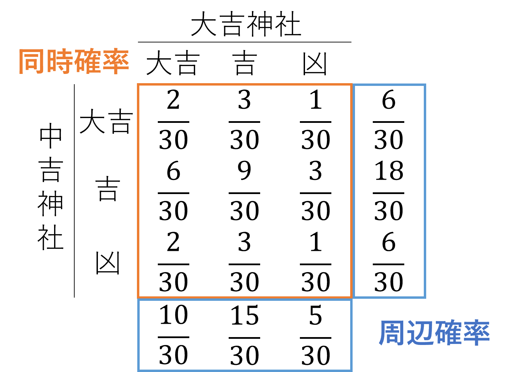

# 確率

はじめに、**確率の公理**から確率（関数） $\mathrm{Pr}(\cdot)$ が満たすべき性質を確認し、次に確率と期待値の一般的な性質を示します。その後にそれぞれの概念を２次元の場合に転用することで、強化学習の習得に不可欠な確率分布や期待値についての理解を促します。

## 目次

- [目次](#目次)
- [確率の公理](#確率の公理)
  - [事象](#事象)
  - [確率の公理と性質](#確率の公理と性質)
- [条件付き確率・独立性](#条件付き確率独立性)
- [確率分布](#確率分布)
  - [離散確率変数](#離散確率変数)
  - [連続確率変数](#連続確率変数)
- [期待値](#期待値)
- [同時確率・周辺確率](#同時確率周辺確率)
  - [離散分布の場合](#離散分布の場合)
  - [連続分布の場合](#連続分布の場合)
  - [期待値](#期待値-1)
- [参考文献](#参考文献)

## 確率の公理

### 事象

はじめに、起こりうる結果の全体を**全事象**（*whole event*）と呼び、起こりうる結果の集合を**事象**（*event*）とよびます。全事象 $\Omega$ が

$$\Omega=\{\omega_1,\omega_2,...,\omega_n\}$$

で表される場合、事象は $\Omega$ の部分集合：

$$\emptyset,\{\omega_1\},...,\{\omega_n\},\{\omega_1,\omega_2\},...,\Omega$$

となります（ $\emptyset$ は**空事象**（*empty event*））。また、このうち $\{\omega_1\},...,\{\omega_n\}$ を**根源事象**（*elementary event*）と呼びます。

> ６面さいころ： $\Omega=\{1,2,3,4,5,6\}$ 

### 確率の公理と性質

確率は事象に対して定義されていますが、正確には次に示す**確率の公理**を満たすような関数 $\mathrm{Pr}(\cdot)$ が与えられたときにこれを確率と呼びます[1]。

1. すべての事象 $A$ に対して $\mathrm{Pr}(A)\geq 0$ 
2. $\mathrm{Pr}(\Omega)=1$
3. 事象 $A,B$ が $A\cap B=\emptyset$ ならば $\mathrm{Pr}(A\cup B)=\mathrm{Pr}(A)+\mathrm{Pr}(B)$ 

上の条件から、確率について以下のような基本的な性質がわかります。

- $\mathrm{Pr}(\cdot)\in[0,1]$
- $A\subset B\Rightarrow \mathrm{Pr}(A)\leq\mathrm{Pr}(B)$
- $\mathrm{Pr}(A\cup B)=\mathrm{Pr}(A)+\mathrm{Pr}(B)-\mathrm{Pr}(A\cap B)$
- $\mathrm{Pr}(A^c)=1-\mathrm{Pr}(A)$

> 正確には、条件３は $A_i\cap A_j=\emptyset\space(i\neq j)$ なる事象 $A_1,A_2,...$ について、 $\mathrm{Pr}(\bigcup_{i=1}^\infty A_i)=\sum_{i=1}^\infty \mathrm{Pr}(A_i)$ であることとなります。

> $A^c$ : 事象 $A$ の補集合

## 条件付き確率・独立性

２つの事象 $A,B$ について、 $\mathrm{Pr}(B)>0$ のとき、 $B$ が与えられたときの $A$ の**条件付き確率**（*conditional-probability*）が次のように定義できます。

$$\mathrm{Pr}(A|B)=\frac{\mathrm{Pr}(A\cap B)}{\mathrm{Pr}(B)}$$

また、ここから**ベイズの定理**を定義することができ、後に詳述します。

[ベイズの定理][doc_MAP_estimation.md]

また、条件付き確率から２事象 $A,B$ が**独立**（*independent*）であることを

$$\mathrm{Pr}(A\cap B)=\mathrm{Pr}(A)\mathrm{Pr}(B)$$

と定義できます。さらに、**背反**（*disjoint*）な事象 $B_1,...,B_n$ （すなわち $B_i\cap B_j=\emptyset\space(i\neq j)$ ）が $\mathrm{Pr}(B_k)>0,\space\bigcup_{k=1}^n B_k=\Omega$ を満たすとき、事象 $A$ の確率を

$$\mathrm{Pr}(A)=\sum_{k=1}^n \mathrm{Pr}(A|B_k)\mathrm{Pr}(B_k)$$

、すなわち**全確率**（*total probability*）として求めることができます。

## 確率分布

### 離散確率変数

一般に、**確率変数**（*random variable*）は $\Omega$ から実数への関数 $X(\cdot)$ として定義され、以下ではこれを $X$ と書きます[1]。確率変数 $X$ の実現値とは、 $\omega_i\in\Omega$ に対する $X(\omega_i)$ の値のことであり、実現値の全体 $\mathcal{X}=\{X(\omega_i)|\omega_i\in\Omega,i\in\N_0\}$ を**標本空間**（*sample space*）と呼びます。

ここで、以下では確率変数を大文字（ $X$ ）で、実現値を小文字（ $x$ ）で、標本空間をカリグラフ体（ $\mathcal X$ ）を用いて区別することににします。

> ６面さいころ（ $\Omega=\{1,2,3,4,5,6\}$ ）であれば $X(\{\omega_i\})=\omega_i$ などと書かれ、おみくじ $\Omega=\{凶,末吉,吉,大吉\}$ であれば例として $X(\{凶\})=0, X(\{大吉\})=3$ といった形で書くことができます。
>
> $\Omega$ の事象の集合を $\mathcal{O}$ としたとき、 $\mathcal{O}$ の元（数値でないこともある）を $\mathcal{X}$ の元（実数値など）に対応させるため、 $X\colon\mathcal{O\to X}$ が関数として定義されていると考えてよいと思います。

次に、標本空間が

$$\mathcal{X}=\{x_0,x_1,x_2,...\}$$

で定義されたことを考えます。このとき $X=x_k$ となる確率は、 $X(\omega)=x_k$ を満たすすべての根源事象 $\omega$ について確率の和から計算されます。以下では、簡単のために $\mathrm{Pr}(X=x_k)=p(x_k)$ と書くことにします。

一般に、関数 $p(x_k)\colon\mathcal{X}\to\R$ が次の性質を満たすとき、これを**確率関数**（*probability function*）または**確率分布**（*probability distribution*）と呼びます。

- $0\leq p(x_k)\leq 1,\space k=0,1,2,...$
- $\sum_{k=0}^\infty p(x_k)=1$

### 連続確率変数

次に、確率変数が連続的な値を持つ場合について考えます。確率を示す関数 $f(x)$ を何らかの形で定義したとします。このとき、 $\mathrm{Pr}(\Omega)=\int_{x\in\mathcal{X}} f(x)dx=1$ となる必要があるため、特定の値 $a$ に対して $\mathrm{Pr}(X=a)$ は $0$ となってしまいます。

以下では、確率変数 $X$ が実数直線上に実現値 $x$ をとることを考えます。関数 $f(x)$ が次の２性質を満たすとき、

- $f(x)\geq 0,\space\forall x\in\mathcal{X}$
- $\int_{-\infty}^\infty f(x)dx=1$

これを**確率密度関数**（*probability density function*）とよび、確率を次のように定義することができます。

$$\mathrm{Pr}[a\leq X\leq b]=\int_a^b f(x)dx$$

ここから、連続的な値をとる確率変数に対してはその確率が範囲として求められることがわかります。

## 期待値

確率変数の関数 $g(X)$ の**期待値**（*expected value*）は、

$$\mathbb{E}[g(X)]=\left\{\begin{aligned}
&\sum_{k=0}^\infty g(x_k)p(x_k)&(Xが離散確率変数)\\
&\int_{-\infty}^\infty g(x)f(x)dx&(Xが連続確率変数)
\end{aligned}\right.$$

で定義されます。これは、 $g(x)$ を $X$ の確率分布で平均を取ったものと言えます。期待値は総和や積分から定義されるため、次のような性質を持ちます。

- $\mathbb{E}[c]=c$ 、特に $\mathbb{E}[1]=1$
- $\mathbb{E}[a g_1(X)+b g_2(X)]=a \mathbb{E}[g_1(X)]+b\mathbb{E}[g_2(X)]$
- すべての $x$ に対して $g(x)\geq 0$ ならば $\mathbb{E}[g(X)]\geq 0$
- すべての $x$ に対して $g_1(x)\geq g_2(x)$ ならば $\mathbb{E}[g_1(X)]\geq \mathbb{E}[g_2(X)]$
- $|\mathbb{E}[g(X)]|\leq \mathbb{E}[|g(X)|]$

ここで、 $a,b,c$ はいずれも定数としました。

> 次のようなくじを例にした場合、期待値は $\mathbb{E}[g(X)]=119$ 円になります。
>
> | 根源事象 $\omega_i$ |はずれ|あたり|大当たり|
> |-|:-:|:-:|:-:|
> | 実現値 $x_i=X(\omega_i)$ | $0$ | $1$ | $2$ |
> | 確率 $p(x_i)$ | $0.8$ | $0.19$ | $0.01$ | 
> | $g(x_i)$ | $0$ 円 | $100$ 円 | $10000$ 円 |

## 同時確率・周辺確率

### 離散分布の場合

2つの確率変数 $X,Y$ の組 $(X,Y)$ を考えると、その確率分布は２次元平面 $\R^2$ 上に分布することになります。はじめに、 $X,Y$ が離散型確率変数である場合、すなわち

$$\mathcal{X}=\{x_0,x_1,...\}, \mathcal{Y}=\{y_0,y_1,...\}$$

上で値を取る場合を考えます。このとき、 $(X,Y)$ の組の実現値が $(x_i,x_j)$ となる確率の関数、**同時確率**（*joint probability*）関数を

$$\mathrm{Pr}(X=x_i,Y=y_j)=p_{X,Y}(x_i,y_i)$$

として定義します。このとき、同時確率 $p_{X,Y}(x_i,y_i)$ は

- $p_{X,Y}(x_i,y_i)\geq 0$
- $\sum_{(x_i,y_i)\in\mathcal{X\times Y}}p_{X,Y}(x_i,y_i)=1$

を満たします。

次に、すべての $Y$ の値について総和をとり、 $X$ のみについての確率を考えると、

$$p_X(x_i)=\sum_{y_j\in\mathcal{Y}}p_{X,Y}(x_i,y_i)$$

が定義されます。このように事象（変数）の確率の和（積分）をとることを**周辺化**ともいい、これを $X$ の**周辺確率**（*marginal probability*）関数といい、 $Y$ についても同様に定義されます。

下図におみくじを例にした離散確率における同時確率と周辺確率のイメージを示します。

### 連続分布の場合

次に $X,Y$ が $\R$ 上の連続な確率変数である場合を考えます。離散分布の場合と同様に、**同時確率密度**（*joint probability density*）関数 $f_{X,Y}(x,y)$ は、

- $f_{X,Y}(x,y)\geq 0$
- $\int_{-\infty}^\infty\int_{-\infty}^\infty f_{X,Y}(x,y)dxdy=1$

を満たします。また、同様に $X$ の**周辺確率密度**（*marginal probability density*）関数は

$$f_X(x)=\int_{-\infty}^\infty f_{X,Y}(x,y)dy$$

で定義されます。

### 期待値

２次元確率変数 $(X,Y)$ に対しても１次元の場合と同様に期待値を計算することができます。すなわち、 $g(X,Y)$ の期待値は

$$\mathbb{E}[g(X,Y)]=\left\{\begin{aligned}
    &\sum_{j=1}^\infty \sum_{i=1}^\infty g(x_i,y_j) p_{X,Y}(x_i,y_j)&(離散分布)\\
    &\int_{-\infty}^\infty \int_{-\infty}^\infty g(x,y) f_{X,Y}(x,y)dxdy&(連続分布)
\end{aligned}\right.$$

で定義されます。

最後に、２次元確率変数に対する期待値の理解の助けとなるいくつかの式変形を示します[1]。

> $\mathbb{E}[X+Y]=\mathbb{E}[X]+\mathbb{E}[Y]$
>
> $$\begin{aligned}
    \mathbb{E}[X+Y]=&\int_{-\infty}^\infty \int_{-\infty}^\infty (x+y)f_{X,Y}(x,y) dxdy\\
    =& \int_{-\infty}^\infty x\left\{\int_{-\infty}^\infty f_{X,Y}(x,y)dy\right\}dx + \int_{-\infty}^\infty y\left\{\int_{-\infty}^\infty f_{X,Y}(x,y)dx\right\}dy\\
    =& \int_{-\infty}^\infty x f_X(x) dx + \int_{-\infty}^\infty y f_Y(y) dy\\
    =& \mathbb{E}[X] + \mathbb{E}[Y]
\end{aligned}$$
>
> 周辺確率密度関数の利用

> $X,Y$ が独立ならば $\mathbb{E}[g(X)h(Y)]=\mathbb{E}[g(X)]\mathbb{E}[h(Y)]$
>
> $$\begin{aligned}
    \mathbb{E}[g(X)h(Y)]=&\int_{-\infty}^\infty \int_{-\infty}^\infty g(x)h(y) f_{X,Y}(x,y) dxdy\\
    =& \int_{-\infty}^\infty \int_{-\infty}^\infty g(x)h(y) f_X(x) f_Y(y) dxdy\\
    =& \int_{-\infty}^\infty g(x) f_Xdx \int_{-\infty}^\infty h(y) f_Y(y)dy\\
    =& \mathbb{E}[g(X)]\mathbb{E}[h(Y)]
\end{aligned}$$
>
> 独立ならば $f_{X,Y}(x,y)=f_X(x)\times f_Y(y)$

> $\mathbb{E}[g(X,Y)]=\mathbb{E}[\mathbb{E}[g(X,Y)|X]]=\mathbb{E}[\mathbb{E}[g(X,Y)|Y]]$
>
> $$\begin{aligned}
    \mathbb{E}[\mathbb{E}[g(X,Y)|X]]=& \int_{-\infty}^\infty \mathbb{E}[g(x,Y)|X=x] f_X(x)dx\\
    =& \int_{-\infty}^\infty \int_{-\infty}^\infty g(x,y) f_{Y|X}(y|x)dy f_X(x)dx\\
    =& \int_{-\infty}^\infty \int_{-\infty}^\infty g(x,y)\frac{f_{X,Y}(x,y)}{f_X(x)}dy f_X(x)dx\\
    =& \mathbb{E}[g(X,Y)]
\end{aligned}$$
>
> 条件付きの場合の期待値、ベイズの定理

## 参考文献

[1] "統計学 Statistics", 久保川達也, 国友直人, 東京大学出版会, 第２刷（Chapter 6～8）

[2] 入門統計解析, 倉田博史, 星野祟宏, 新世社, 第15刷（第４章）