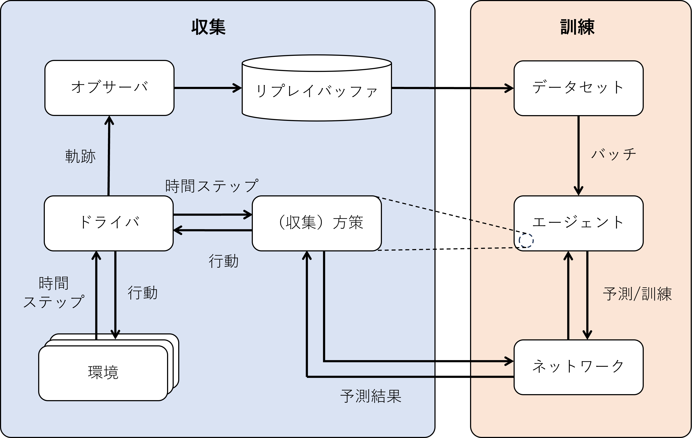

雑多なことを記述する。

全体：なぜ英語を付するか？<br>
日本語訳はばらつきが大きいため、いくらかばらつきの少ない英語を付することで誤解が生じないようにしています。

## 目次

- [目次](#目次)
- [記法の定義](#記法の定義)
- [面白そうな文献](#面白そうな文献)
- [草稿](#草稿)
  - [POMDP\&MPOによる環境での、エージェントのフロー](#pomdpmpoによる環境でのエージェントのフロー)
  - [補足：ノンパラメトリック](#補足ノンパラメトリック)
  - [ボルツマン分布](#ボルツマン分布)
    - [参考文献](#参考文献)
  - [同時確率・周辺確率](#同時確率周辺確率)
    - [離散分布の場合](#離散分布の場合)
    - [連続分布の場合](#連続分布の場合)
    - [参考文献](#参考文献-1)
  - [価値関数・行動関数の記法](#価値関数行動関数の記法)
    - [参考文献](#参考文献-2)
  - [リプレイバッファ（TF-Agents）](#リプレイバッファtf-agents)
    - [TF-Agentsライブラリ](#tf-agentsライブラリ)
    - [経験のリプレイ（*Experience Replay*）](#経験のリプレイexperience-replay)
    - [実装：リプレイバッファ](#実装リプレイバッファ)
    - [参考文献](#参考文献-3)

## 記法の定義

|記号|意味|
|-|-|
| $\N$ | $0$ を含まない自然数 |
| $\N_0$ | $0$ を含む自然数|
| $\R_{\geq 0}$ | $0$ 以上の実数|
| $\|\mathcal{X}\|$ | 集合 $\mathcal{X}$ の要素数 |
| $\mathbb{I}_{\{B\}}$ |事象 $B$ が真なら $1$ 、そうでないなら $0$ をとる指示関数|
| $x,X$ |それぞれ確率変数 $X$ （大文字）、実現値 $x$ （小文字）|
| $\mathcal{X}$ |実現値の取りうる値の集合 <br>例）６面さいころでは $x \in \mathcal{X}=\{1,2,3,4,5,6\}$ | 
| $\mathrm{Pr}(X)$ | $X$ の確率 |
| $s,s_t,S,S_t,\mathcal{S}$ | それぞれ状態（の実現値） $s$ 、状態変数 $S$ （時間ステップ $t$ で $s_t,S_t$ ）、全状態の集合 $\mathcal{S}$ |
| $a,a_t,A,A_t,\mathcal{A}$ | それぞれ行動（の実現値） $a$ 、行動変数 $A$ （時間ステップ $t$ で $a_t,A_t$ ）、全行動の集合 $\mathcal{A}$ |
| $\pi,\pmb{\pi}$| 定常な方策： $\pi$  / 非定常な（すなわち時間ステップ $t$ により変化するような）方策： $\pmb{\pi}$ <br> $\pmb{\pi}$ を（定常非定常問わず）方策の系列とみることもあります

> ペアノの公理的には $\N$ に $0$ が自明的に含まれてもいいとは思いますが、使い分けをしたい時もあることを考えて $\N$ を $\{1,2,...\}$ 、 $\N_0$ を $\{0,1,...\}$ と定義します。


## 面白そうな文献

- 現場で使える！ Python深層強化学習入門, 伊藤多一ほか, 翔泳社, 第一刷
  - 548.13 G75
  - 実装という面に重きが置かれているため、その前提となるシステムの説明もわかりやすいものが多い。実装対象はDQNとかActor-Criticとかではあるが、基礎知識の学習などに便利そうだと感じた
- Pythonで学ぶ強化学習 第二版, 久保宏隆, 
  - 548.13 Ku11
  - 結構いろいろなアルゴリズムの実装がのっている感じがある。Q学習とかはもちろんA2Cとかも。
- パターン認識と機械学習 -ベイズ推論による統計的予測-, C.M.ビショップ, Springer Japan, 
  - 548.13, B47
  - 黄色い分厚い本。とにかくいろんなことが書いてあるから利用するのに便利そうだと感じた。特に理論面において。

## 草稿

### POMDP&MPOによる環境での、エージェントのフロー

1) 上記の設定でエージェントの行動が最適化される一般的な流れは以下の通りです。

- エージェントは、観測値から行動へのマッピングを行う初期方策$\pi_0$から始めます。
- エージェントは現在の方策に従って環境と相互作用し、観測値、行動、報酬、次の観測値の軌跡を収集します。
- エージェントは収集した軌跡を用いて、現在の方策の下での状態-行動価値関数$Q(s, a)$と状態分布$\xi(s)$を推定します。
- エージェントはMPOの最適化問題を解きます。これは、現在の方策$\pi_t(a|s)$に対するKLダイバージェンス制約の下で、$Q(s, a)$の期待値を最大化するような新しい行動分布$q(a|s)$を見つけるという問題です。
- エージェントは方策$\pi_{t+1}$を更新します。これは、最適な行動分布$q(a|s)$に等しく設定します。
- エージェントは収束するか、終了条件が満たされるまで、2-5のステップを繰り返します。

2) 物理エンジンによる計算は二つの段階で行われます。

- エージェントが環境と相互作用するとき、物理エンジンは環境とエージェントの行動の動力学をシミュレートし、エージェントに観測値と報酬を生成します。
- エージェントがMPOの最適化問題を解くとき、物理エンジンは目的関数と制約の勾配を行動分布$q(a|s)$に関して計算します。これは物理エンジンが微分可能であり、シミュレーションを通して勾配を伝播させることができるからです。

Bingから

### 補足：ノンパラメトリック

**ノンパラメトリック**は分布が固定されたり既知の形やパラメタを持たないことを意味します。分布は事前に定義されたモデルでは**なく**、データに基づいています。逆に**パラメトリック**はパラメタに基づくデータであり、**特定の分布を背後に想定している**ことを意味します。

### ボルツマン分布

**ボルツマン分布**（*Boltzmann distribution*）とは、システムが特定の状態になる確率を、その状態のエネルギーとシステムの温度の関数として与える確率分布です[A1]。システムが状態 $i$ にある確率 $p_i$ （すなわちボルツマン分布）は

$$p_i\propto \exp \left(-\frac{\varepsilon_i}{kT}\right)$$

のような比例関係を持ちます。ここで、 $\varepsilon_i$ は状態 $i$ におけるエネルギー、 $k,T$ はそれぞれボルツマン定数と温度です。

情報処理の文脈では、コスト関数をエネルギー $\varepsilon$ とみなして、ボルツマン分布を

$$\mathrm{P}(\varepsilon)=\frac{1}{Z}\exp\left(-\frac{\varepsilon}{T}\right)$$

として定義することが多いです[A2]。分母 $Z$ は正規化定数であり、全状態について $P(\varepsilon)$ を積分することで計算されます。また、温度 $T$ はパラメタとして与えることができます。


この関係により、**コストと確率を結び付ける**ことが可能になります。ただし $Z$ は定数であるため、最大化/最小化の問題においてはその値を求めることなく、単純に左辺が指数関数に比例することのみを用いることが可能です。

#### 参考文献
[A1] [Boltzmann distribution](https://en.wikipedia.org/wiki/Boltzmann_distribution)

[A2] [Boltzmann分布](https://ibisforest.org/index.php?Boltzmann%E5%88%86%E5%B8%83)

### 同時確率・周辺確率

#### 離散分布の場合

2つの確率変数 $X,Y$ の組 $(X,Y)$ を考えると、その確率分布は２次元平面 $\R^2$ 上に分布することになります。はじめに、 $X,Y$ が離散型確率変数である場合、すなわち

$$\mathcal{X}=\{x_0,x_1,...\}, \mathcal{Y}=\{y_0,y_1,...\}$$

上で値を取る場合を考えます。このとき、 $(X,Y)$ の組の実現値が $(x_i,x_j)$ となる確率の関数、**同時確率**（*joint probability*）関数を

$$P(X=x_i,Y=y_j)=p_{X,Y}(x_i,y_i)$$

として定義します。このとき、同時確率 $p_{X,Y}(x_i,y_i)$ は

- $p_{X,Y}(x_i,y_i)\geq 0$
- $\sum_{(x_i,y_i)\in\mathcal{X\times Y}}p_{X,Y}(x_i,y_i)=1$

を満たします。

次に、すべての $Y$ の値について総和をとり、 $X$ のみについての確率を考えると、

$$p_X(x_i)=\sum_{y_j\in\mathcal{Y}}p_{X,Y}(x_i,y_i)$$

が定義されます。このように事象（変数）の確率の和（積分）をとることを**周辺化**ともいい、これを $X$ の**周辺確率**（*marginal probability*）関数といい、 $Y$ についても同様に定義されます。

下図におみくじを例にした離散確率における同時確率と周辺確率のイメージを示します。


#### 連続分布の場合

次に $X,Y$ が $\R$ 上の連続な確率変数である場合を考えます。離散分布の場合と同様に、**同時確率密度**（*joint probability density*）関数 $f_{X,Y}(x,y)$ は、

- $f_{X,Y}(x,y)\geq 0$
- $\int_{-\infty}^\infty\int_{-\infty}^\infty f_{X,Y}(x,y)dxdy=1$

を満たします。また、同様に $X$ の**周辺確率密度**（*marginal probability density*）関数は

$$f_X(x)=\int_{-\infty}^\infty f_{X,Y}(x,y)dy$$

で定義されます。

#### 参考文献

[A1] 統計学-Statistics, 久保川達也, 国友直人, 東京大学出版会, 第2刷（第８章）

### 価値関数・行動関数の記法

Sutton-Bartoの記法では、

- ベルマン方程式の厳密解として定義される価値関数、行動価値関数は英子文字で表記される。（ $v_\pi(s),v^*(s),q_\pi(s,a),q^*(s,a)$ ）
- ベルマン方程式の近似解あるいは推定値として定義されるものは英大文字で表記される。（ $V_t(s), Q_t(s,a)$ ）

#### 参考文献

[A0] R.S. Sutton and A.G. Barto, "Reinforcement Learning: An Introduction" Second Edition, MIT Press, Cambridge, MA, 2018
[A1] 現場で使える！ Python深層学習入門, 伊藤多一ほか, 翔泳社, 第1刷（Chapter 5.5）

### リプレイバッファ（TF-Agents）

#### TF-Agentsライブラリ

TF-Agents ライブラリは、Tensorflow をベースとする強化学習ライブラリであり、OpenAI Gym や PyBullet ライブラリ、DeepMind の DM Control（ MuJoCo ベース）などをサポートします。基本的な強化学習アルゴリズム、効率のよいリプレイバッファや指標など強化学習に活躍する様々な機能を搭載しています。

TF-Agents 環境は次のようにロードされます（いくつかの依存関係のインストールは必要ですが）。

```python
from tf_agents.environments import suite_gym
env = suite_gym.load("Breakout-v4")
```

`env.reset()` や `env.step(1)` により学習を進めます。また、 `env.observation_spec()`, `env.action_spec()`, `env_time_step_spec()` により環境、行動、時間ステップの仕様を取得することが可能です。

一般的にはTF-Agentsの訓練アーキテクチャは下記のように２つに分かれた形状を取ります[A1]。



図１．TF-Agentsの典型的な訓練アーキテクチャ[A1]

収集側では**ドライバ**が中心となり行動を選択しながら環境と相互作用し、軌跡を収集します。一方右側では**エージェント**が軌跡をもとに訓練を行い、方策の更新を行います。

ここで、一般に環境は複数となりますが、これはCPU/GPUのパワーを活かしつつ相関の低い軌跡を収集するためです。また、ドライバが様々な収集作業の仲介を行うことで、全体としての柔軟性（拡張性）を向上させています。

> 課題にあった環境を作成したい場合は、 `tf_agents.environments.py_environment` パッケージの `PyEnvironment` クラスを継承するカスタムクラスを作成し、 `action_spec()`, `observation_spec()`, `_reset()`, `_step()` といったメソッドをオーバーライドすることで実現できます。

#### 経験のリプレイ（*Experience Replay*）

経験のリプレイ（*experience replay*; ER）とは、遷移（一般には $\{s_t,a_t,r_t,s_{t+1},d_t\}$ の組）を一時的に**リプレイバッファ**（*replay buffer* or *replay memory*）と呼ばれる領域に保存しておき、訓練時にはこれをランダムに取り出すことで学習に用いるという手法です[A2]。主な目的はサンプル効率の向上であり、特にそのコストが高い環境（高精度なシミュや実機でのテストなど）のような過去の経験を再利用することが望ましい環境で用いられます。

*Prioritized Experience Replay*（PER）をはじめとして様々な拡張モデルが提案されていますが、一般には ER の「最適方策への収束性」や「収束速度」についての改善手法であると考えられます[A3]。

> PER：保存された各遷移 $i$ について、その TD 誤差 $\delta_i$ をもとに遷移の重要度 $p_i$ を決定するような手法[A2]です。重要度は $p_i=|\delta_i|+\epsilon$ または $p_i=\frac1{rank(i)}$ ( $i$ : $|\delta_i|$ でソートした際の順位）が提案されており、後者の方が頑強ではあるものの、多くのライブラリが前者を採用しているようです。この重要度を用いて、実際にサンプルされる確率 $P(i)=(p_i)^\alpha / \sum_k (p_k)^\alpha\space (\alpha\geq0)$ が決定されます。

一方、一部の強化学習においては ER を使用することはできないようです。適用が不可能であるのは、方策勾配法に連なるもの、具体的には目的関数に **「現在の」戦略の期待値** を利用する類のアルゴリズムです[A4]。例えば方策勾配法においては、目的関数は

$$\mathcal{J}(\theta)\propto \sum_{s\in\mathcal{S}}{d^{\pi_\theta}(s)\sum_{a\in\mathcal{A}}{\pi_\theta(a|s)Q^{\pi_\theta}(s,a)}}$$

に従います。方策 $\pi_\theta$ の下で、「状態に遷移する確率」×「その状態での行動確率」×「行動の価値」、すなわち現在の方策の期待値を計算しています。したがって、これに対して過去の経験を与えてしまうと現在の方策の良し悪しを判断することができなくなってしまうようです。

当然解決手法もあり、例えば探索用（リプレイバッファ蓄積用）の方策を別途設ける手法（*Actor-Critic with Experience Replay*; ACER）や、方策を価値関数に従った決定的なものとする手法（*Deep Deterministic Policy Gradient*; DDPG など）などが提案されています。

#### 実装：リプレイバッファ

TF-Agents ライブラリは、`tf_agents.replay_buffers` パッケージで種々のリプレイバッファを実装しています。モジュール名の先頭が `py_` になっているものは純粋に Python で書かれたものであり、一方 `tf_` は TensorFlow ベースのものです。

たとえば、一様サンプリングのリプレイバッファ（ `TFUniformReplayBuffer` クラス）は次のように使用することができます。

```python
from tf_agents.environments.tf_py_environments import TFPyEnvironment
from tf_agents.agents.dqn.dqn_agent import DqnAgent
from tf_agents.replay_buffers import tf_uniform_replay_buffer

# 環境の設定をラップ
tf_env = TFPyEnvironment(env)

# エージェントの作成
agent = DqnAgent(...)
agent.initialize()

# リプレイバッファの作成
replay_buffer = tf_uniform_replay_buffer.TFUniformReplayBuffer(
  data_spec=agent.collect_data_spec,
  batch_size=tf_env.batch_size,
  max_length=1000000)

# オブザーバの作成
replay_buffer_observer = replay_buffer.add_batch
```

ここで、`data_spec` はリプレイバッファに保存されるデータの使用、`batch_size` は各ステップで渡される軌跡の値（＝ドライバが一回の行動で収集する軌跡の数）です。また、リプレイバッファの上限 `max_length` を100万としていますが、これは2015年のDQN論文に従った値です。ただし、非常に大量のRAMを必要とします。

最後の行ではリプレイバッファに軌跡を書き込むオブザーバを作成していますが、独自実装も可能です。ここではリプレイバッファの実装について概要を示しましたが、より詳細な実装はTensorFlowの[ドキュメント](https://www.tensorflow.org/agents/tutorials/5_replay_buffers_tutorial)などが参考になります。

> 余談：例えば `FrameStack4` ラッパーを使用する場合、本来必要な量の４倍のRAMを使用してしまいます（２つの連続した軌跡を保存したときに、２つめの軌跡の 3/4 は一つ前の軌跡と重複するため）。したがって、`tf_agents.replay_buffers.py_hashed_replay_buffer` パッケージの `PyHashedReplayBuffer` の使用も検討してよいかもしれません。

#### 参考文献

[A1] scikit-learn、Keras、TensorFlow による実線機械学習 第２版, Aurélien Géron, オライリージャパン, 第１刷（Chapter 18.12）

[A2] [【強化学習】Experience Replayの理論](https://zenn.dev/ymd_h/articles/c3ba23033a6442)

[A3] [【強化学習】Experience Replay の研究の傾向とその考察](https://zenn.dev/ymd_h/articles/8261cb7b9fb925)

[A4] [Replay BufferがPolicy Gradientで使えない理由](https://medium.com/programming-soda/replay-buffer%E3%81%8Cpolicy-gradient%E3%81%A7%E4%BD%BF%E3%81%88%E3%81%AA%E3%81%84%E7%90%86%E7%94%B1-57801f439aa6)

[A5] [Replay Buffers](https://www.tensorflow.org/agents/tutorials/5_replay_buffers_tutorial)